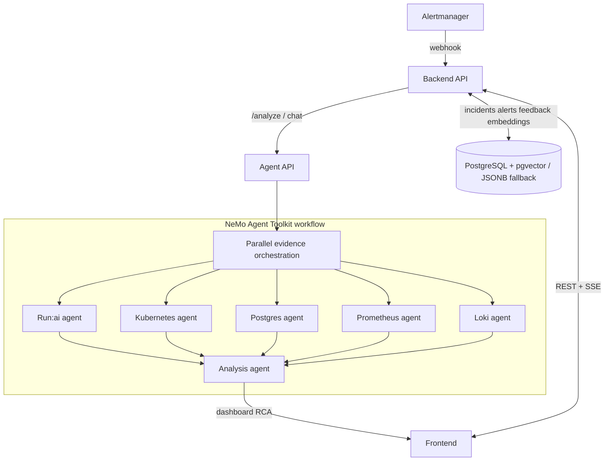

# Run:AI RCA

Run:AI RCA is a KubeRCA-inspired incident analysis cockpit for NVIDIA Run:ai
environments: Alertmanager intake, incident/alert dashboards, structured RCA
reports, realtime updates, chat, and reusable incident memory. Instead of a
single agent, it uses a component-oriented multi-agent design with the NVIDIA
NeMo Agent Toolkit as the orchestration backbone. RCA is read-only by default
and degrades gracefully when Run:ai, Prometheus, Loki, or Kubernetes access is
missing.

## Repository Layout

```text
agent/      FastAPI analysis service and NeMo Agent Toolkit workflow config
backend/    Go API server for Alertmanager intake, incidents, alerts, SSE
frontend/   React dashboard
charts/     Helm chart for Kubernetes deployment
docs/       Architecture and operation notes
```

## Architecture



## Local Development

```bash
# Agent
cd agent && python -m venv .venv && source .venv/bin/activate
pip install -e ".[dev]" && uvicorn app.main:app --reload --port 8000

# Backend
cd backend && go test ./... && go run .

# Frontend
cd frontend && npm install && npm run dev
```

The frontend expects the backend at `http://localhost:8080` by default.

## Deployment

Container images and the Helm chart are published to GHCR on `main` pushes and
version tags (`v*.*.*`). Pull requests build/lint only. Images are tagged with
the chart `appVersion` plus `sha-...`; the chart is published as an OCI
artifact.

- `ghcr.io/<owner>/runai-rca-backend`, `-agent`, `-frontend`
- `ghcr.io/<owner>/charts/runai-rca`

### 1. Secret

The backend auto-creates the target database if it is missing (needs `CREATEDB`,
or pre-create it). Existing databases are never modified.

```bash
kubectl create namespace runai-rca
kubectl create secret generic runai-rca-secrets -n runai-rca \
  --from-literal=DATABASE_URL='postgres://user:pw@pg-host:5432/runai_rca?sslmode=require' \
  --from-literal=POSTGRES_DSN='postgres://user:pw@pg-host:5432/runai_rca?sslmode=require' \
  --from-literal=RUNAI_CLIENT_ID='<id>' \
  --from-literal=RUNAI_CLIENT_SECRET='<secret>'
```

### 2. Install

```bash
helm upgrade --install runai-rca oci://ghcr.io/<owner>/charts/runai-rca \
  --version <chart-version> -n runai-rca \
  --set global.imageRegistry=ghcr.io/<owner> \
  --set secrets.existingSecret=runai-rca-secrets \
  --set agent.env.runaiBaseUrl=https://runai.example.com \
  --set agent.env.runaiTokenUrl=https://runai.example.com/auth/token \
  --set agent.env.prometheusUrl=http://prometheus.monitoring.svc:9090 \
  --set agent.env.lokiUrl=http://loki-gateway.monitoring.svc
```

Bundled single-pod Postgres instead of an external DB: `--set postgresql.enabled=true`.

### LLM synthesis (optional)

RCA synthesis runs deterministically in-process unless the NeMo runtime is
enabled. To synthesize through an OpenAI-compatible endpoint (e.g. LiteLLM):

```bash
  --set agent.env.enableNatRuntime=true \
  --set agent.env.natConfigFile=/app/configs/runai_rca_workflow_litellm.yml \
  --set agent.env.llmBaseUrl=https://llm.example.com/v1 \
  --set agent.env.llmModel=<model> \
  --set secrets.llmApiKey='<llm-api-key>'
```

Workflow configs: `runai_rca_workflow.yml` (default, no external LLM),
`_litellm.yml` (OpenAI-compatible), `_mcp.yml` (Prometheus/Loki MCP + NIM).

### Runtime checks

Automatic RCA starts only after Alertmanager posts to Backend
`/webhook/alertmanager`; a Slack notification alone does not prove that the RCA
webhook receiver was routed. Check live intake and analysis state with:

```bash
curl -s http://<frontend-or-backend-url>/api/v1/alerts
curl -s http://<frontend-or-backend-url>/api/v1/analysis-runs
```

Agent `/healthz` means the Agent API process is alive. Collector cards in the UI
turn `ok` only after an RCA run stores collector `artifacts`; pod `Running` or
health `200` is not enough by itself. Chat is context-grounded from the active
incident/alert RCA content. In the current implementation it does not call the
LLM path directly; `ENABLE_NAT_RUNTIME=true` affects `/analyze` synthesis, while
`/chat` returns a deterministic context answer. When no detail RCA is attached,
Backend supplies dashboard and analysis-run state so Chat can report current
alerts, latest run status, agent timeout/failure warnings, and configured
runtime mode.

## Configuration

Key values (full secret keys: `DATABASE_URL`, `POSTGRES_DSN`, `RUNAI_CLIENT_ID`,
`RUNAI_CLIENT_SECRET`, `RUNAI_BEARER_TOKEN`, `NVIDIA_API_KEY`, `LLM_API_KEY`):

| Helm value | Purpose |
| --- | --- |
| `global.imageRegistry` / `imagePullSecrets` | Registry prefix and pull secrets for all images |
| `secrets.existingSecret` | Existing Secret with DB/Run:ai/NVIDIA/LLM credentials |
| `agent.env.runaiBaseUrl` / `runaiTokenUrl` | Run:ai API URL and OAuth token URL (token URL required for client_id/secret) |
| `agent.env.prometheusUrl` / `lokiUrl` | In-cluster Prometheus / Loki URLs |
| `agent.env.enableNatRuntime` / `natConfigFile` | Enable NeMo synthesis and select workflow config |
| `agent.env.llmBaseUrl` / `llmModel` | OpenAI-compatible endpoint and model |
| `agent.rbac.clusterWide` / `namespaces` | Read-only RBAC scope for evidence collection |
| `postgresql.enabled` / `auth.*` | Use bundled Postgres and its user/password/database |
| `ingress.*` | Frontend host, TLS, class, annotations |
| `{backend,agent,frontend}.image.tag` | Override image tags (default: chart appVersion) |

RCA tables are created automatically with idempotent `CREATE TABLE IF NOT
EXISTS`; no migration step is needed. pgvector is used when available, otherwise
the backend falls back to JSONB cosine search. Sensitive values are redacted
before evidence leaves a collector; add patterns via `MASKING_REGEX_LIST_JSON`.

## Documentation

- `docs/CONFIGURATION.md` — full env var and Helm value reference
- `docs/DEPLOYMENT.md` — detailed deployment, RBAC, and DB notes
- `docs/API.md` — backend and agent endpoints
- `docs/ARCHITECTURE.md` — implementation contract
- `docs/OPERATING-MODEL.md` — operating model
