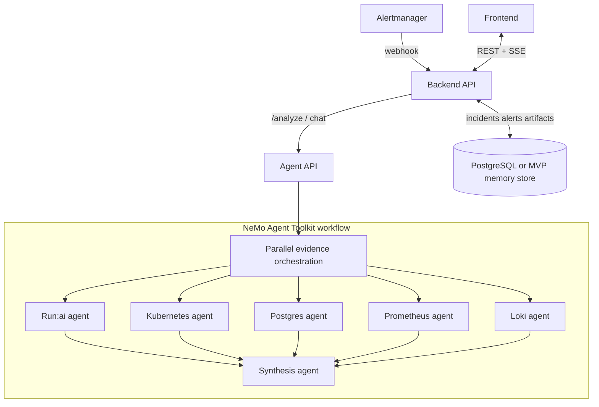

# Run:AI RCA

Run:AI RCA is a KubeRCA-inspired incident analysis cockpit for NVIDIA Run:ai
environments. It keeps the operator workflow that made KubeRCA useful:
Alertmanager intake, incident and alert dashboards, structured RCA reports,
Slack-friendly summaries, realtime updates, chat, and reusable incident memory.

The key difference is the analysis engine. Instead of a single agent, Run:AI RCA
uses a component-oriented multi-agent design with NVIDIA NeMo Agent Toolkit as
the orchestration backbone.

## Product Direction

- White-first operations UI with NVIDIA green accents.
- One unified Incident or Alert page. Operators should see the final RCA and
  every agent's evidence trail in the same place.
- Read-only RCA by default. The system explains root cause and next actions but
  does not remediate automatically.
- Graceful degradation. If Run:ai API, Prometheus, Loki, or Kubernetes access is
  missing, the RCA still returns a useful partial report and clearly marks
  missing data.

## Repository Layout

```text
agent/          FastAPI analysis service and NeMo Agent Toolkit workflow config
backend/        Go API server for Alertmanager intake, incidents, alerts, SSE
frontend/       React dashboard with NVIDIA-inspired white theme
charts/         Helm chart for Kubernetes deployment
docs/           Architecture, UI direction, and operation notes
```

## Architecture



## MVP Interfaces

Backend:

- `POST /webhook/alertmanager`
- `GET /api/v1/incidents`
- `GET /api/v1/incidents/{id}`
- `POST /api/v1/incidents/{id}/analyze`
- `POST /api/v1/incidents/{id}/resolve`
- `GET /api/v1/alerts`
- `GET /api/v1/alerts/{id}`
- `GET /api/v1/events`
- `POST /api/v1/chat`

Agent:

- `POST /analyze`
- `POST /summarize-incident`
- `POST /chat`
- `GET /healthz`

## Local Development

Agent:

```bash
cd agent
python -m venv .venv
source .venv/bin/activate
pip install -e ".[dev]"
uvicorn app.main:app --reload --port 8000
```

Backend:

```bash
cd backend
go test ./...
go run .
```

Frontend:

```bash
cd frontend
npm install
npm run dev
```

The frontend expects the backend at `http://localhost:8080` by default.

## Configuration

Core environment variables:

| Variable | Purpose |
| --- | --- |
| `AGENT_URL` | Backend to Agent URL, default `http://localhost:8000` |
| `RUNAI_BASE_URL` | Run:ai control plane URL |
| `RUNAI_CLIENT_ID` | Run:ai application client ID |
| `RUNAI_CLIENT_SECRET` | Run:ai application client secret |
| `PROMETHEUS_URL` | Prometheus base URL |
| `LOKI_URL` | Loki base URL |
| `POSTGRES_DSN` | Postgres RCA store and pgvector diagnostic DSN |
| `NVIDIA_API_KEY` | NIM key for NeMo Agent Toolkit workflows |
| `NAT_CONFIG_FILE` | Optional NeMo workflow config path, default `configs/runai_rca_workflow.yml` |

NeMo Agent Toolkit workflows:

- `agent/configs/runai_rca_workflow.yml` runs the component collectors through
  NAT `parallel_executor` and deterministic synthesis. It does not require
  external MCP servers.
- `agent/configs/runai_rca_workflow_mcp.yml` adds Prometheus/Loki MCP client
  groups and a NIM-backed `react_agent` synthesis path for environments where
  those services are available.

## Container and Helm Deployment

Each runtime has its own image:

```bash
docker build -t runai-rca-agent:0.1.0 agent
docker build -t runai-rca-backend:0.1.0 backend
docker build -t runai-rca-frontend:0.1.0 frontend
```

The Helm chart deploys the frontend, backend, agent service, read-only
Kubernetes RBAC for evidence collection, and the secret/config boundaries for
Run:ai, Prometheus, Loki, Postgres, and NeMo Agent Toolkit.

```bash
helm template runai-rca charts/runai-rca
helm install runai-rca charts/runai-rca \
  --set agent.env.runaiBaseUrl=https://runai.example.com \
  --set agent.env.prometheusUrl=http://prometheus.monitoring:9090 \
  --set agent.env.lokiUrl=http://loki.monitoring:3100 \
  --set secrets.existingSecret=runai-rca-secrets
```

When `POSTGRES_DSN` is configured, the Postgres agent checks database
connectivity, active connections, long-running transactions, pgvector extension
availability, and expected RCA table presence. If it is not configured, the
agent marks Postgres evidence as unavailable without blocking the rest of the
RCA.

## KubeRCA Lineage

This project intentionally preserves the KubeRCA feel:

- Incident and alert are first-class workflow objects.
- RCA output is structured, reviewable, and editable by operators.
- Agent evidence is not hidden in logs. It is part of the incident record.
- The UI is dense and operational, not a marketing landing page.

See `docs/ARCHITECTURE.md` and `docs/UI-DIRECTION.md` for the implementation
contract.
