# Run:AI RCA

Run:AI RCA is a KubeRCA-inspired incident analysis cockpit for NVIDIA Run:ai
environments. It keeps the operator workflow that made KubeRCA useful:
Alertmanager intake, incident and alert dashboards, structured RCA reports,
Slack-friendly summaries, realtime updates, chat, and reusable incident memory.

The key difference is the analysis engine. Instead of a single agent, Run:AI RCA
uses a component-oriented multi-agent design with NVIDIA NeMo Agent Toolkit as
the orchestration backbone.

## Product Direction

- White-first operations UI with NVIDIA green accents.
- One unified Incident or Alert page. Operators should see the final RCA and
  every agent's evidence trail in the same place.
- Read-only RCA by default. The system explains root cause and next actions but
  does not remediate automatically.
- Graceful degradation. If Run:ai API, Prometheus, Loki, or Kubernetes access is
  missing, the RCA still returns a useful partial report and clearly marks
  missing data.

## Repository Layout

```text
agent/          FastAPI analysis service and NeMo Agent Toolkit workflow config
backend/        Go API server for Alertmanager intake, incidents, alerts, SSE
frontend/       React dashboard with NVIDIA-inspired white theme
charts/         Helm chart for Kubernetes deployment
docs/           Architecture, UI direction, and operation notes
```

## Architecture

```mermaid
flowchart TD
  AM[Alertmanager] -->|webhook| BE[Backend API]
  FE[Frontend] <-->|REST + SSE| BE
  BE -->|/analyze / chat| AG[Agent API]
  BE <-->|incidents alerts feedback embeddings| DB[(PostgreSQL + JSONB vectors)]

  subgraph "NeMo Agent Toolkit workflow"
    ORCH[Parallel evidence orchestration]
    RA[Run:ai agent]
    KA[Kubernetes agent]
    DBA[Postgres agent]
    PA[Prometheus agent]
    LA[Loki agent]
    AA[Analysis agent]
    CA[Chat agent]
  end

  AG --> ORCH
  ORCH --> RA
  ORCH --> KA
  ORCH --> DBA
  ORCH --> PA
  ORCH --> LA
  RA --> AA
  KA --> AA
  DBA --> AA
  PA --> AA
  LA --> AA
  AA -->|dashboard RCA| FE
  DB --> CA
  AG --> CA
```



## MVP Interfaces

Backend:

- `POST /webhook/alertmanager`
- `GET /api/v1/incidents`
- `GET /api/v1/incidents/{id}`
- `POST /api/v1/incidents/{id}/analyze`
- `POST /api/v1/incidents/{id}/resolve`
- `GET /api/v1/incidents/{id}/feedback`
- `POST /api/v1/incidents/{id}/feedback`
- `POST /api/v1/incidents/{id}/vote`
- `POST /api/v1/incidents/{id}/comments`
- `PUT /api/v1/incidents/{id}/comments/{comment_id}`
- `DELETE /api/v1/incidents/{id}/comments/{comment_id}`
- `GET /api/v1/alerts`
- `GET /api/v1/alerts/{id}`
- `GET /api/v1/alerts/{id}/feedback`
- `POST /api/v1/alerts/{id}/feedback`
- `POST /api/v1/alerts/{id}/vote`
- `POST /api/v1/alerts/{id}/comments`
- `PUT /api/v1/alerts/{id}/comments/{comment_id}`
- `DELETE /api/v1/alerts/{id}/comments/{comment_id}`
- `POST /api/v1/embeddings/search`
- `GET /api/v1/events`
- `POST /api/v1/chat`

Agent:

- `POST /analyze`
- `POST /summarize-incident`
- `POST /chat` context-aware RCA chat grounded in current incidents, alerts, evidence, feedback, and similar RCA memory
- `GET /healthz`

## Local Development

Agent:

```bash
cd agent
python -m venv .venv
source .venv/bin/activate
pip install -e ".[dev]"
uvicorn app.main:app --reload --port 8000
```

Backend:

```bash
cd backend
go test ./...
go run .
```

Frontend:

```bash
cd frontend
npm install
npm run dev
```

The frontend expects the backend at `http://localhost:8080` by default.

## Configuration

Core environment variables:

| Variable | Purpose |
| --- | --- |
| `AGENT_URL` | Backend to Agent URL, default `http://localhost:8000` |
| `LANGUAGE` | Backend/Agent response language, `en` or `ko` |
| `KUBERNETES_API_URL` | In-cluster Kubernetes API URL, default `https://kubernetes.default.svc` |
| `KUBERNETES_TOKEN_PATH` | Service account token path for in-cluster Kubernetes collection |
| `KUBERNETES_CA_PATH` | Service account CA path for in-cluster Kubernetes collection |
| `KUBERNETES_TIMEOUT_SECONDS` | Kubernetes API request timeout |
| `KUBERNETES_LIST_LIMIT` | Kubernetes pod/event list page size for evidence collection, default `50` |
| `KUBERNETES_NAMESPACES` | Optional comma-separated namespace allowlist for Kubernetes direct collection |
| `KUBERNETES_CLUSTER_SCOPE_ENABLED` | Enables cluster-scoped Kubernetes calls such as node lookups; Helm follows `agent.rbac.clusterWide` |
| `RUNAI_BASE_URL` | Run:ai control plane URL |
| `RUNAI_BEARER_TOKEN` | Optional Run:ai bearer token secret |
| `RUNAI_CLIENT_ID` | Run:ai application client ID |
| `RUNAI_CLIENT_SECRET` | Run:ai application client secret |
| `RUNAI_TOKEN_URL` | Optional OAuth token URL for Run:ai client credentials |
| `RUNAI_WORKLOADS_PATH` | Run:ai workloads API path, default `/api/v1/workloads` |
| `RUNAI_PROJECTS_PATH` | Run:ai projects API path, default `/api/v1/projects` |
| `RUNAI_QUEUES_PATH` | Run:ai queues API path, default `/api/v1/queues` |
| `RUNAI_TIMEOUT_SECONDS` | Run:ai API request timeout |
| `RUNAI_LOG_NAMESPACES` | Comma-separated Run:ai control-plane log namespaces, default `runai,runai-backend` |
| `PROMETHEUS_URL` | Prometheus base URL |
| `PROMETHEUS_TIMEOUT_SECONDS` | Prometheus query timeout |
| `PROMETHEUS_MCP_URL` | Optional remote Prometheus MCP URL for the MCP workflow |
| `LOKI_URL` | Loki base URL |
| `LOKI_TIMEOUT_SECONDS` | Loki query timeout |
| `LOKI_QUERY_LIMIT` | Maximum log lines requested per Loki query group, default `20` |
| `LOKI_MCP_URL` | Optional remote Loki MCP URL for the MCP workflow |
| `DATABASE_URL` | Backend Postgres store DSN for incidents, alerts, embeddings, feedback, and comments |
| `DATABASE_CONNECT_TIMEOUT_SECONDS` | Backend Postgres startup connection timeout, default `5` |
| `POSTGRES_DSN` | Agent Postgres diagnostic DSN; defaults to `DATABASE_URL` in Helm |
| `POSTGRES_TIMEOUT_SECONDS` | Agent Postgres diagnostic query timeout |
| `TROUBLESHOOTING_CASES_FILE` | Local known-cases/playbook markdown path |
| `AGENT_SOULS_FILE` | Agent role-contract prompt path, default `prompts/agent_souls.md` |
| `MASKING_REGEX_LIST_JSON` | Optional JSON array of custom redaction regexes |
| `BUILTIN_REDACTION_ENABLED` | Enable built-in secret redaction, default `true` |
| `BUILTIN_REDACTION_HASH_MODE` | Replace secrets with stable short hashes instead of `[MASKED]`, default `false` |
| `NVIDIA_API_KEY` | NIM key for NeMo Agent Toolkit workflows |
| `NAT_CONFIG_FILE` | Optional NeMo workflow config path, default `configs/runai_rca_workflow.yml` |
| `NAT_TIMEOUT_SECONDS` | NeMo Agent Toolkit CLI execution timeout |
| `VITE_ENABLE_MOCK_DATA` | Frontend local-dev sample data toggle; Helm uses `frontend.config.enableMockData` |

NeMo Agent Toolkit workflows:

- `agent/configs/runai_rca_workflow.yml` runs the component collectors through
  NAT `parallel_executor` and the `analysis_agent` RCA step. It does not require
  external MCP servers.
- `agent/configs/runai_rca_workflow_mcp.yml` adds Prometheus/Loki MCP client
  groups and a NIM-backed Analysis Agent review path for environments where
  those services are available.

## Container and Helm Deployment

Each runtime has its own image:

```bash
docker build -t runai-rca-agent:0.1.0 agent
docker build -t runai-rca-backend:0.1.0 backend
docker build -t runai-rca-frontend:0.1.0 frontend
```

The Helm chart deploys the frontend, backend, agent service, read-only
Kubernetes RBAC for evidence collection, and the secret/config boundaries for
Run:ai, Prometheus, Loki, Postgres, and NeMo Agent Toolkit.

```bash
helm template runai-rca charts/runai-rca
helm install runai-rca charts/runai-rca \
  --set agent.env.runaiBaseUrl=https://runai.example.com \
  --set agent.env.prometheusUrl=http://prometheus-kube-prometheus-prometheus.monitoring.svc.cluster.local:9090 \
  --set agent.env.lokiUrl=http://loki-gateway.monitoring.svc.cluster.local \
  --set-string agent.env.runaiLogNamespaces='runai\,runai-backend' \
  --set secrets.existingSecret=runai-rca-secrets
```

For an existing Postgres, set `secrets.databaseUrl` or provide a Secret through
`secrets.existingSecret`. By default the chart reads `DATABASE_URL` and
`POSTGRES_DSN`; if your existing Secret uses different key names, set
`secrets.keys.databaseUrl` and `secrets.keys.postgresDsn`. For a bundled
single-pod Postgres, enable:

```bash
helm install runai-rca charts/runai-rca \
  --set postgresql.enabled=true \
  --set postgresql.auth.password=change-me
```

If `secrets.existingSecret` is used for Run:ai/NVIDIA credentials while bundled
Postgres is enabled, the chart creates a separate generated database Secret and
points Backend/Agent DB variables at it. To use a dedicated existing DB Secret
instead, set `secrets.databaseExistingSecret`.

The Agent uses read-only cluster-wide RBAC by default so it can inspect target
pods, Run:ai control-plane namespaces, and node context. To limit it to selected
namespaces, disable cluster-wide RBAC and list the namespaces that should be
queryable:

```bash
helm upgrade --install runai-rca charts/runai-rca \
  --set agent.rbac.clusterWide=false \
  --set 'agent.rbac.namespaces[0]=runai' \
  --set 'agent.rbac.namespaces[1]=runai-backend' \
  --set 'agent.rbac.namespaces[2]=runai-vision'
```

Frequently tuned Helm values:

| Value | Purpose |
| --- | --- |
| `global.imageRegistry` / `imagePullSecrets` | Private registry prefix and pull secrets applied to all runtime images |
| `backend.env.agentUrl` | Override Backend-to-Agent URL when the Agent is external or remote |
| `backend.env.language` / `agent.env.language` | Set RCA language to `en` or `ko` |
| `backend.env.databaseConnectTimeoutSeconds` | Backend startup timeout for the Postgres store connection |
| `secrets.keys.*` | Existing Secret key names for DB, Run:ai, and NVIDIA credentials |
| `secrets.existingSecret` | Existing Secret for Run:ai/NVIDIA credentials and, by default, DB keys |
| `secrets.databaseExistingSecret` | Existing Secret used only for `DATABASE_URL` / `POSTGRES_DSN` |
| `agent.rbac.clusterWide` | Use a ClusterRole for Kubernetes evidence collection; default `true` |
| `agent.rbac.namespaces` | Namespaces that receive Role/RoleBinding when `agent.rbac.clusterWide=false`; defaults to the release namespace |
| `agent.env.kubernetesNamespaces` | Agent-side Kubernetes namespace allowlist; when empty and `clusterWide=false`, Helm derives it from `agent.rbac.namespaces` |
| `agent.env.runaiBaseUrl` / `agent.env.runaiTokenUrl` | Run:ai API and optional OAuth token endpoint |
| `agent.env.runaiWorkloadsPath`, `runaiProjectsPath`, `runaiQueuesPath` | Run:ai API path overrides for different Run:ai versions |
| `agent.env.runaiLogNamespaces` | Namespaces for Run:ai control-plane/backend logs, default `runai,runai-backend` |
| `agent.env.prometheusUrl` | In-cluster Prometheus URL, for example `http://prometheus-kube-prometheus-prometheus.monitoring.svc.cluster.local:9090` |
| `agent.env.lokiUrl` | In-cluster Loki URL, for example `http://loki-gateway.monitoring.svc.cluster.local` |
| `agent.env.prometheusMcpUrl` / `agent.env.lokiMcpUrl` | Remote MCP endpoints when using the MCP workflow |
| `agent.env.*TimeoutSeconds` | Request/runtime timeouts for Kubernetes, Run:ai, Prometheus, Loki, Postgres, and NAT |
| `agent.env.kubernetesListLimit` / `agent.env.lokiQueryLimit` | Evidence volume controls for Kubernetes list calls and Loki log query groups |
| `agent.env.troubleshootingCasesFile` / `agent.env.agentSoulsFile` | Paths for injected troubleshooting memory and agent role contracts |
| `agent.env.maskingRegexListJson` | Cluster-specific secret masking regexes as a JSON array |
| `frontend.config.apiBaseUrl` | Browser API base URL when not using the bundled nginx `/api` proxy |
| `frontend.config.enableMockData` | Show sample dashboard records only when no live incidents or alerts exist; default `false` in Helm |
| `backend.extraEnv`, `agent.extraEnv`, `frontend.extraEnv` | Additional container env entries for deployment-specific settings |
| `podAnnotations` / `podLabels` | Global pod metadata applied to Backend, Agent, Frontend, and bundled Postgres |
| `{backend,agent,frontend,postgresql}.podAnnotations` / `.podLabels` | Component-specific pod metadata merged over global metadata |
| `podSecurityContext` / `securityContext` | Global pod and container security contexts |
| `{backend,agent,frontend,postgresql}.podSecurityContext` / `.securityContext` | Component-specific pod and container security contexts |
| `priorityClassName` / `topologySpreadConstraints` | Global scheduling policy for all pods |
| `{backend,agent,frontend,postgresql}.priorityClassName` / `.topologySpreadConstraints` | Component-specific scheduling policy overrides |
| `{backend,agent,frontend,postgresql}.service.annotations` | Service annotations for cloud/load-balancer or mesh integrations |
| `{backend,agent,frontend}.readinessProbe` / `.livenessProbe` | HTTP probe overrides for each service |
| `postgresql.readinessProbe` / `postgresql.livenessProbe` | Bundled Postgres probe overrides; empty values use a `pg_isready` default based on `postgresql.auth.username` |
| `postgresql.persistence.*` | PVC enablement, storage class, and size for bundled Postgres |
| `postgresql.nodeSelector` / `.affinity` / `.tolerations` | Bundled Postgres scheduling overrides; fall back to the global scheduling values |

For annotation keys that contain dots or slashes, prefer a small values file. If
you use `--set`, escape dots and use `--set-string`, for example:

```bash
helm upgrade --install runai-rca charts/runai-rca \
  --set-string 'backend.service.annotations.service\.beta\.kubernetes\.io/aws-load-balancer-type=nlb'
```

Mock data is a frontend-only sample mode. It is enabled by default during Vite
local development, disabled by default in Helm/static deployments, and is shown
only after the Backend successfully returns empty incident and alert lists. API
errors do not fall back to mock records. As soon as real incident or alert data
is returned by the Backend, the UI uses the live values and does not mix mock
records into Operations, Analysis, Evidence, or Agents.

When `DATABASE_URL` is configured, the backend creates and uses `incidents`,
`alerts`, `incident_embeddings`, `rca_feedback`, and `rca_comments`. If the
pgvector extension is not available, the backend still stores sparse text
vectors in JSONB and serves similar-incident search. When `POSTGRES_DSN` is
configured, the Postgres agent checks connectivity, active connections,
long-running transactions, pgvector availability, and expected RCA table
presence. If it is not configured, the agent marks Postgres evidence as
unavailable without blocking the rest of the RCA.

Sensitive values are redacted before evidence is returned to the backend or
passed into NeMo synthesis. The built-in redactor masks common secret keys,
Authorization headers, JWT-like values, token query parameters, Postgres URL
passwords, long base64 blobs, Kubernetes env values, command flags, sensitive
annotation keys, and embedded annotation secrets. Add cluster-specific patterns
with `MASKING_REGEX_LIST_JSON` when needed.

## KubeRCA Lineage

This project intentionally preserves the KubeRCA feel:

- Incident and alert are first-class workflow objects.
- The Analysis Dashboard tracks RCA lifecycle, quality, missing evidence,
  similar incidents, feedback, and per-agent coverage.
- RCA output is structured, reviewable, and annotated by operators.
- Similar incidents, votes, and markdown comments are part of the RCA loop.
- Agent evidence is not hidden in logs. It is part of the incident record.
- The UI is dense and operational, not a marketing landing page.

See `docs/ARCHITECTURE.md` and `docs/UI-DIRECTION.md` for the implementation
contract.
