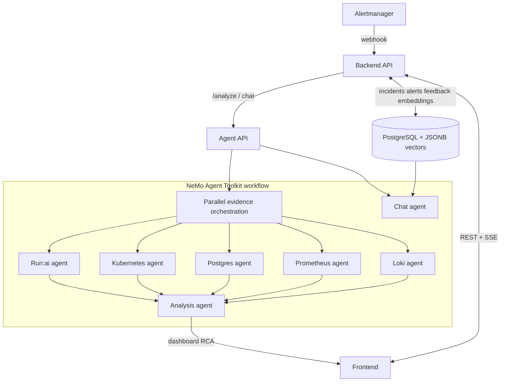

# Run:AI RCA

Run:AI RCA is a KubeRCA-inspired incident analysis cockpit for NVIDIA Run:ai
environments. It keeps the operator workflow that made KubeRCA useful:
Alertmanager intake, incident and alert dashboards, structured RCA reports,
Slack-friendly summaries, realtime updates, chat, and reusable incident memory.

The key difference is the analysis engine. Instead of a single agent, Run:AI RCA
uses a component-oriented multi-agent design with NVIDIA NeMo Agent Toolkit as
the orchestration backbone.

## Product Direction

- White-first operations UI with NVIDIA green accents.
- One unified Incident or Alert page. Operators should see the final RCA and
  every agent's evidence trail in the same place.
- Read-only RCA by default. The system explains root cause and next actions but
  does not remediate automatically.
- Graceful degradation. If Run:ai API, Prometheus, Loki, or Kubernetes access is
  missing, the RCA still returns a useful partial report and clearly marks
  missing data.

## Repository Layout

```text
agent/          FastAPI analysis service and NeMo Agent Toolkit workflow config
backend/        Go API server for Alertmanager intake, incidents, alerts, SSE
frontend/       React dashboard with NVIDIA-inspired white theme
charts/         Helm chart for Kubernetes deployment
docs/           Architecture, UI direction, and operation notes
```

## Architecture



## MVP Interfaces

Backend:

- `POST /webhook/alertmanager`
- `GET /api/v1/incidents`
- `GET /api/v1/incidents/{id}`
- `POST /api/v1/incidents/{id}/analyze`
- `POST /api/v1/incidents/{id}/resolve`
- `GET /api/v1/incidents/{id}/feedback`
- `POST /api/v1/incidents/{id}/feedback`
- `POST /api/v1/incidents/{id}/vote`
- `POST /api/v1/incidents/{id}/comments`
- `PUT /api/v1/incidents/{id}/comments/{comment_id}`
- `DELETE /api/v1/incidents/{id}/comments/{comment_id}`
- `GET /api/v1/alerts`
- `GET /api/v1/alerts/{id}`
- `GET /api/v1/alerts/{id}/feedback`
- `POST /api/v1/alerts/{id}/feedback`
- `POST /api/v1/alerts/{id}/vote`
- `POST /api/v1/alerts/{id}/comments`
- `PUT /api/v1/alerts/{id}/comments/{comment_id}`
- `DELETE /api/v1/alerts/{id}/comments/{comment_id}`
- `POST /api/v1/embeddings/search`
- `GET /api/v1/events`
- `POST /api/v1/chat`

Agent:

- `POST /analyze`
- `POST /summarize-incident`
- `POST /chat` context-aware RCA chat grounded in current incidents, alerts, evidence, feedback, and similar RCA memory
- `GET /healthz`

## Local Development

Agent:

```bash
cd agent
python -m venv .venv
source .venv/bin/activate
pip install -e ".[dev]"
uvicorn app.main:app --reload --port 8000
```

Backend:

```bash
cd backend
go test ./...
go run .
```

Frontend:

```bash
cd frontend
npm install
npm run dev
```

The frontend expects the backend at `http://localhost:8080` by default.

## Configuration

Core environment variables:

| Variable | Purpose |
| --- | --- |
| `AGENT_URL` | Backend to Agent URL, default `http://localhost:8000` |
| `KUBERNETES_API_URL` | In-cluster Kubernetes API URL, default `https://kubernetes.default.svc` |
| `KUBERNETES_TIMEOUT_SECONDS` | Kubernetes API request timeout |
| `RUNAI_BASE_URL` | Run:ai control plane URL |
| `RUNAI_BEARER_TOKEN` | Optional Run:ai bearer token secret |
| `RUNAI_CLIENT_ID` | Run:ai application client ID |
| `RUNAI_CLIENT_SECRET` | Run:ai application client secret |
| `RUNAI_TOKEN_URL` | Optional OAuth token URL for Run:ai client credentials |
| `RUNAI_WORKLOADS_PATH` | Run:ai workloads API path, default `/api/v1/workloads` |
| `RUNAI_PROJECTS_PATH` | Run:ai projects API path, default `/api/v1/projects` |
| `RUNAI_QUEUES_PATH` | Run:ai queues API path, default `/api/v1/queues` |
| `RUNAI_LOG_NAMESPACES` | Comma-separated Run:ai control-plane log namespaces, default `runai,runai-backend` |
| `PROMETHEUS_URL` | Prometheus base URL |
| `PROMETHEUS_MCP_URL` | Optional remote Prometheus MCP URL for the MCP workflow |
| `LOKI_URL` | Loki base URL |
| `LOKI_MCP_URL` | Optional remote Loki MCP URL for the MCP workflow |
| `DATABASE_URL` | Backend Postgres store DSN for incidents, alerts, embeddings, feedback, and comments |
| `POSTGRES_DSN` | Agent Postgres diagnostic DSN; defaults to `DATABASE_URL` in Helm |
| `TROUBLESHOOTING_CASES_FILE` | Local known-cases/playbook markdown path |
| `AGENT_SOULS_FILE` | Agent role-contract prompt path, default `prompts/agent_souls.md` |
| `MASKING_REGEX_LIST_JSON` | Optional JSON array of custom redaction regexes |
| `BUILTIN_REDACTION_ENABLED` | Enable built-in secret redaction, default `true` |
| `BUILTIN_REDACTION_HASH_MODE` | Replace secrets with stable short hashes instead of `[MASKED]`, default `false` |
| `NVIDIA_API_KEY` | NIM key for NeMo Agent Toolkit workflows |
| `NAT_CONFIG_FILE` | Optional NeMo workflow config path, default `configs/runai_rca_workflow.yml` |

NeMo Agent Toolkit workflows:

- `agent/configs/runai_rca_workflow.yml` runs the component collectors through
  NAT `parallel_executor` and the `analysis_agent` RCA step. It does not require
  external MCP servers.
- `agent/configs/runai_rca_workflow_mcp.yml` adds Prometheus/Loki MCP client
  groups and a NIM-backed Analysis Agent review path for environments where
  those services are available.

## Container and Helm Deployment

Each runtime has its own image:

```bash
docker build -t runai-rca-agent:0.1.0 agent
docker build -t runai-rca-backend:0.1.0 backend
docker build -t runai-rca-frontend:0.1.0 frontend
```

The Helm chart deploys the frontend, backend, agent service, read-only
Kubernetes RBAC for evidence collection, and the secret/config boundaries for
Run:ai, Prometheus, Loki, Postgres, and NeMo Agent Toolkit.

```bash
helm template runai-rca charts/runai-rca
helm install runai-rca charts/runai-rca \
  --set agent.env.runaiBaseUrl=https://runai.example.com \
  --set agent.env.prometheusUrl=http://prometheus-kube-prometheus-prometheus.monitoring.svc.cluster.local:9090 \
  --set agent.env.lokiUrl=http://loki-gateway.monitoring.svc.cluster.local \
  --set-string agent.env.runaiLogNamespaces='runai\,runai-backend' \
  --set secrets.existingSecret=runai-rca-secrets
```

For an existing Postgres, set `secrets.databaseUrl` or provide
`DATABASE_URL`/`POSTGRES_DSN` from `secrets.existingSecret`. For a bundled
single-pod Postgres, enable:

```bash
helm install runai-rca charts/runai-rca \
  --set postgresql.enabled=true \
  --set postgresql.auth.password=change-me
```

When `DATABASE_URL` is configured, the backend creates and uses `incidents`,
`alerts`, `incident_embeddings`, `rca_feedback`, and `rca_comments`. If the
pgvector extension is not available, the backend still stores sparse text
vectors in JSONB and serves similar-incident search. When `POSTGRES_DSN` is
configured, the Postgres agent checks connectivity, active connections,
long-running transactions, pgvector availability, and expected RCA table
presence. If it is not configured, the agent marks Postgres evidence as
unavailable without blocking the rest of the RCA.

Sensitive values are redacted before evidence is returned to the backend or
passed into NeMo synthesis. The built-in redactor masks common secret keys,
Authorization headers, JWT-like values, token query parameters, Postgres URL
passwords, long base64 blobs, Kubernetes env values, command flags, sensitive
annotation keys, and embedded annotation secrets. Add cluster-specific patterns
with `MASKING_REGEX_LIST_JSON` when needed.

## KubeRCA Lineage

This project intentionally preserves the KubeRCA feel:

- Incident and alert are first-class workflow objects.
- The Analysis Dashboard tracks RCA lifecycle, quality, missing evidence,
  similar incidents, feedback, and per-agent coverage.
- RCA output is structured, reviewable, and annotated by operators.
- Similar incidents, votes, and markdown comments are part of the RCA loop.
- Agent evidence is not hidden in logs. It is part of the incident record.
- The UI is dense and operational, not a marketing landing page.

See `docs/ARCHITECTURE.md` and `docs/UI-DIRECTION.md` for the implementation
contract.
