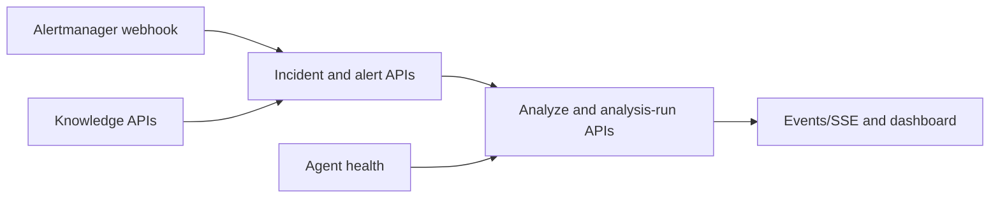

# API Reference

> **Lens:** Reference — the HTTP surface.
> **In this doc:** Backend endpoints · Agent endpoints · webhook accept/ignore semantics.

**Who this is for:** an operator testing an integration, or a developer building
a client. An endpoint is simply one HTTP address that accepts a request or
returns a record. Start with the webhook for alert intake, incidents for case
views, and analysis runs for progress; use OpenAPI when a tool needs every field.



## OpenAPI contract

The Backend serves its GitBook-compatible **OpenAPI 3.0.3** contract at
`GET /api/v1/openapi.json`. Use it as the source for an API portal, generated
clients, or an interactive renderer such as Scalar or Swagger UI. The current
contract establishes the Backend route map; the Knowledge operations include
request schemas and lifecycle response codes in detail.

Open `/api-docs` on the deployed RCA URL for the built-in Scalar reference. It
loads the same-origin contract and can send requests directly with **Try it**;
no Scalar account or hosted Scalar service is used.

## Endpoints

### Choose an endpoint by task

Read incident/alert endpoints to see a case, use analyze endpoints to request a
fresh investigation, and use the events endpoint when a browser needs live
updates. The detailed list below remains the authoritative route reference.

Backend:

- `POST /webhook/alertmanager`
- `GET /api/v1/openapi.json`
- `GET /api/v1/incidents?view=active|archived|trash`
- `GET /api/v1/incidents/{id}`
- `POST /api/v1/incidents/{id}/analyze`
- `POST /api/v1/incidents/{id}/resolve`
- `POST /api/v1/incidents/{id}/archive`
- `POST /api/v1/incidents/{id}/unarchive`
- `POST /api/v1/incidents/{id}/restore`
- `POST /api/v1/incidents/bulk`
- `DELETE /api/v1/incidents/trash`
- `DELETE /api/v1/incidents/{id}`
- `DELETE /api/v1/incidents/{id}?permanent=true`
- `GET /api/v1/incidents/{id}/feedback`
- `POST /api/v1/incidents/{id}/feedback`
- `POST /api/v1/incidents/{id}/vote`
- `POST /api/v1/incidents/{id}/comments`
- `PUT /api/v1/incidents/{id}/comments/{comment_id}`
- `DELETE /api/v1/incidents/{id}/comments/{comment_id}`
- `GET /api/v1/alerts`
- `GET /api/v1/alerts/{id}`
- `GET /api/v1/alerts/{id}/feedback`
- `POST /api/v1/alerts/{id}/feedback`
- `POST /api/v1/alerts/{id}/vote`
- `POST /api/v1/alerts/{id}/comments`
- `PUT /api/v1/alerts/{id}/comments/{comment_id}`
- `DELETE /api/v1/alerts/{id}/comments/{comment_id}`
- `POST /api/v1/embeddings/search`
- `GET /api/v1/analysis-runs`
- `GET /api/v1/analysis-runs/{id}/evaluation?author=...`
- `PUT /api/v1/analysis-runs/{id}/evaluation?author=...`
- `GET /api/v1/knowledge-candidates?status=...`
- `GET /api/v1/knowledge-candidates/{id}`
- `POST /api/v1/knowledge-candidates/{id}/decision`
- `GET /api/v1/knowledge-packages?include_retired=true|false`
- `GET /api/v1/knowledge-packages/{id}`
- `POST /api/v1/knowledge-packages/{id}/retire`
- `GET /api/v1/knowledge/runtime-snapshot`
- `GET /api/v1/knowledge/probe-metrics`
- `POST /api/v1/analysis-runs/{id}/progress`
- `GET /api/v1/stats/recurrence?days=7`
- `GET /api/v1/stats/llm-spend?days=7`
- `GET /api/v1/stats/kpi?days=7`
- `GET /api/v1/events`
- `POST /api/v1/chat`

`POST /webhook/alertmanager` returns HTTP 202 with `status`, `alerts`,
`accepted`, and `ignored` counts. Alerts with severity `info` or `information`
are counted as ignored and do not create incidents, alerts, SSE events, or
analysis runs.

`GET /api/v1/incidents` returns the active incident view by default. Use
`view=archived` for archived incidents and `view=trash` for soft-deleted
incidents that are still inside the trash retention window. Invalid view values
return HTTP 400. List pagination keeps `total` scoped to the selected view.

Incident lifecycle actions:

- `POST /api/v1/incidents/{id}/resolve` toggles the operator's final approval
  for the RCA. It sets or clears `user_approved_at` and does not change
  `status` or `resolved_at`; those remain the Alertmanager incident state.
  Similar-incident memory is loaded only after this approval.
- `POST /api/v1/incidents/{id}/archive` hides an active incident from the active
  list without deleting data. A new matching alert automatically unarchives the
  incident.
- `POST /api/v1/incidents/{id}/unarchive` moves an archived incident back to the
  active view.
- `DELETE /api/v1/incidents/{id}` soft-deletes an incident into the trash view,
  removes it from active matching indexes, and prevents backfill, dashboard,
  chat fallback, and memory search from using it.
- `POST /api/v1/incidents/{id}/restore` restores a soft-deleted incident when its
  matching indexes are not already owned by a newer incident.
- `DELETE /api/v1/incidents/{id}?permanent=true` permanently deletes the incident
  and its alerts, embeddings, feedback, comments, and analysis runs.

## Knowledge candidate decisions

All knowledge lifecycle actions use the same endpoint. Replace
`{candidate_id}` with the value returned by the candidate list or detail API.
`actor` and `note` are optional audit fields.

```http
POST /api/v1/knowledge-candidates/{candidate_id}/decision
Content-Type: application/json
```

```json
{
  "action": "shadow",
  "actor": "on-call@example.com",
  "note": "Observe this probe template before activation."
}
```

| `action` | Valid when | Result |
| --- | --- | --- |
| `shadow` | Candidate is pending | Validates it and creates a non-active package for observation. |
| `activate` | Candidate is shadowed | Activates that package in the runtime snapshot. |
| `approve` | Candidate is pending | Validates it and creates an active package immediately. |
| `reject` | Candidate is pending or shadowed | Rejects the candidate; a shadow package is retired. |

The request body is identical for every action; only `action` changes. `approve`
and `shadow` invoke the Agent validator before the transition. A successful
`shadow`, `activate`, or `approve` response contains both `candidate` and
`package`; a successful pending-candidate `reject` response contains `candidate`.
Invalid actions return 400, a validation rejection returns 422, and an invalid
lifecycle transition returns 409.

Candidate generation has two evidence paths. The primary path requires a complete
trace-v3 ledger: one selected/supported family-matching hypothesis, canonical
supporting evidence from at least two source groups, and a linked probe execution.
If that ledger is incomplete, a candidate may use the `harness_claim` path only
when the output harness is `supported`, its root-cause claim matches the snapshot
family, all supporting evidence is canonical and contradiction-free, and the
supporting evidence is non-empty. This path deliberately permits one source group
and no linked probe execution; its compiled `probe_template_ids` value is `[]`,
never `null`. Such payloads carry `evidence_source: "harness_claim"` and
`provenance.promotion_path: "harness_claim"` for auditability.

Saving an evaluation re-runs candidate validation for the exact run and analysis
hash. A still-invalid candidate keeps `validation_failed` but refreshes its
`validation_error` and `updated_at`; a candidate that becomes eligible returns to
`ready_for_review` and still requires an explicit candidate decision before
activation.

## Bulk incident lifecycle actions

To apply one lifecycle action to several incidents, send:

```http
POST /api/v1/incidents/bulk
Content-Type: application/json
```

```json
{
  "incident_ids": ["INC-...", "INC-..."],
  "action": "archive"
}
```

`action` may be `archive`, `unarchive`, `restore`, `trash`, or
`delete_permanently`. The response contains the IDs that were processed. To
permanently delete every incident currently in the trash, call
`DELETE /api/v1/incidents/trash`; the response contains `deleted_count`.

## Package retirement

To retire a package explicitly, send the same optional audit fields without an
`action` field:

```http
POST /api/v1/knowledge-packages/{package_id}/retire
Content-Type: application/json
```

```json
{
  "actor": "on-call@example.com",
  "note": "Superseded by package kp-newer."
}
```

`GET /api/v1/stats/recurrence?days=N` returns recurrence statistics for the last
`N` days. `days` defaults to 7, clamps to 1..90, and returns:

```json
{
  "data": {
    "days": 7,
    "rate": 0.5,
    "total": 4,
    "recurred": 2,
    "daily": [{"date": "2026-07-06", "total": 1, "recurred": 1, "rate": 1}]
  }
}
```

`GET /api/v1/stats/llm-spend?days=N` aggregates analysis-run `metadata.llm_usage`
into tokens, calls, failed calls, estimated USD cost, daily buckets, and per-model
breakdowns for the selected 1..90 day window.

`GET /api/v1/stats/kpi?days=N` returns mean/p50/p90 time-to-RCA and
time-to-resolve metrics plus daily buckets. Time-to-RCA uses the first successful
completion timestamp for each incident, so later re-analysis does not rewrite the
baseline.

`POST /api/v1/analysis-runs/{id}/progress` accepts agent progress while a run is
`analyzing`. The backend appends entries to `metadata.progress_log` with a cap of
200 and broadcasts each accepted entry as `analysis.progress` over SSE. Completed
and failed runs preserve the accumulated progress log.

Incident responses expose Alertmanager state as `status` / `resolved_at` and
operator final approval as `user_approved_at`. `AnalysisRun` responses include
optional `metadata`. LLM token accounting is stored under `metadata.llm_usage`
when the agent returns usage data. Incident detail responses expose the latest
run usage as `token_usage`, and include `similar_recent_count` for the recent
similar-incident count shown in the UI.

Incident detail also exposes `analysis_run_id`, `analysis_hash`, optional
`harness`, and optional `ontology_reasoning` for the newest RCA. The evaluation
GET returns only reviews whose hash matches the current RCA; PUT upserts the
current browser actor's review. A stale hash is rejected with HTTP 400 so a
review cannot be attached to a re-analysed report.

`GET /api/v1/events` emits named SSE events. Incident archive, unarchive,
delete, restore, and manual permanent delete changes emit `incident.updated` so
other dashboard sessions can refresh the active, archived, and trash views.
Analysis lifecycle events include `analysis.started`, `analysis.progress`, and
`analysis.completed`; progress events carry `run_id`, `phase`, optional
collector/hypothesis fields, confidence snapshots, and a timestamp.

Agent:

- `POST /analyze`
- `POST /summarize-incident`
- `POST /chat` context-aware RCA chat grounded in current incidents, alerts, evidence, feedback, and similar RCA memory
- `GET /healthz` returns process/runtime health and `collectors: {active, unknown}`. `unknown` lists unrecognized names supplied through `COLLECTORS`; it is configuration visibility, not collector health.
