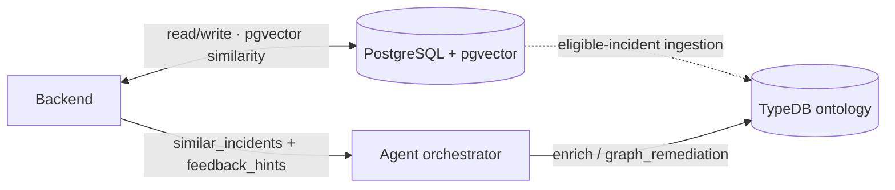
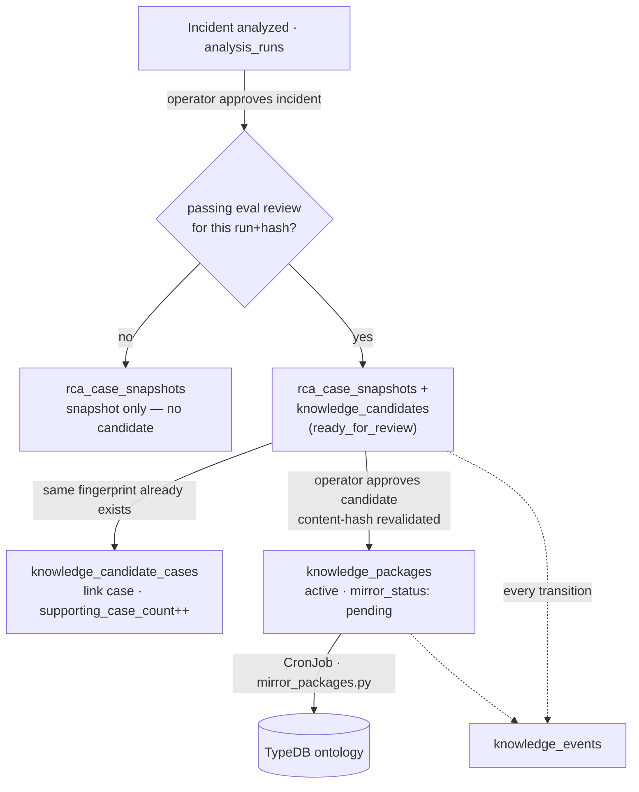

# Data Stores

> **Lens:** How it's built (data) — the two stores and what each owns.
> **In this doc:** PostgreSQL tables · TypeDB ontology · ingestion paths · connection config.

Run:AI RCA uses two stores with distinct roles. See [Architecture](ARCHITECTURE.md) for the
runtime flow; this document is the data-structure reference.

**Who this is for:** an operator who needs to know where a record lives, or a
developer who needs to understand why two databases appear in one deployment.
PostgreSQL is the working case file. TypeDB is an optional relationship index
built from approved parts of that case file.

| Store | Role | Owner | Required? |
|---|---|---|---|
| **PostgreSQL** | Operational source of truth: incidents, alerts, RCA results, operator feedback, similarity vectors | Go backend | Yes (in-memory fallback for local dev) |
| **TypeDB** | Ontology knowledge graph: typed entities + relations for relational reasoning at synthesis | Agent | No (`typedb.enabled`, default on in Helm) |

The graph is **derived from** Postgres — an eligibility-gated projection, not a
second source of truth. It contains only Dashboard-approved incidents after the
grace period (`typedb.ingest.requireApproval=true` by default).

**pgvector** similarity is owned by the **backend** (Go), not the agent: the
backend runs the cosine search and passes the matches into each `/analyze`
request. The agent **orchestrator** owns the **TypeDB** side — it consults the
graph during analysis. See [RCA Pipeline](RCA-PIPELINE.md) and
[Knowledge Base](KNOWLEDGE-BASE.md).

---

## 1. PostgreSQL (operational)

### Find data by task

Use PostgreSQL for the current incident, its alerts, analysis runs, operator
feedback, similarity search, and the approved-knowledge learning pipeline. Use
TypeDB only for optional topology and approved-history relationships; it is never
a second operational source of truth.

Tables are auto-created by the backend on startup (`backend/store_postgres.go`).
Fourteen tables, grouped by what they serve.

**Ingestion & analysis**

| Table | Purpose | Key columns |
|---|---|---|
| `incidents` | Correlated alert groups — the unit of RCA and the Slack thread | `incident_id` (PK), `correlation_key`, `status`, `fired_at`, `resolved_at`, `alert_count`, `analysis_seq`, `user_approved_at` |
| `alerts` | Individual alerts; a re-firing alert accrues here | `alert_id` (PK), `incident_id`, `fingerprint`, `occurrence_count`, `occurrence_pods` (JSONB), `labels`/`annotations` (JSONB), `thread_ts` |
| `analysis_runs` | **RCA source of truth** — the full output of every analysis run | `run_id` (PK), `source` (`auto`/`manual`/`chat`/`feedback`), `status`, `target_type`/`target_id`, `analysis_summary`/`analysis_detail`, `analysis_quality`, `root_cause_family`, `capabilities`/`missing_data`/`warnings`/`artifacts` (JSONB) |
| `incident_embeddings` | Similarity memory — find past look-alike incidents | `incident_id`, `alert_id`, `analysis_summary`/`analysis_detail`, `vector_json` (JSONB), `embedding vector(384)` + HNSW cosine index |

> The per-alert RCA columns (`analysis_*`, `capabilities`, …) have been **removed** from `alerts` — the RCA lives on `analysis_runs`. The backend no longer creates or reads them; drop any leftover columns from existing DBs manually (documented in `store_postgres.go`).

**Operator feedback & evaluation**

| Table | Purpose | Key columns |
|---|---|---|
| `rca_feedback` | Operator votes **and** comments (polymorphic target) | `feedback_id` (PK), `kind` (`vote`/`comment`), `target_type`/`target_id`, `vote`, `body`, `author` |
| `rca_eval_reviews` | Structured quality review — scores, hard gates, real-world outcome. **Gates** knowledge learning | `review_id` (PK), `run_id`, `analysis_hash`, `reviewer`, `scores`/`hard_gates` (JSONB), `resolution_outcome`, `effective_action`, `expected_family` |

> `rca_comments` is **deprecated** — read only (if it still exists) to migrate old rows into `rca_feedback`, then droppable. New comments are `rca_feedback` rows with `kind='comment'`.

**Approved-knowledge learning pipeline** — see [the learning pipeline](#the-learning-pipeline-how-an-incident-becomes-knowledge) below.

| Table | Purpose | Key columns |
|---|---|---|
| `rca_case_snapshots` | Immutable snapshot of an **operator-approved** RCA — the input to learning + ontology | `case_id` (PK = `run_id:hash`), `incident_id`, `run_id`, `analysis_hash`, `approval_state` (`active`/`revoked`/`superseded`), `mechanism_fingerprint`, `snapshot` (JSONB) |
| `knowledge_candidates` | Knowledge drawn from a snapshot, moving through a review state machine | `candidate_id` (PK), `case_id`, `knowledge_fingerprint`, `supporting_case_count`, `status` (`ready_for_review`→`active` / `validation_failed` / `rejected` / `superseded`), `content_hash`, `payload` (JSONB) |
| `knowledge_candidate_cases` | M:N link — which approved cases support one candidate (cross-incident dedup) | `candidate_id` + `case_id` (composite PK), `linked_at` |
| `knowledge_packages` | Published knowledge; mirrored to TypeDB | `package_id` (PK = `KPK-<case>`), `candidate_id`, `status` (`active`/`shadow`/`retired`), `payload` (JSONB), `mirror_status` |
| `knowledge_events` | Append-only audit log of every lifecycle transition | `event_id` (PK), `candidate_id`, `package_id`, `event_type`, `actor`, `note`, `created_at` |

**Chat & offline**

| Table | Purpose | Key columns |
|---|---|---|
| `chat_conversations` | Chatbot threads, linked to incident/alert context | `conversation_id` (PK), `incident_id`, `alert_id`, `messages` (JSONB), `context_label` |
| `rca_dataset` | Offline eval dataset — a CronJob accumulates operator-labeled incidents, exported to the curated set | `dataset_id` (PK), `incident_id`, `alertname`, `expected_family`, `approved`, `question` (JSONB) |
| `ontology_backfill_cursors` | One-time backfill bookkeeping (snapshots → TypeDB) | `cursor_name` (PK), `approved_at`, `case_id` |

**Similarity search**: `incident_embeddings.embedding` (pgvector, HNSW cosine) is
the primary path; a JSONB sparse-vector cosine fallback runs when pgvector is
unavailable. The 384-dim vector is a deterministic feature-hash of the RCA text
(no model dependency) — see `backend/memory.go`. `labels`/`annotations` JSONB are
the richest entity source consumed by ingestion (cluster/node/queue/etc.).

### The learning pipeline: how an incident becomes knowledge

An approved RCA becomes reusable knowledge through gated steps. **Two human gates
keep it honest** — nothing goes live automatically.

| Step | Trigger (when) | Writes | Gate |
|---|---|---|---|
| **Snapshot** | Operator approves the incident (`user_approved_at`) | `rca_case_snapshots` (immutable, `case_id = run_id:hash`) | Latest analysis run must be `complete` with a bound hash |
| **Candidate** | Same approval, one transaction | `knowledge_candidates` (`ready_for_review` / `validation_failed`) + `knowledge_events` (`candidate_generated`) | A **passing `rca_eval_reviews`** bound to that exact run+hash, family match, evidence/harness gates — otherwise snapshot only |
| **Link** | A candidate with the same `knowledge_fingerprint` already exists | `knowledge_candidate_cases`, bump `supporting_case_count` | Cross-incident dedup — no duplicate candidate |
| **Publish** | Operator approves the candidate (`POST /api/v1/knowledge-candidates/…`) | `knowledge_packages` (`active`, `mirror_status=pending`); prior same-fingerprint package → `retired` | Content-hash **revalidation** — candidate must still be `ready_for_review` and hash-stable |
| **Mirror** | `typedb-package-mirror-job` CronJob (`ontology/mirror_packages.py`) | TypeDB upsert; `knowledge_packages.mirror_status` → `current`/`failed` | **Advisory** — a failed mirror never blocks activation |
| **Audit** | Every transition above | `knowledge_events` (append-only) | — |

A **shadow** publish (`ShadowKnowledgeCandidate`) stages a package for review
*without* exposing it to the active runtime snapshot, so an approval can't
silently shift RCA ranking; a later explicit activation promotes it.

---

## 2. TypeDB (ontology knowledge graph)

Schema: `agent/ontology/schema.tql` (TypeQL 3.x). Three layers.

### Infra layer — *populated by ingestion*
`cluster`, `node`, `namespace`, `project`, `queue`, `workload`, `pod`,
`control_plane_component`.
GPU is modeled as attributes (`gpu_allocated`, `gpu_requested`) on
`node`/`queue`/`project`, not a separate entity.

### Incident / RCA layer — *populated by ingestion*
`alert`, `incident` (owns `analysis_summary` so prior RCA is queryable),
`analysis_run`.

### Knowledge layer — *curated; seeded from the `knowledge/` catalogs*
`symptom` (owns `keyword` for matching), `root_cause`, `action`, plus the
`xid_error` GPU-fault catalog (with `leads_to` chains) and
`control_plane_component` platform topology (with `depends_on`). This is the
"this symptom → this cause → fixed by this action" knowledge the orchestrator
consults. Fed by five loaders — see [How data gets in](#3-how-data-gets-in) and
the [Knowledge Base](KNOWLEDGE-BASE.md) doc.

### Root-cause taxonomy (16 families, `sub root_cause`)
`node_kubelet_pressure`, `runai_scheduling_quota`, `k8s_scheduling_error`,
`runai_control_plane_error`, `k8s_control_plane_error`, `workload_startup_error`,
`image_pull_error`, `gpu_hardware_error`, `network_fabric_error`,
`cluster_network_error`, `k8s_storage_error`, `storage_backend_error`,
`workload_runtime_error`, `observability_accuracy`, `platform_auth_error`,
`platform_lifecycle_change`
(+ `insufficient_evidence`). Must stay in sync with the loader `FAMILIES` sets and
`agent/app/services/root_cause_ranking.py`; guardrail tests enforce it.

### Relations
- **Topology**: `scopes` (cluster→node/project), `runs_on` (node→pod),
  `belongs_to` (workload→pod), `in_project`, `submitted_to` (workload→queue),
  `contains` (namespace→pod/workload/component), `depends_on` (component→component)
- **Incident**: `grouped_into` (incident←alert), `analyzed_by`, `similar_to`
- **Knowledge**: `has_symptom`, `indicates` (symptom→cause), `has_cause`,
  `fixed_by` (cause→action), `resolved_by` (symptom→action), `supported_by`
  (←evidence), `emits`, `applies_to` (xid→gpu_model), `leads_to` (xid→xid)

### Populated vs modeled
| Status | Entities / relations |
|---|---|
| ✅ Populated (`ontology/ingest.py`) | infra + incident layer + topology/`grouped_into` |
| ✅ Knowledge (`load_knowledge` / `load_troubleshooting` / other `load_*`) | symptom/cause/action plus executable runbook steps, transitions, outcomes, recommendations, XIDs, and component dependencies |
| 🟦 Promoted (`ingest.py --promote-knowledge`) | `confirmed:<alert>` symptom → family → action, from operator-confirmed RCAs |
| ⬜ Modeled, not yet fed | `evidence`, `analysis_run`, `similar_to`, `supported_by`, GPU attrs |

---

## 3. How data gets in

| Path | Script | Source | Gate |
|---|---|---|---|
| Schema + functions | `load_schema` / `load_functions` | `schema.tql` / `functions.tql` | Helm post-install/upgrade hook (`typedb-schema-job.yaml`) |
| Curated knowledge | `load_knowledge`, `load_troubleshooting`, `load_xids`, `load_alerts`, `load_known_issues`, `load_architecture` | the `knowledge/` catalogs | Version-controlled files, run in the schema job |
| Topology + incidents | `ontology/ingest.py` (CronJob) | Postgres `incidents`/`alerts` | Dashboard-approved (`user_approved_at`) and resolved ≥ `resolvedGraceHours` ago; `requireReview` is deprecated |
| Knowledge promotion | `ingest.py --promote-knowledge` | operator-confirmed RCAs | Resolved + net-positive feedback |

The **orchestrator** consults TypeDB during analysis
(`agent/app/services/kg_enrichment.py`): node blast radius, prior same-alert
incidents, and graph-derived remediation. It degrades to an empty context when
TypeDB is off/unreachable. Inspect the graph with `python -m ontology.query`
(`--incident` / `--recent` / `--count`) or TypeDB Studio.

---

## 4. Connection / config

| Env | Default | Notes |
|---|---|---|
| `ENABLE_TYPEDB` | `false` (Helm sets it from `typedb.enabled`) | Master switch |
| `TYPEDB_ADDRESS` | `localhost:1729` | In-cluster: `<release>-typedb:1729` |
| `TYPEDB_DATABASE` | `runai_rca` | |
| `TYPEDB_USERNAME` / `TYPEDB_PASSWORD` | `admin` / `password` | CE defaults — override beyond PoC |
| `POSTGRES_DSN` | — | Backend Postgres (also read by agent collectors/ingestion) |
| `RUNAI_DB_DSN` | — | Optional read-only DSN for the **Run:ai control-plane** Postgres; enables the postgres drill-down's `sql_select` over platform schemas (workloads/audit/…). Use a read-only role. |

When `RUNAI_DB_DSN` is used for collection, audit/history reads run in a UTC
session. A `timestamp without time zone` value is interpreted as Run:ai UTC and
the resulting observation declares `naive_timestamps_assumed_utc: true`.
Audit-table failures are isolated: successful tables remain available, while
failed or discovery-capped tables are reported as partial/missing data. A failed
Run:ai control-plane DB connection is likewise visible as unavailable context,
not a healthy Postgres check or causal evidence.

TypeDB deploys as a single-node `StatefulSet` + PVC
(`charts/runai-rca/templates/typedb.yaml`). Community Edition is single-node;
HA/clustering is the paid Enterprise tier.
