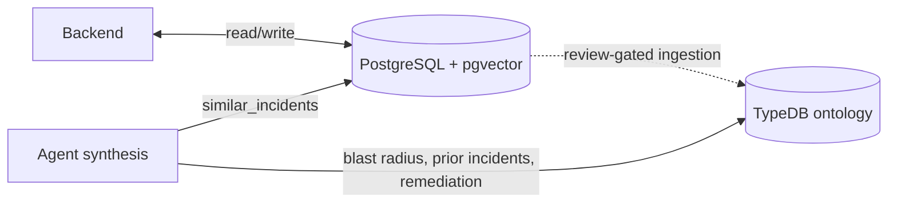

# Data Stores

> **Lens:** How it's built (data) — the two stores and what each owns.
> **In this doc:** PostgreSQL tables · TypeDB ontology · ingestion paths · connection config.

Run:AI RCA uses two stores with distinct roles. See [Architecture](ARCHITECTURE.md) for the
runtime flow; this document is the data-structure reference.

| Store | Role | Owner | Required? |
|---|---|---|---|
| **PostgreSQL** | Operational source of truth: incidents, alerts, RCA results, operator feedback, similarity vectors | Go backend | Yes (in-memory fallback for local dev) |
| **TypeDB** | Ontology knowledge graph: typed entities + relations for relational reasoning at synthesis | Agent | No (`typedb.enabled`, default on in Helm) |

The graph is **derived from** Postgres — a review-gated projection, not a second
source of truth.

---

## 1. PostgreSQL (operational)

Tables are auto-created by the backend on startup (`backend/store_postgres.go`).

| Table | Purpose | Key columns |
|---|---|---|
| `incidents` | Correlated alert groups | `incident_id` (PK), `correlation_key`, `title`, `severity`, `status`, `fired_at`, `resolved_at`, `alert_count` |
| `alerts` | Individual alerts + their RCA | `alert_id` (PK), `incident_id` (FK), `fingerprint`, `occurrence_count`, `occurrence_pods` (JSONB), `labels`/`annotations` (JSONB), `analysis_summary`/`analysis_detail`, `analysis_quality`, `capabilities`/`missing_data`/`warnings`/`artifacts` (JSONB) |
| `incident_embeddings` | Similarity memory | `incident_id` (PK), `alert_id`, `analysis_summary`/`analysis_detail`, `labels` (JSONB), `vector_json` (JSONB), `embedding vector(384)` + HNSW cosine index |
| `rca_feedback` | Operator votes | `feedback_id` (PK), `target_type`, `target_id`, `vote` (`up`/`down`), `author`, `created_at` |
| `rca_comments` | Operator notes | `comment_id` (PK), `target_type`, `target_id`, `body`, `author`, `created_at` |
| `analysis_runs` | RCA execution history | `run_id` (PK), `source` (`auto`/`manual`/`chat`/`feedback`), `status`, `target_type`, `target_id`, `analysis_*`, `created_at` |

**Similarity search**: `incident_embeddings.embedding` (pgvector, HNSW cosine) is
the primary path; a JSONB sparse-vector cosine fallback runs when pgvector is
unavailable. The 384-dim vector is a deterministic feature-hash of the RCA text
(no model dependency) — see `backend/memory.go`. `labels`/`annotations` JSONB are
the richest entity source consumed by ingestion (cluster/node/queue/etc.).

---

## 2. TypeDB (ontology knowledge graph)

Schema: `agent/ontology/schema.tql` (TypeQL 3.x). Three layers.

### Infra layer — *populated by ingestion*
`cluster`, `node`, `namespace`, `project`, `queue`, `workload`, `pod`,
`control_plane_component`.
GPU is modeled as attributes (`gpu_allocated`, `gpu_requested`) on
`node`/`queue`/`project`, not a separate entity.

### Incident / RCA layer — *populated by ingestion*
`alert`, `incident` (owns `analysis_summary` so prior RCA is queryable),
`analysis_run`.

### Knowledge layer — *curated; seeded from `knowledge/failure_modes.yaml`*
`symptom` (owns `keyword` for matching), `root_cause`, `action`, `evidence`,
`runbook`. This is the "this symptom → this cause → fixed by this action"
knowledge the synthesis step consults.

### Root-cause taxonomy (5 families, `sub root_cause`)
`node_kubelet_pressure`, `scheduling_quota_exhaustion`, `control_plane_error`,
`workload_startup_image_failure`, `insufficient_evidence`. Mirrors the ranking
families in `agent/app/services/root_cause_ranking.py`.

### Relations
- **Topology**: `scopes` (cluster→node/project), `runs_on` (node→pod),
  `belongs_to` (workload→pod), `in_project`, `submitted_to` (workload→queue),
  `contains` (namespace→pod/workload/component)
- **Incident**: `grouped_into` (incident←alert), `analyzed_by`, `similar_to`
- **Knowledge**: `has_symptom`, `indicates` (symptom→cause), `has_cause`,
  `fixed_by` (cause→action), `supported_by` (←evidence), `emits`

### Populated vs modeled
| Status | Entities / relations |
|---|---|
| ✅ Populated (`ontology/ingest.py`) | infra + incident layer + topology/`grouped_into` |
| 🟦 Knowledge (`ontology/load_knowledge.py`) | `symptom`/`root_cause`/`action` + `indicates`/`fixed_by` |
| ⬜ Modeled, not yet fed | `evidence`, `runbook`, `control_plane_component`, `analysis_run`, `similar_to`, `has_symptom`, `supported_by`, GPU attrs |

---

## 3. How data gets in

| Path | Script | Source | Gate |
|---|---|---|---|
| Topology + incidents | `ontology/ingest.py` | Postgres `incidents`/`alerts` | Review-gated (operator up-vote or comment); `--all` for bulk PoC load |
| Failure-mode knowledge | `ontology/load_knowledge.py` | `knowledge/failure_modes.yaml` (team-curated) | Version-controlled file |
| Schema | `ontology/load_schema.py` | `ontology/schema.tql` | Helm post-install hook (`typedb-schema-job.yaml`) |

The agent **consults** TypeDB once at synthesis (`agent/app/services/kg_enrichment.py`):
node blast radius, prior same-alert incidents, and curated remediation for the
ranked family. It degrades to an empty context when TypeDB is off/unreachable.

---

## 4. Connection / config

| Env | Default | Notes |
|---|---|---|
| `ENABLE_TYPEDB` | `false` (Helm sets it from `typedb.enabled`) | Master switch |
| `TYPEDB_ADDRESS` | `localhost:1729` | In-cluster: `<release>-typedb:1729` |
| `TYPEDB_DATABASE` | `runai_rca` | |
| `TYPEDB_USERNAME` / `TYPEDB_PASSWORD` | `admin` / `password` | CE defaults — override beyond PoC |
| `POSTGRES_DSN` | — | Backend Postgres (also read by agent collectors/ingestion) |

TypeDB deploys as a single-node `StatefulSet` + PVC
(`charts/runai-rca/templates/typedb.yaml`). Community Edition is single-node;
HA/clustering is the paid Enterprise tier.
