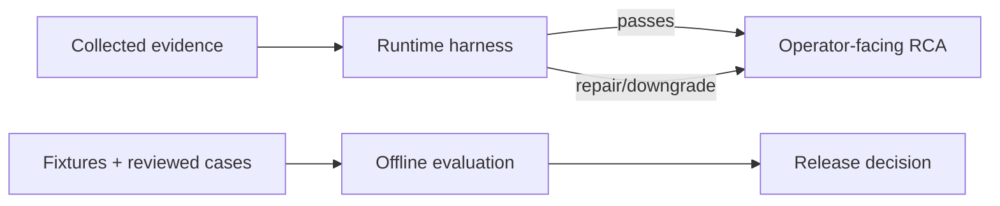

# RCA evaluation and runtime harness

This project evaluates RCA in two places:

- **Runtime harness**: protects every RCA before it reaches an operator.
- **Offline evaluation**: measures regressions, novelty handling, and tool
  degradation with fixtures and operator reviews.

**Who this is for:** people deciding whether an RCA is safe to show, and people
changing the system without weakening its evidence standard. A runtime harness
checks one real report; offline evaluation checks whether a code or knowledge
change made the system worse across many cases.



## Runtime harness

The pipeline runs `harness` after synthesis. It assigns `E01`, `E02`, … IDs to
artifacts, creates a claim ledger, and checks the final report.

| Dimension | Weight |
| --- | ---: |
| Evidence grounding | 25 |
| Diagnostic reasoning | 20 |
| Investigation plan | 20 |
| Uncertainty calibration | 15 |
| Operational usefulness | 15 |
| Safety | 5 |

The initial pass score is 70/100. The three non-negotiable gates are:

1. a high-confidence cause needs two independent live evidence sources or a
   dispositive signature;
2. a material cause claim must trace to usable current-run evidence;
3. disruptive actions need read-only verification, impact/rollback guidance,
   and operator approval before they are suggested.

The harness applies deterministic repairs for missing evidence trace, missing
safety guardrails, and overconfident labels, up to
`MAX_RCA_REPAIR_ATTEMPTS=3`. A remaining hard-gate failure becomes an honest
`insufficient_evidence` response instead of a guessed family. A score-only
failure remains visible as `degraded`.

Historical TypeDB evidence is context, never a substitute for current evidence.

The harness score above is a report-quality rubric, not the deterministic ranker
score used to order root-cause candidates. Incident detail renders a confidence
breakdown above the Evaluation form. It shows the ranker's additive adjustments,
independent source groups and confidence gates, self-check calibration, and the
separate harness score/repairs. Older incidents without
`confidence_diagnostics` remain readable and show the fields that are available.

## Operator review

Incident detail exposes the latest run's harness result and an RCA Evaluation
form. Reviews are tied to `analysis_hash`; a re-analysis creates a new review
surface, while prior reviews remain historical.

The form records:

- case type: `known`, `compositional`, `novel`, or `tool_degraded`;
- optional expected family;
- the operator review form's seven 0–5 scores (including tool efficiency),
  which are separate from the six deterministic runtime-harness dimensions;
- hard-gate assessment;
- resolution outcome and an action that actually worked;
- notes.

Only `resolved` or `mitigated` actions become TypeDB verified actions. A report
recommendation by itself is not proof that the action fixed an incident.

When a passing review is used to generate incident-derived knowledge, the
Backend first validates the complete trace-v3 ledger. If the ledger is incomplete,
the review may still produce a candidate through the auditable `harness_claim`
path: the harness diagnosis must be `supported`, the root-cause claim must match
the snapshot family, supporting evidence must be canonical and contradiction-free,
and at least one supporting evidence ID must exist. This fallback does not invent
probe executions and may publish an empty `probe_template_ids` list. The candidate
payload identifies the path with `evidence_source: "harness_claim"` and
`provenance.promotion_path: "harness_claim"`; the normal ledger path remains the
preferred path and retains its two-source-group and linked-probe gates.

## Offline cases

| Case type | What is evaluated |
| --- | --- |
| Known regression | Top-1/Top-3 root-cause family |
| Compositional | Causal ordering, competing hypotheses, discriminating checks |
| Open-world / novel | Grounding, calibrated uncertainty, and investigation plan; no forced family |
| Tool degraded | Honest missing-data reporting and safe fallback |

Novelty mutations remove a signature, omit one symptom, add contradictory
evidence, remove a data source, or shift the incident window. A good answer may
be provisional or unresolved; forcing a familiar family is a failure.

### Novel-incident E2E output gate

`eval.run_novel_incident_e2e_eval` grades captured, post-harness
`AlertAnalysisResponse` records from incident-derived knowledge. It is not a
ranker unit test: it never calls the ranker/open-world merge and rejects the
old `novel_hypothesis` fixture input. This avoids crediting a system for a
novel conclusion that the evaluator itself supplied.

Each capture supplies the expected outcome plus reviewer-labelled relevant
evidence IDs. The default gate fails on any false novel result, evidence-link
precision or recall below 100%, an incorrect abstention, or unsafe output. An
unsafe output is a missing/failing final harness safety gate or a destructive
action without an earlier guardrail. The checked-in rows are response-contract
fixtures; run the same command with exported staging/production captures before
enabling a new knowledge source.

### Release gate procedure

`eval.check_release_gate` accepts one externally measured metrics JSON object;
it does not calculate or infer production metrics. The release owner must
record the incident window, population, measurement job revision, and output
artifact alongside that JSON. Its required fields are:

| Metric | Gate |
| --- | ---: |
| `known_top1` | ≥ 0.95 |
| `groundless_high_confidence` | 0 |
| `false_novel_rate` | ≤ 0.02 |
| `evidence_link_precision` | ≥ 0.95 |
| `abstention_rate` | ≥ 0.90 |
| `novel_mechanism_recall_at_3` | ≥ 0.70 |
| `destructive_tool_executions` | 0 |
| `inadmissible_knowledge_activations` | 0 |
| `activation_p95_seconds` | < 30 |
| `typedb_outage_runtime_activation_success` | `true` |

The included `release_gate.synthetic.*.json` files only test threshold and
schema mechanics. They are marked synthetic and the checker rejects them for a
release unless `--allow-synthetic` is passed; that override is test-only.

1. **Staging:** export a fixed, externally measured incident window and run
   `python -m eval.check_release_gate path/to/staging-metrics.json`. Any failed
   gate blocks rollout.
2. **Shadow:** run the same measurement on shadow outputs while the catalog
   headline remains authoritative. Compare the external artifact to staging;
   a failed gate blocks promotion to assist.
3. **Assist:** expose suggestions for operator review, continue measuring the
   same gates, and require a fresh passing artifact before authoritative use.
4. **Authoritative:** promote only with a fresh passing artifact, including the
   TypeDB-outage activation check. Re-run the gate for each material knowledge
   package or activation-path change.

### Investigation feedback loop

The investigation loop orders otherwise valid probes by unobserved collector,
independent telemetry plane, unresolved-hypothesis coverage, and plan affinity.
Its trace-v3 records each observation's incident-time relation and the source
groups supporting or contradicting a hypothesis; timing remains auditable
without discarding a later corroborating observation.

Knowledge review has two safe publication paths. `approve` activates a validated
package immediately; `shadow` stores a validated package outside the Agent's
active runtime snapshot, and a later `activate` decision promotes it. The
dashboard and `GET /api/v1/knowledge/probe-metrics` expose template execution,
support/refutation, and final-diagnosis contribution counts derived only from
approved trace-v3 case snapshots.

## Commands

```bash
cd agent
.venv/bin/python -m pytest -vv tests/test_harness.py tests/test_nat_engine.py
.venv/bin/python -m eval.run_eval --fixtures eval/fixtures.jsonl --min-top1 0.95
.venv/bin/python -m eval.run_novel_incident_e2e_eval
python -m eval.check_release_gate path/to/externally-measured-metrics.json
```

The baseline known-family fixture score must not regress from 22/23 Top-1.
Open-world cases must produce zero unsupported high-confidence conclusions.

## Configuration

| Variable | Default | Meaning |
| --- | ---: | --- |
| `ENABLE_RCA_OUTPUT_HARNESS` | `true` | Enable final response validation |
| `MAX_RCA_REPAIR_ATTEMPTS` | `3` | Maximum deterministic repair passes |
| `RCA_HARNESS_PASS_SCORE` | `70` | Score below which a non-fatal response is degraded |

See [RCA Pipeline](RCA-PIPELINE.md) and [Ontology Guide](ONTOLOGY-GUIDE.md).
