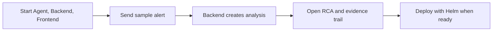

# Getting Started

> **Lens:** How to use — from zero to your first RCA in a few minutes.
> **In this doc:** prerequisites · run locally · trigger a first analysis · deploy to Kubernetes · where to go next.

Run:AI RCA has three services — **Backend** (Go: Alertmanager intake + API), **Agent**
(FastAPI: evidence collection + RCA synthesis), and **Frontend** (React dashboard). All three
run locally with no external dependencies: the Backend falls back to an in-memory store and the
Agent runs the NAT engine by default. Without LLM credentials, each stage
degrades deterministically; if the engine fails, the same pipeline runs directly.

**Who this is for:** someone seeing the project for the first time. The quickest
path is: start the three local services, send one sample alert, then open the
incident page. External systems improve evidence but are not required to learn
the flow.



## Prerequisites

- Go, Python 3, and Node.js for local development.
- (Optional) A Kubernetes cluster + Helm 3 for a real deployment.
- (Optional) Run:ai, Prometheus, Loki, and Postgres endpoints for live evidence — every
  integration degrades gracefully when it is absent.

## 1. Run locally

```bash
# Agent — FastAPI on :8000
cd agent && python -m venv .venv && source .venv/bin/activate
pip install -e ".[dev]" && uvicorn app.main:app --reload --port 8000

# Backend — Go on :8080
cd backend && go run .

# Frontend — Vite dev server on :5173, proxies the backend at :8080
cd frontend && npm install && npm run dev
```

Open the dashboard at http://localhost:5173. The frontend expects the backend at
`http://localhost:8080` by default.

## 2. Trigger your first RCA

Automatic RCA starts when Alertmanager posts to the Backend. To simulate that locally, send an
Alertmanager-style payload to the webhook (a real Alertmanager sends the full envelope; the
Backend reads `alerts[]` labels/annotations for Run:ai context):

```bash
curl -s -X POST http://localhost:8080/webhook/alertmanager \
  -H 'Content-Type: application/json' \
  -d '{
    "alerts": [{
      "status": "firing",
      "labels": {"alertname": "GPUWorkloadPending", "severity": "warning",
                 "cluster": "dev", "project": "vision", "namespace": "runai-vision"},
      "annotations": {"description": "Workload pending in queue gpu-a"}
    }]
  }'
```

The webhook returns HTTP 202 with `accepted`/`ignored` counts (alerts with severity `info` are
ignored and create nothing). Then watch intake and analysis state:

```bash
curl -s http://localhost:8080/api/v1/alerts
curl -s http://localhost:8080/api/v1/analysis-runs
```

The alert appears in the dashboard, correlated into an incident, with an RCA once the Agent
`/analyze` call completes. See [Operating Model](OPERATING-MODEL.md) for what `ok`, `partial`,
and `pending` mean, and the [API Reference](API.md) for the full endpoint list.

## 3. Deploy to Kubernetes

Images and the Helm chart are published to GHCR. Create the credentials Secret, then install:

```bash
kubectl create namespace runai-rca
kubectl create secret generic runai-rca-secrets -n runai-rca \
  --from-literal=RUNAI_CLIENT_ID='<id>' \
  --from-literal=RUNAI_CLIENT_SECRET='<secret>' \
  --from-literal=DATABASE_URL='postgres://user:pw@pg-host:5432/runai_rca?sslmode=require' \
  --from-literal=POSTGRES_DSN='postgres://user:pw@pg-host:5432/runai_rca?sslmode=require'

helm upgrade --install runai-rca oci://ghcr.io/<owner>/charts/runai-rca -n runai-rca \
  --set global.imageRegistry=ghcr.io/<owner> \
  --set secrets.existingSecret=runai-rca-secrets \
  --set agent.env.runaiBaseUrl=https://runai.example.com \
  --set agent.env.prometheusUrl=http://prometheus.monitoring.svc:9090 \
  --set agent.env.lokiUrl=http://loki-read.monitoring.svc.cluster.local:3100
```

No external database? Add `--set postgresql.enabled=true` for a bundled single-pod Postgres
(pgvector included). The final step is routing Alertmanager to the Backend webhook — see
[Deployment › Alertmanager Webhook Routing](DEPLOYMENT.md#alertmanager-webhook-routing).

## Where to go next

- [Architecture](ARCHITECTURE.md) — how a webhook becomes an RCA.
- [Configuration Reference](CONFIGURATION.md) — every env var and Helm value.
- [Deployment](DEPLOYMENT.md) — full deployment, RBAC, and database setup.
- [Data Stores](DATABASE.md) — PostgreSQL schema and the TypeDB ontology.
