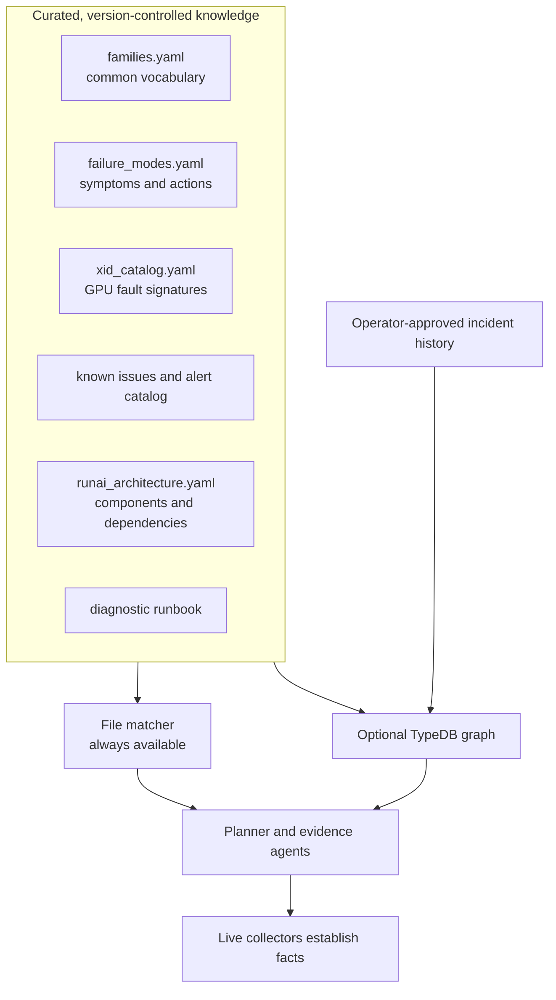
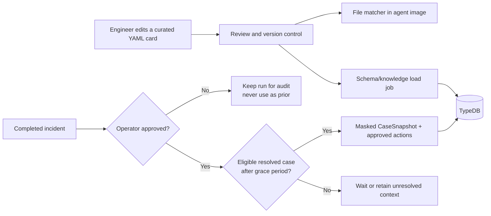
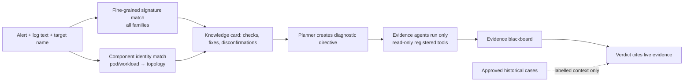

# Knowledge Base

> **In plain language:** this is the team's senior engineer's notebook. It gives
> the Agent dependable context before an incident, but it never substitutes that
> context for facts collected from the live system.

The knowledge base solves a practical problem: an alert may say only “GPU
unhealthy,” while an experienced operator knows which component to inspect,
which symptom is meaningful, and which old fix is safe to consider. The Agent
stores that shared experience in version-controlled cards and, optionally, in a
TypeDB relationship graph. Live collectors still decide what is true now.

## 1. What the Agent knows before an alert

| Layer | Plain meaning | Main source | What it helps with |
| --- | --- | --- | --- |
| Vocabulary | Names for the kinds of failure the product can discuss | `families.yaml` | Consistent RCA labels |
| Signature cards | Specific words, XID codes, symptoms, checks, and fixes | `failure_modes.yaml`, XID/issue/alert catalogs | Find the right investigation path |
| Topology | What a platform component depends on | `runai_architecture.yaml` | Check the right service in the right order |
| Approved history | Human-reviewed past cases | Backend Postgres → TypeDB | Offer labelled context, never proof |

Read the diagram left to right. Curated files work even when TypeDB is off. The
graph adds relationships—such as “this component depends on that one” or “this
approved case had this family”—but does not make a collector optional.

### Keeping the vocabulary consistent

`families.yaml` and `failure_modes.yaml` share one failure-family vocabulary.
When adding a family, update both files **and** the built-in catalog mirror in
`agent/app/knowledge.py`; schema/loader tests enforce that agreement. The family
ranker does not retrieve knowledge. It merely orders candidates and provides a
coarse cause narrative after precise matches have been found.

## 2. How knowledge enters the system

| Entry path | Approval needed? | What is retained |
| --- | --- | --- |
| Curated catalog | Code/content review | Controlled signatures, checks, topology |
| Incident memory | **Yes: `user_approved_at`** | Masked approved snapshot and evidence references |
| Knowledge package | Approval/activation workflow | Validated summaries and existing probe-template IDs |

This is deliberately conservative. An unapproved analysis can be useful to its
operator, but it never becomes a similar-incident prior and is never ingested as
knowledge. Approval is the human statement: “this is safe to teach from.” Raw
logs, credentials, and arbitrary commands are not copied into TypeDB.

Incident-derived candidates normally come from a complete trace-v3 ledger with a
family-matching selected/supported hypothesis, canonical evidence from at least
two source groups, and a linked probe execution. When the ledger is incomplete,
the Backend can use the separately audited `harness_claim` path only for a
supported harness root-cause claim that matches the snapshot family, has
canonical non-contradictory supporting evidence, and has at least one supporting
evidence ID. This path does not invent probes or require two source groups; its
payload records `evidence_source: "harness_claim"` and an empty
`probe_template_ids` list. Re-saving an evaluation refreshes a failed candidate's
latest validation reason and can make it reviewable again when all gates pass.

## 3. How knowledge is used during an analysis

The retrieval entry point is the **fine-grained signature match**. It searches
curated symptoms, NVIDIA XID codes, alert text, and known issues across *all*
families. Exact matches lead; BM25/synonym recall is only a conservative fallback.
The family ranker then helps order the matches; it is not a gate and cannot hide
a precise card from another family.

A component name is another entry point. For example, an alert about a
`nvidia-driver-daemonset-...` Pod can reach the GPU Operator dependency chain
even if no error string arrives. The directive contains questions, checks,
disconfirmations, and declarative probe templates. Placeholders are filled only
from alert scope. It is guidance, not a shell command: each agent's read-only
tool registry remains the enforcement boundary.

**Runtime activation ladder.** How aggressively approved knowledge packages
feed the live analysis is controlled by `DYNAMIC_KNOWLEDGE_MODE` (default
`assist`):

- `off` — approved packages are not consulted at runtime.
- `shadow` — records observations without changing the headline RCA.
- `assist` — merges **active** packages and emits shadow "pending-activation"
  report hints, without changing family selection.
- `authoritative` — merges **active and shadow** packages with provenance
  markers that name the contributing package, family, and symptom.

Runtime-package families are hard-validated against the closed `families.yaml`
catalog; a package naming a family outside it is rejected.

## 4. Worked example: NVIDIA Xid 79

**Situation:** a workload alert arrives with `NVRM: Xid ... 79` and “GPU has
fallen off the bus.”

| Step | What the system does | What the operator sees |
| --- | --- | --- |
| 1. Recognise | The XID/signature card matches `79` and maps to `gpu_hardware_error` | A specific GPU-hardware candidate, not a generic “node problem” |
| 2. Guide | The card supplies driver/GPU checks and the topology points to the NVIDIA driver/GPU Operator path | A playbook section with ordered, read-only checks and disconfirmations |
| 3. Collect | System, Kubernetes, Loki, and Prometheus agents query their own allowed evidence planes | Evidence cards such as a timestamped Xid line, node condition, or metric |
| 4. Decide | The blackboard compares support and refutation; the verdict can cite only live evidence | RCA evidence IDs, confidence, and a next check—or `insufficient_evidence` |

The card does not declare the GPU failed. It says what would make that claim
credible and what would argue against it. If the live evidence is missing or
contradictory, the report stays cautious.

## 5. In depth: optional TypeDB enrichment

TypeDB mirrors curated topology and approved history so the orchestrator can ask
relationship questions: “what depends on this component?”, “which workloads
share this node?”, or “which approved cases resemble this alert?” It is optional.
When unavailable, the Agent warns and continues through the YAML/Python path.

Curated facts are dual-loaded: `agent/app/knowledge.py` uses the files directly,
and `agent/ontology/load_*.py` mirrors the same facts into TypeDB. A topology
entry also carries its layer, purpose, failure effect, `depends_on` path,
`owns_schema`, and safe check text. That lets the Postgres drill-down describe
schema ownership and lets the runtime load the diagnostic runbook from TypeDB
first, falling back to adjacent YAML only when the graph is unavailable.

See [Learning and Ontology](LEARNING-AND-ONTOLOGY.md) for the approval story and
[Ontology Guide](ONTOLOGY-GUIDE.md) for the graph model and TypeDB queries.
