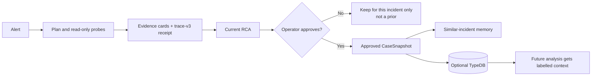
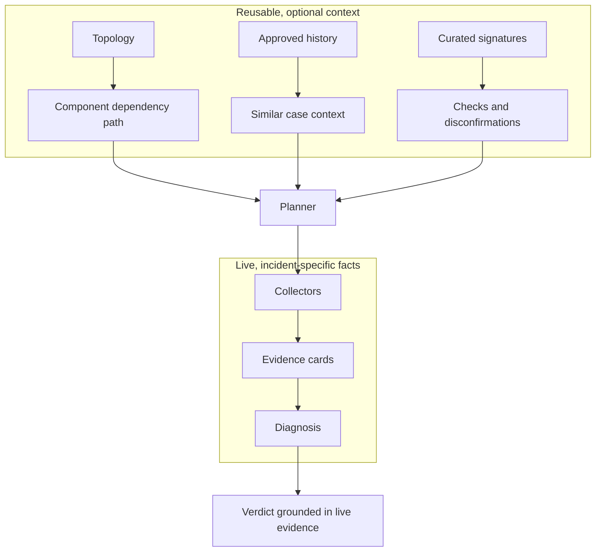
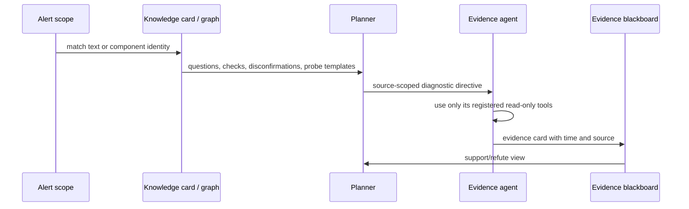

# Learning and Ontology, in Plain Language

> **In plain language:** learning is the team's reviewed casebook. Like a
> flight recorder plus a senior engineer's notebook, it remembers what happened
> only after a human says the lesson is trustworthy.

Run:AI RCA separates a current diagnosis from reusable knowledge. A diagnosis is
one claim about one incident. Evidence is the live observation that supports or
refutes that claim. A similar old incident can suggest a question, but it cannot
prove today's cause.

| Term | Plain meaning | Example |
| --- | --- | --- |
| Incident | A real operational event | A training job loses its GPU |
| Diagnosis | A claim about that event | “The GPU/driver path may have failed” |
| Probe | One bounded, read-only check | Read node journal lines |
| Evidence card | What a probe actually observed | Timestamped `Xid 79` line |
| Ontology | A map of things and their relationships | GPU Operator → driver daemonset |

## 1. The learning flow and its approval gate

| Gate | Why it exists | Result |
| --- | --- | --- |
| Operator approval | Stops guesses from teaching the system | Unapproved runs never become priors |
| Resolved/grace eligibility for ingest | Lets feedback and re-analysis settle | Stable approved cases enter TypeDB |
| Masked projection | Avoids copying raw sensitive material | Summary and evidence references, not logs/secrets |

This is not automatic self-training. Only `user_approved_at` cases are matched
as similar-incident memory and ingested into TypeDB. An approved unresolved RCA
may be retained as unresolved context, but it is not promoted as positive causal
knowledge. Re-analysis updates the same run's graph edges so stale evidence does
not linger.

## 2. What an ontology adds

| Knowledge layer | Question it can answer | What it cannot do |
| --- | --- | --- |
| Curated signature | “What does Xid 79 usually warrant checking?” | Declare today’s GPU failed |
| Component topology | “What should be checked before/after this service?” | Invent a component outage |
| Approved history | “Has a reviewed similar case existed?” | Supply a high-confidence proof |

TypeDB is optional enrichment. If it is disabled or unavailable, file-based
catalogs still guide the planner and collectors still produce an RCA. The report
records the gap rather than silently claiming graph reasoning happened.

## 3. How guidance becomes safe investigation

The diagnostic directive is deliberately declarative. It can say “inspect the
driver daemonset for this alert's node,” but it is never an executable command.
Only placeholders already present in the alert scope can be resolved. Kubernetes,
Loki, Prometheus, Run:ai, and Postgres agents each retain their own tool registry,
which is the actual permission boundary.

`trace-v3` is the investigation receipt. It records the hypothesis, probe,
time relation, source group, and whether an observation supported or refuted a
claim. It prevents later corroboration from being presented as if it was known
at alert time.

## 4. Worked example: Xid 79 from alert to verdict

1. An alert or Loki/System line says `NVRM: Xid ... 79` and “GPU has fallen off
   the bus.” The curated XID card matches before any family ranker decision.
2. The card identifies the GPU-hardware path and gives questions such as “is the
   driver reporting a persistent device loss?” plus disconfirmations such as a
   clean driver journal.
3. The planner gives relevant agents declarative, read-only probes. A component
   name such as `nvidia-driver-daemonset-...` can reach the same topology path
   even without the XID text.
4. The operator sees evidence cards: a timestamped Xid line, affected node,
   collection gaps, and the exact evidence IDs used by the RCA.
5. If independent live signals agree, the verdict can cite them. If they do not,
   the report says `insufficient_evidence` and retains the card as a next-check
   guide rather than claiming a hardware fault.

## 5. In depth: packages and the graph mirror

Backend Postgres is the authority for package approval, activation, and
retirement. A `shadow` package is observed but not active; `activate` explicitly
enables it; `approve` validates and activates it; `reject`/`retired` keep it out
of runtime use. The TypeDB package-mirror CronJob copies summaries and approved
template bindings for graph queries; it never changes activation.

For the catalog map, see [Knowledge Base](KNOWLEDGE-BASE.md). For entities,
relations, and safe TypeDB Studio checks, see [Ontology Guide](ONTOLOGY-GUIDE.md).
