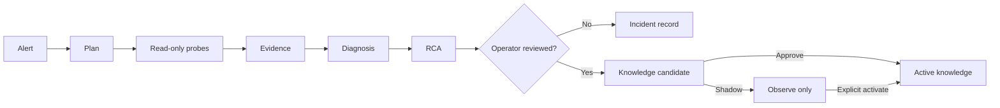

# Learning and Ontology, in Plain Language

> **In one sentence:** Run:AI RCA checks facts from several sources, keeps an auditable record, and only reuses cases that a human has reviewed.

This is a newcomer-friendly companion to the detailed [RCA Pipeline](RCA-PIPELINE.md) and [Ontology & Ingestion Guide](ONTOLOGY-GUIDE.md).

| Term | Plain meaning | Example |
| --- | --- | --- |
| **Incident** | A real outage event | A workload remains `Pending` |
| **Diagnosis** | One claim about that incident's cause | "GPU quota is likely exhausted" |
| **Probe** | A small, read-only check | Read pod events or a Prometheus metric |
| **Evidence** | The observation returned by a probe | An `Insufficient gpu` event |

A diagnosis is a claim; evidence is the observation that supports or refutes it. Similar past incidents are context, never proof of the current cause.

## From alert to reusable knowledge

The investigation loop prefers an unobserved collector, then an independent telemetry plane, then a probe that best distinguishes unresolved hypotheses, and finally plan affinity. All probes are structurally read-only: allowlisted Kubernetes GET/LIST calls, metrics/log queries, Run:ai GET requests, or read-only SQL.

## trace-v3: the investigation receipt

`trace-v3` records which hypothesis led to which probe, when it ran, and which evidence supported or refuted it. It records the evidence's incident-time relation and source group. Later corroboration remains useful, but is never presented as if it were known before the outage.

High-confidence diagnoses need two independent live sources or a confirmed signature. Otherwise the response must say `insufficient_evidence` rather than turn a plausible guess into a conclusion.

## Ontology and safe publication

The TypeDB ontology is a relationship map, not a replacement for live collection. It connects nodes, workloads, incidents, diagnoses, evidence, and verified actions. That enables questions such as "what else is affected?" and "what approved cases are related?" TypeDB is optional; the RCA still works when it is unavailable.

The migration is additive: existing RCA records remain intact. The trace-v3 backfill projects only eligible approved v3 records and never invents v3 facts from legacy v1/v2 traces.

Reviewed, valid trace-v3 cases can create a knowledge candidate. It contains only a minimal safe summary and approved probe-template identifiers, not raw logs, queries, or credentials. `shadow` keeps a package outside the Agent's active runtime snapshot; `activate` explicitly promotes it; `approve` activates a validated package immediately; `reject` or `retired` keeps it out of runtime use.

The dashboard and `GET /api/v1/knowledge/probe-metrics` use approved trace-v3 cases to show probe executions, support/refutation, and contribution to final diagnoses.

## Package mirror

Backend Postgres is the authority for package approval, activation, and retirement. The `typedb-package-mirror` CronJob only copies package summaries and template bindings to TypeDB for graph queries. It runs hourly by default (`0 * * * *`) and never changes runtime activation.

`package mirror: no packages` is normal: no approved or shadow package exists to copy yet. Disabling the mirror does not stop RCA or active runtime knowledge; only the TypeDB package projection can become stale.

For the detailed model and queries, see the [Ontology & Ingestion Guide](ONTOLOGY-GUIDE.md). For settings, see [Configuration](CONFIGURATION.md).
