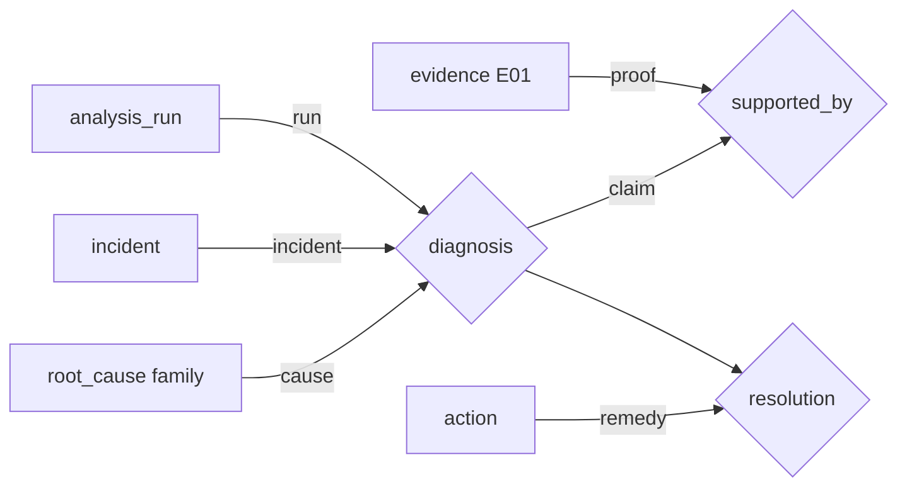

# Ontology and approved-RCA ingestion

TypeDB is the relational knowledge layer for RCA. It does not replace live
collectors: collectors establish facts about the incident now; TypeDB supplies
curated topology and approved historical context.

## The model

| Concept | TypeDB representation | Meaning |
| --- | --- | --- |
| Object | entity | `incident`, `analysis_run`, `symptom`, `root_cause`, `evidence`, `action`, component |
| Property | attribute | IDs, status, confidence, score, summary, approval time |
| Relationship | relation | `diagnosis`, `observed_symptom`, `supported_by`, `resolution`, `depends_on` |
| Role | relation role | A participant's meaning, for example `diagnosis(run, incident, cause)` |
| Reasoning function | `fun` | A read-only query-time derivation over those relationships |

The important distinction is that `root_cause` is a reusable family, while a
`diagnosis` is one run's claim about one incident. Evidence therefore supports a
**diagnosis**, not the global family entity.



`observed_symptom(run, incident, symptom, evidence)` records the concrete
evidence that established a symptom. `resolution(diagnosis, action)` is created
only when an operator marks the outcome as `resolved` or `mitigated`.

## Approval and ingestion

The TypeDB ingest CronJob selects only incidents that satisfy all of these:

- dashboard approval (`incidents.user_approved_at`);
- Alertmanager status `resolved` and the configured grace period;
- a latest analysis run with a current `analysis_hash`.

An approved but unresolved RCA is still useful for topology and evidence
history, but it is stored as `diagnosis_state=unresolved` and is never promoted
as positive cause knowledge. Raw artifact results, tokens, and credentials are
not copied into TypeDB; only a masked summary and `{run_id}:E##` reference are.

Re-analysis reuses the run ID. Ingest removes that run's old diagnosis and
support edges, then writes the latest hash and artifacts, so stale evidence
cannot survive as current evidence.

## Functions the Agent uses

| Function | Purpose | Runtime use |
| --- | --- | --- |
| `causes_for_symptom` | Curated family candidates for a live-matched symptom | bounded ranking bonus |
| `dependencies_for_component` / `checks_for_component_path` | Recursive component dependency and checks | investigation plan |
| `affected_workloads_for_node` | Node blast radius | impact context |
| `approved_incidents_for_cause` / `evidence_for_approved_cause` | Approved historical context | synthesis only |
| `verified_actions_for_family` | Actions confirmed effective by an operator | labelled historical guidance |
| `ancestor_xids_for` | Recursive XID causal chain | GPU remediation |

Historical context can never satisfy the current RCA's evidence gate or create
high confidence by itself. The ranker caps graph corroboration at two points and
still requires live evidence or a dispositive signature.

## Studio checks

Use these after the schema job and an approved-incident ingest.

```typeql
# Approved incidents only
match $i isa incident, has incident_id $id, has approved_at $at;
select $id, $at;
```

```typeql
# A run-scoped diagnosis and the evidence that supports it
match
  $r isa analysis_run, has run_id "ANL-...";
  $d isa diagnosis, links (run: $r, incident: $i, cause: $c);
  $s isa supported_by, links (claim: $d, proof: $e);
  $e has evidence_id $eid, has source $source, has summary $summary;
  $c has subtype $family;
select $family, $eid, $source, $summary;
```

```typeql
# Dependency reasoning for a component
match let $name in dependencies_for_component("runai-container-toolkit");
select $name;
```

```typeql
# Curated causes for a symptom already observed live
match let $family in causes_for_symptom("RunAIWorkloadPending");
select $family;
```

If TypeDB is unavailable, the Agent records the warning and falls back to the
curated YAML/Python path; RCA generation remains available.

## Operations

The Helm schema hook applies the additive schema and functions before the ingest
CronJob runs. Never rebuild `runai_rca` to apply this change. A live validation
test must use a temporary database and delete it in `finally`, so TypeDB Studio
does not accumulate validation databases.

See [Knowledge Base](KNOWLEDGE-BASE.md), [RCA Pipeline](RCA-PIPELINE.md), and
[Evaluation](EVALUATION.md).
