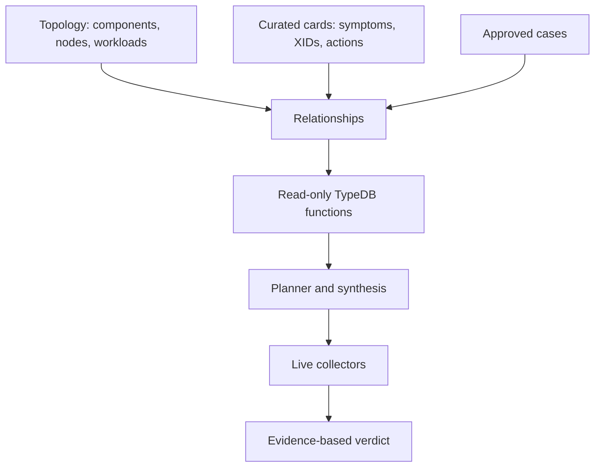
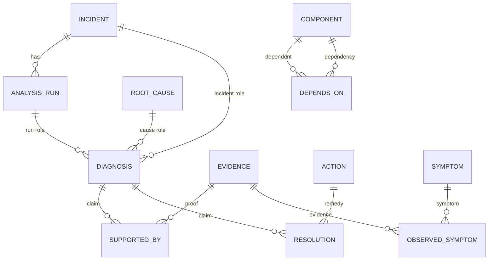
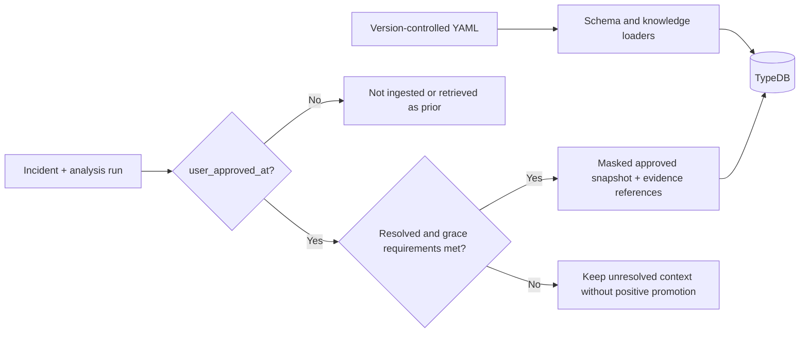
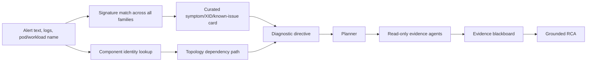

# Ontology and approved-RCA ingestion

> **In plain language:** the ontology is a labelled map of the platform and its
> reviewed experiences. Think of a transit map: it shows how places connect, but
> you still need live traffic reports to know what is blocked right now.

TypeDB is the optional relationship layer for Run:AI RCA. Collectors establish
live facts. The ontology supplies curated topology and operator-approved history.
If TypeDB is unavailable, the Agent continues through the YAML/Python path and
records the gap.

## 1. Four connected knowledge layers



| Layer | Stored things | Why it matters |
| --- | --- | --- |
| Topology | Components and dependencies | Gives a sensible check order |
| Curated knowledge | Symptoms, families, actions, XID chains, runbooks | Turns a signature into questions |
| Approved history | Reviewed incidents and runs | Provides labelled comparison context |
| Live evidence | Current collector observations | Is the only basis for current proof |

Read the diagram top to bottom. The graph can recommend *where to look*; it
cannot tell the report *what happened* without current evidence.

## 2. TypeDB schema: entities, relations, and roles



| Schema word | Meaning | Example |
| --- | --- | --- |
| Entity | A named thing | incident, component, evidence, action |
| Attribute | A property | `incident_id`, confidence, masked summary |
| Relation | A meaningful connection | `supported_by`, `depends_on` |
| Role | A participant's job in a relation | diagnosis is the claim; evidence is the proof |

A `root_cause` is a reusable family such as `gpu_hardware_error`. A `diagnosis`
is one run's claim about one incident. Evidence supports that diagnosis, not the
global family. `observed_symptom` records a symptom plus its evidence.
`resolution` is written only when an operator records `resolved` or `mitigated`.

## 3. Ingestion: how safe knowledge enters TypeDB



| Source | Gate | Safety property |
| --- | --- | --- |
| Schema/functions/catalogs | Version-controlled load job | Same curated facts as file matcher |
| Incident/RCA | Operator approval; normally resolved plus grace | Unapproved analyses never become priors |
| Verified remedy | Approved non-abstained outcome | Historical guidance, not current proof |

The ingest CronJob uses an immutable approved CaseSnapshot when available; it
does not substitute a later run. Re-analysis replaces old diagnosis/support
edges for its run. Raw artifacts, tokens, credentials, and arbitrary commands
are excluded: TypeDB receives masked summaries and `{run_id}:E##` references.

## 4. Retrieval during a live analysis



| Function use | Result | Boundary |
| --- | --- | --- |
| `causes_for_symptom` | Curated candidate families | Live match still required |
| `dependencies_for_component` / `checks_for_component_path` | Dependency-aware checks | Not an outage assertion |
| `affected_workloads_for_node` | Blast-radius context | Not causal proof |
| Approved-case/action functions | Labelled historical context | Cannot satisfy evidence gate |

Fine-grained signature matching is the retrieval entry point. It searches
failure-mode symptoms, NVIDIA XID codes, alert text, and known issues across all
families. The family ranker only orders candidates and supplies narrative. A
target component name can independently reach topology: a driver daemonset alert
can expose GPU Operator dependencies even without a matching error line.

The planner turns guidance into a `diagnostic_directive`: questions, checks,
alternative branches, disconfirmations, and declarative probe templates. Only
alert-scope placeholders resolve. No directive executes anything; each agent's
registered tool set is the enforcement boundary.

## 5. Worked example: NVIDIA Xid 79

| Moment | System behaviour | Operator-visible result |
| --- | --- | --- |
| Alert arrives | `NVRM: Xid ... 79` matches the XID/signature card | Specific GPU-hardware candidate |
| Context is found | Card and topology identify driver/GPU Operator checks | Ordered checks and disconfirmations |
| Evidence is collected | Relevant agents read logs, node state, and metrics | Timestamped evidence cards with source/scope |
| Verdict is made | Blackboard weighs support and refutation | Evidence IDs or `insufficient_evidence` |

The graph avoids a generic “GPU issue” response. It does not turn Xid text alone
into a verdict. Missing target scope, post-resolution observations, or
contradictory live evidence remain context rather than proof.

## 6. Studio checks and operations

Use the read-only CLI after the schema job and an approved-case ingest:

```bash
kubectl exec -n <ns> deploy/<release>-agent -- python -m ontology.query --recent 20
kubectl exec -n <ns> deploy/<release>-agent -- python -m ontology.query --incident INC-...
kubectl exec -n <ns> deploy/<release>-agent -- python -m ontology.query --count
```

### In depth: function and Studio reference

| Function | What it asks |
| --- | --- |
| `causes_for_symptom` | Which curated families fit one live-matched symptom? |
| `dependencies_for_component` / `checks_for_component_path` | What does this component depend on and what should be checked? |
| `affected_workloads_for_node` | What is the node blast radius? |
| `approved_incidents_for_cause` / `evidence_for_approved_cause` | Which approved cases are useful labelled context? |
| `verified_actions_for_family` | Which operator-confirmed action is historical guidance? |

```typeql
# A run-scoped claim and the evidence that supports it
match
  $r isa analysis_run, has run_id "ANL-...";
  $d isa diagnosis, links (run: $r, incident: $i, cause: $c);
  $s isa supported_by, links (claim: $d, proof: $e);
  $e has evidence_id $eid, has source $source, has summary $summary;
  $c has subtype $family;
select $family, $eid, $source, $summary;
```

The Helm schema hook applies additive schema/functions before the ingest CronJob.
Do not rebuild `runai_rca`; validate against a temporary database and remove it
afterward so TypeDB Studio does not collect test databases.

## Glossary (용어집)

| Term | Meaning |
| --- | --- |
| Ontology | A shared map of things and their meaningful relationships |
| TypeDB | The optional database that stores and queries that map |
| Entity / relation / attribute | A thing / its connection / one of its properties |
| Family | A broad root-cause category shared by catalogs |
| Signature | Specific text or code that recognises a symptom or known issue |
| Symptom | A named observable pattern, such as an XID or scheduling event |
| Known issue | Curated product behaviour/bug with version-aware context |
| Probe | One bounded, read-only evidence check |
| Diagnostic directive | Planner guidance: questions, checks, branches, and safe templates |
| Blackboard | The evidence ledger that compares support and refutation |
| Evidence card | An operator-readable record of one probe observation |

See [Knowledge Base](KNOWLEDGE-BASE.md), [Learning and Ontology](LEARNING-AND-ONTOLOGY.md), and [RCA Pipeline](RCA-PIPELINE.md).
