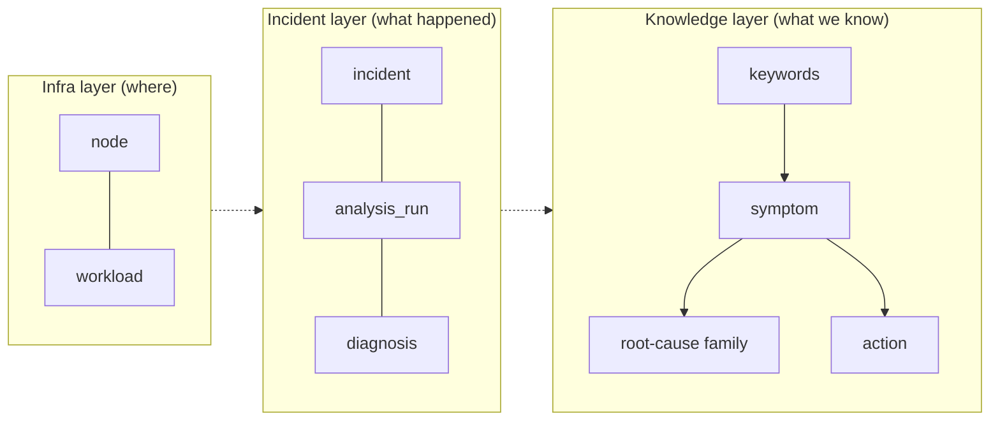
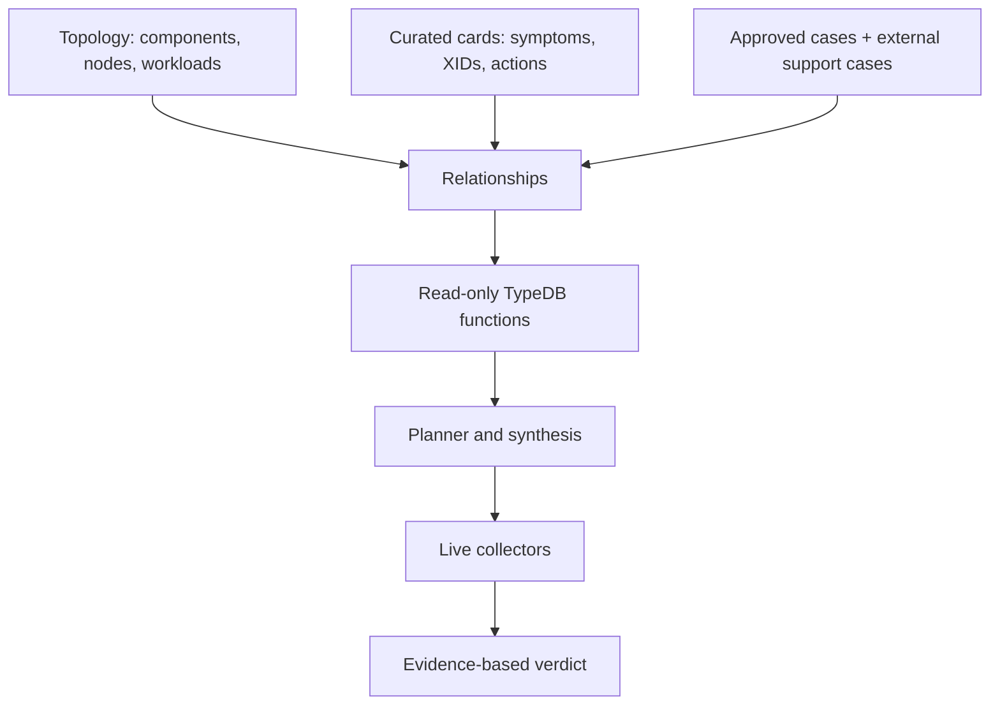
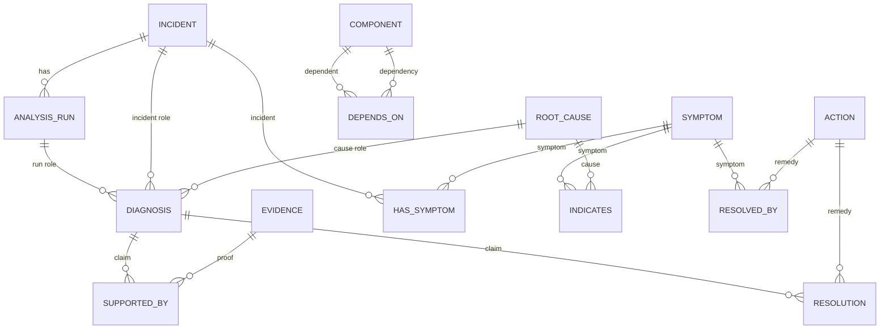
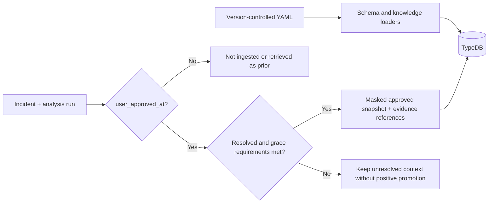
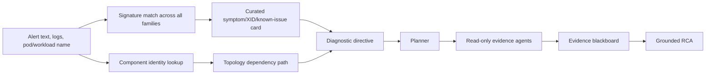

# Ontology and approved-RCA ingestion

> **In plain language:** the ontology is a labelled map of the platform and its
> reviewed experiences. Think of a transit map: it shows how places connect, but
> you still need live traffic reports to know what is blocked right now.

TypeDB is the optional relationship layer for Run:AI RCA. Collectors establish
live facts. The ontology supplies curated topology and operator-approved history.
If TypeDB is unavailable, the Agent continues through the YAML/Python path and
records the gap.

## 0. The one-page mental model

If you remember one picture, make it this one — three layers, one chain:


```mermaid
flowchart LR
  subgraph INFRA["Infra layer (where)"]
    N[node] --- W[workload]
  end
  subgraph INCIDENT["Incident layer (what happened)"]
    I[incident] --- RUNX[analysis_run] --- D[diagnosis]
  end
  subgraph KNOWLEDGE["Knowledge layer (what we know)"]
    K[keywords] --> SY[symptom] --> F[root-cause family]
    SY --> AC[action]
  end
  INFRA -.-> INCIDENT
  INCIDENT -.-> KNOWLEDGE
```

And one sentence: **observed keywords match a symptom; the symptom names its
family (the mechanism) and carries its confirmed actions.** Everything else —
runbooks, probes, cases, packages — exists to feed or verify that chain.
Curated YAML, operator-approved incidents, and vendor-support external cases
all write the *same* chain, so one retrieval path serves all three.

## 1. Four connected knowledge layers


```mermaid
flowchart TB
  T[Topology: components, nodes, workloads] --> R[Relationships]
  C[Curated cards: symptoms, XIDs, actions] --> R
  H[Approved cases + external support cases] --> R
  R --> Q[Read-only TypeDB functions]
  Q --> P[Planner and synthesis]
  P --> L[Live collectors]
  L --> V[Evidence-based verdict]
```

| Layer | Stored things | Why it matters |
| --- | --- | --- |
| Topology | Components and dependencies | Gives a sensible check order |
| Curated knowledge | Symptoms, families, actions, XID chains, runbooks | Turns a signature into questions |
| Approved history | Reviewed incidents and runs | Provides labelled comparison context |
| Live evidence | Current collector observations | Is the only basis for current proof |

Read the diagram top to bottom. The graph can recommend *where to look*; it
cannot tell the report *what happened* without current evidence.

## 2. TypeDB schema: entities, relations, and roles


```mermaid
erDiagram
  INCIDENT ||--o{ ANALYSIS_RUN : has
  ANALYSIS_RUN ||--o{ DIAGNOSIS : "run role"
  INCIDENT ||--o{ DIAGNOSIS : "incident role"
  ROOT_CAUSE ||--o{ DIAGNOSIS : "cause role"
  DIAGNOSIS ||--o{ SUPPORTED_BY : claim
  EVIDENCE ||--o{ SUPPORTED_BY : proof
  DIAGNOSIS ||--o{ RESOLUTION : claim
  ACTION ||--o{ RESOLUTION : remedy
  COMPONENT ||--o{ DEPENDS_ON : dependent
  COMPONENT ||--o{ DEPENDS_ON : dependency
  INCIDENT ||--o{ HAS_SYMPTOM : incident
  SYMPTOM ||--o{ HAS_SYMPTOM : symptom
  SYMPTOM ||--o{ INDICATES : symptom
  ROOT_CAUSE ||--o{ INDICATES : cause
  SYMPTOM ||--o{ RESOLVED_BY : symptom
  ACTION ||--o{ RESOLVED_BY : remedy
```

| Schema word | Meaning | Example |
| --- | --- | --- |
| Entity | A named thing | incident, control_plane_component, evidence, action |
| Attribute | A property | `incident_id`, confidence, masked summary |
| Relation | A meaningful connection | `supported_by`, `depends_on` |
| Role | A participant's job in a relation | diagnosis is the claim; evidence is the proof |

A `root_cause` is a reusable family such as `gpu_hardware_error`. A `diagnosis`
is one run's claim about one incident. Evidence supports that diagnosis, not the
global family. `indicates` and `resolved_by` are the knowledge chain
(symptom → family, symptom → confirmed action); `has_symptom` links an incident
to the symptoms it exhibited. `resolution` is written only when an operator
records `resolved` or `mitigated`.

The current schema has **16 operational families + 3 auxiliary states**: the
16 `failure_modes.yaml` families are operator-facing, while
`platform_version_bug`, `expected_known_behavior`, and `insufficient_evidence`
are supporting classification states. Together with `cause_instance sub root_cause`,
that is 20 `root_cause` subtypes total; the closed vocabulary is intentionally
unchanged.

Runbooks appear twice on purpose: one *executable* runbook holds every
diagnostic step (the walk and all probe IDs live there), and per-domain
runbooks (`…:domain:gpu_stack`, `…:domain:runai_scheduling`, …) group the same
steps so browsing shows the real coverage instead of "Kubernetes only".
External support cases add per-case playbook runbooks (`ext:…:playbook`) with
the diagnostic steps the vendor thread actually walked.

## 3. Ingestion: how safe knowledge enters TypeDB


```mermaid
flowchart LR
  Y[Version-controlled YAML] --> L[Schema and knowledge loaders]
  L --> T[(TypeDB)]
  I[Incident + analysis run] --> A{user_approved_at?}
  A -->|No| N[Not ingested or retrieved as prior]
  A -->|Yes| E{Resolved and grace requirements met?}
  E -->|Yes| M[Masked approved snapshot + evidence references]
  E -->|No| U[Keep unresolved context without positive promotion]
  M --> T
```

| Source | Gate | Safety property |
| --- | --- | --- |
| Schema/functions/catalogs | Version-controlled load job | Same curated facts as file matcher |
| Incident/RCA | Operator approval; normally resolved plus grace | Unapproved analyses never become priors |
| Verified remedy | Approved non-abstained outcome | Historical guidance, not current proof |
| External support case | Curator-approved bundle in the repo; loaded by the ingest CronJob | Trusted vendor knowledge: enters the same symptom→family→action chain; only support-confirmed actions become `resolved_by`, diagnostic steps become a per-case playbook |

The ingest CronJob uses an immutable approved CaseSnapshot when available; it
does not substitute a later run. Re-analysis replaces old diagnosis/support
edges for its run. Raw artifacts, tokens, credentials, and arbitrary commands
are excluded: TypeDB receives masked summaries and `{run_id}:E##` references.

## 4. Retrieval during a live analysis


```mermaid
flowchart LR
  A[Alert text, logs, pod/workload name] --> S[Signature match across all families]
  A --> C[Component identity lookup]
  S --> K[Curated symptom/XID/known-issue card]
  C --> T[Topology dependency path]
  K --> D[Diagnostic directive]
  T --> D
  D --> P[Planner]
  P --> E[Read-only evidence agents]
  E --> B[Evidence blackboard]
  B --> R[Grounded RCA]
```

| Function use | Result | Boundary |
| --- | --- | --- |
| `causes_for_symptom` | Curated candidate families | Live match still required |
| `dependencies_for_component` / `checks_for_component_path` | Dependency-aware checks | Not an outage assertion |
| `_BLAST_QUERY` | Blast-radius context | Not causal proof |
| `_PRIOR_QUERY` → `_CASE_CARD_QUERY` | Labelled historical CaseCard context | Cannot satisfy evidence gate |
| `_KNOWLEDGE_QUERY` (including promoted `confirmed:{alert_name}` symptoms) | Symptom-specific remediation | Live match still required |
| `_FN_DIAGNOSTIC_TRANSITIONS` | Diagnostic-tree transitions | Read-only planner guidance |

Fine-grained signature matching is the retrieval entry point. It searches
failure-mode symptoms, NVIDIA XID codes, alert text, and known issues across all
families. The family ranker only orders candidates and supplies narrative. A
target component name can independently reach topology: a driver daemonset alert
can expose GPU Operator dependencies even without a matching error line.

The planner turns guidance into a `diagnostic_directive`: questions, checks,
alternative branches, disconfirmations, and declarative probe templates. Only
alert-scope placeholders resolve. No directive executes anything; each agent's
registered tool set is the enforcement boundary.

## 5. Worked example: NVIDIA Xid 79

| Moment | System behaviour | Operator-visible result |
| --- | --- | --- |
| Alert arrives | `NVRM: Xid ... 79` matches the XID/signature card | Specific GPU-hardware candidate |
| Context is found | Card and topology identify driver/GPU Operator checks | Ordered checks and disconfirmations |
| Evidence is collected | Relevant agents read logs, node state, and metrics | Timestamped evidence cards with source/scope |
| Verdict is made | Blackboard weighs support and refutation | Evidence IDs or `insufficient_evidence` |

The graph avoids a generic “GPU issue” response. It does not turn Xid text alone
into a verdict. Missing target scope, post-resolution observations, or
contradictory live evidence remain context rather than proof.

## 6. Studio checks and operations

Use the read-only CLI after the schema job and an approved-case ingest:

```bash
kubectl exec -n <ns> deploy/<release>-agent -- python -m ontology.query --recent 20
kubectl exec -n <ns> deploy/<release>-agent -- python -m ontology.query --incident INC-...
kubectl exec -n <ns> deploy/<release>-agent -- python -m ontology.query --count
```

### In depth: runtime query and Studio reference

| Runtime path | What it asks |
| --- | --- |
| `causes_for_symptom` | Which curated families fit one live-matched symptom? |
| `dependencies_for_component` / `checks_for_component_path` | What does this component depend on and what should be checked? |
| `_BLAST_QUERY` | What is the node blast radius? |
| `_PRIOR_QUERY` → `_CASE_CARD_QUERY` | What CaseCard belongs to a prior same-alert incident? |
| `_KNOWLEDGE_QUERY` (including promoted `confirmed:{alert_name}` symptoms) | Which action matches a live symptom? |
| `_FN_DIAGNOSTIC_TRANSITIONS` | Which transitions continue this diagnostic tree? |

```typeql
# A run-scoped claim and the evidence that supports it
match
  $r isa analysis_run, has run_id "ANL-...";
  $d isa diagnosis, links (run: $r, incident: $i, cause: $c);
  $s isa supported_by, links (claim: $d, proof: $e);
  $e has evidence_id $eid, has source $source, has summary $summary;
  $c has subtype $family;
select $family, $eid, $source, $summary;
```

The Helm schema hook applies additive schema/functions before the ingest CronJob.
Do not rebuild `runai_rca`; validate against a temporary database and remove it
afterward so TypeDB Studio does not collect test databases.

## Glossary (용어집)

| Term | Meaning |
| --- | --- |
| Ontology | A shared map of things and their meaningful relationships |
| TypeDB | The optional database that stores and queries that map |
| Entity / relation / attribute | A thing / its connection / one of its properties |
| Family | A broad root-cause category shared by catalogs |
| Signature | Specific text or code that recognises a symptom or known issue |
| Symptom | A named observable pattern, such as an XID or scheduling event |
| Known issue | Curated product behaviour/bug with version-aware context |
| Probe | One bounded, read-only evidence check |
| Diagnostic directive | Planner guidance: questions, checks, branches, and safe templates |
| Blackboard | The evidence ledger that compares support and refutation |
| Evidence card | An operator-readable record of one probe observation |

See [Knowledge Base](KNOWLEDGE-BASE.md), [Learning and Ontology](LEARNING-AND-ONTOLOGY.md), and [RCA Pipeline](RCA-PIPELINE.md).
