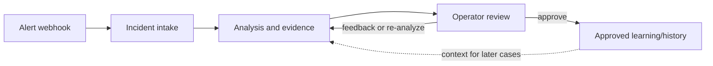

# Operating Model

> **Lens:** How it behaves — what the system does, and the lines it won't cross.
> **In this doc:** supported signals · intake/analysis triggers · runtime status semantics · agent role contracts · RCA boundaries · degraded mode.

Run:AI RCA is read-only by default.

**A simple mental model:** the service is a case desk. It receives a signal,
opens a case, asks read-only questions, lets an operator review the answer, and
only then lets that reviewed case inform future investigations.

This is a workflow, not autonomous remediation. Feedback can ask for a fresh
analysis. Approval is a separate human decision that controls learning; it never
changes a cluster resource.

## Supported Signals

- Alertmanager webhooks
- Run:ai control plane metadata
- Kubernetes pod, workload, event, node, and manifest state
- Postgres RCA store, pgvector, connection, and write-path health
- Prometheus metrics
- Loki logs

## Intake And Analysis Triggers

Automatic RCA is webhook-driven. Alertmanager must route matching alerts to
Backend `POST /webhook/alertmanager`; receiving the same alert in Slack only
proves that the Slack receiver matched. It does not prove that the RCA webhook
receiver matched or that Alertmanager could reach the Backend service.

Every accepted webhook alert is stored, correlated into an incident, and then
starts an asynchronous Agent `/analyze` call. Operators can also create analysis
runs manually from incident analysis, comment/feedback reanalysis, or chat
requests that explicitly ask for a new analysis. When chat does not specify a
target incident or alert, Backend selects the latest non-resolved alert if one
exists. The Analysis Dashboard is backed by `/api/v1/analysis-runs`; if that
list is empty, no analysis trigger has reached the Backend yet.

When an already analyzed alert auto-refires within
`AUTO_REANALYZE_COOLDOWN_MINUTES` (default `360`), Backend returns its existing
run unchanged. After the cooldown, it re-analyzes that run in place, so each
incident keeps a single RCA run that evolves over time. The last-good RCA
content and any not-yet-delivered Slack notifications are kept while the
re-analysis runs and if it fails; only a new success replaces the report.
Setting `0` or less disables auto re-analysis, so the existing run is always
reused. Re-activated incidents move to the top of the incident list by recent
activity.

## Runtime Status Semantics

Kubernetes `Running` and Agent `/healthz` confirm that processes are alive, but
they do not mean collector evidence has been produced. The Agents view marks a
collector `ok` only after recent RCA data contains at least one artifact from
that collector. If no artifact is attached yet, the UI shows `pending` even when
all pods are healthy.

Agent `/healthz` reports `nemo_runtime` as `enabled` or `fallback`.
`enabled` means the in-process NAT engine orchestrates the pipeline stages.
`fallback` means the same pipeline ran directly because the engine was disabled
or failed. Both modes are in-process and produce complete RCAs; this is not a
chat-specific LLM readiness signal.

## Agent Role Contracts

- RunAI Agent uses the Run:ai API for workload, project, queue, quota, priority,
  and scheduling context. It does not run the `runai` CLI by default.
- Kubernetes Agent inspects workload pods/events, Run:ai control-plane pod
  health, namespace scans, node conditions, and Kubernetes scheduling blockers.
- Prometheus Agent inspects queue/project GPU metrics and pod or namespace
  resource signals.
- Loki Agent inspects workload logs plus Run:ai control-plane/backend logs from
  `runai` and `runai-backend` by default.
- Postgres Agent inspects RCA store connectivity, pgvector, embeddings,
  feedback, comments, and memory health. With `RUNAI_DB_DSN` set it can also
  read the Run:ai control-plane database (workloads/audit/… schemas) during
  drill-down.
- Store/Postgres ownership includes verifying the target database exists, the
  backend user can create/update RCA tables, and pgvector is installed plus
  enabled with `CREATE EXTENSION vector;` when true pgvector readiness is
  required. Without pgvector, the backend should remain healthy with JSONB
  sparse-vector memory fallback.
- System Agent inspects node infrastructure below Kubernetes — dmesg/journalctl/
  syslog for kernel, GPU driver / NVIDIA XID, OOM, and hardware errors — via a
  per-node DaemonSet.
- Change Agent answers "what changed?" around the alert window: recently-bumped
  controllers, new/deleting pods, node-condition transitions, and recent events.

Each evidence agent can additionally run its own bounded, read-only drill-down
loop (`ENABLE_AGENT_DRILLDOWN`) scoped to its own domain's tools. The
orchestration flow that ties these together is the [RCA Pipeline](RCA-PIPELINE.md).

For timestamped alerts, collectors retain a collection window from five minutes
before firing through five minutes after resolution (a firing alert is bounded
to 15 minutes). A post-resolution epilogue remains visible as recovery context,
but occurrence evidence in Postgres, Change, System, and Loki is promoted only
inside the causal window ending at resolution. Change history starts one hour before
the fired time; its drill-down `lookback_seconds` may widen that historical
range from 60 to 86,400 seconds. Successful change results are cached for about
120 seconds only within one analysis, so a later re-analysis recollects fresh.
- Analysis Agent produces the KubeRCA-style dashboard RCA: root cause,
  confidence, impact, missing data, recommended manual actions, prevention, and
  evidence coverage.
- Chat Agent runs an agentic loop over read-only cross-domain drill-down tools
  and can trigger an on-demand RCA. It is grounded in the same TypeDB knowledge
  graph as the pipeline, including prior cases, per-family knowledge, and blast
  radius. Drill-down defaults to the loaded incident/alert target; a frontend
  context picker provides an explicit cluster scope. The deterministic,
  context-grounded answer is the fallback only when no chat LLM is configured.
  If chat is opened from a dashboard page without attached incident or alert RCA
  content, Backend attaches dashboard and analysis-run state so Chat can report
  current alert counts, latest run state, agent timeout/failure warnings,
  database state, and runtime mode.

## RCA Boundaries

The system can:

- explain likely root cause
- list supporting evidence
- identify missing evidence
- recommend manual next steps
- compare to previous incidents

The system must not:

- delete workloads
- change queues or quotas
- restart pods
- mutate Kubernetes resources
- perform autonomous remediation

## Degraded Mode

Each collector reports `ok`, `partial`, or `unavailable`. The final RCA should
prefer transparent partial answers over pretending all integrations worked.
