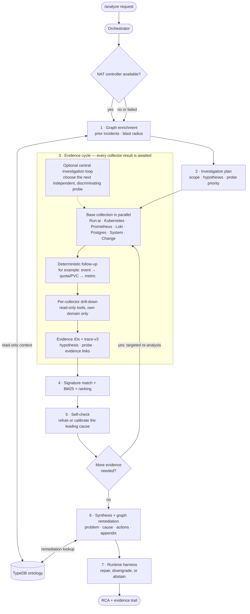
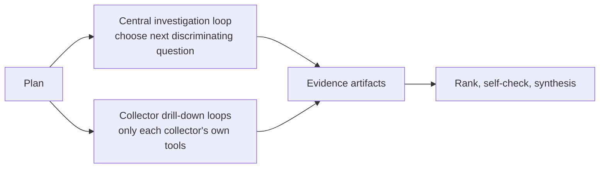

# RCA Pipeline

> **Lens:** How the Agent turns one alert into one grounded RCA — every stage,
> in order.
> **In this doc:** the orchestrator flow · planner · 7 collectors · central
> investigation loop · per-collector autonomous drill-down · signature matching +
> BM25 recall · ranking · self-check / re-analysis · synthesis · runtime harness · evidence
> presentation · safety envelope.

The Agent is **not** a single prompt. It is a component-oriented multi-agent
pipeline run by one orchestrator (`agent/app/services/orchestrator.py`) under a
single overall deadline. Every LLM stage is optional: with no LLM configured, or
on any failure, the pipeline degrades to its deterministic path and still
produces a report. The seven pipeline stages run as NAT functions under the
`runai_rca_pipeline` controller workflow (`agent/configs/runai_rca_engine.yml`),
which is built once at startup. If the NAT engine is disabled or fails, the same
stages run directly in process as the failure fallback.

**A simple mental model:** the pipeline is a careful investigation checklist.
It first learns the alert's scope, then gathers facts, challenges its own
conclusion, and checks that the written RCA says no more than the facts support.

`trace-v3` is the only public and persisted reasoning contract. It records the
exact `selected_hypothesis_id`; an open-world selection also carries its
`mechanism_fingerprint`. The internal hypothesis ledger remains transient, and
operational budget stops remain in logs/progress events rather than the trace.

The whole run is wrapped in `asyncio.wait_for(analyze, ANALYSIS_DEADLINE_SECONDS)`
(default **900s / 15 min**). On overrun it returns a graceful degraded report,
never a hang. Per-step ceilings are generous *on purpose* (deep evidence beats
fast-but-shallow); the overall deadline is the real bound. The backend's
`AGENT_REQUEST_TIMEOUT_SECONDS` (960s) must stay above it.

## Stage guide: what enters, leaves, and can stop a stage

| Stage | Input → output | What can stop or limit it |
| --- | --- | --- |
| Enrich | Alert target → approved history/topology context | TypeDB is optional; no graph is a warning, not a stop |
| Plan | Alert + context → scoped hypotheses and probes | Missing labels reduce scope, never authorize broad writes |
| Evidence | Plan → collector artifacts | Per-source failure becomes partial/unavailable evidence |
| Rank | Artifacts → ordered candidates | Signatures still need supporting live evidence |
| Self-check | Leading candidate → caveat/re-analysis need | LLM is optional; deadline bounds extra work |
| Synthesize | Evidence → operator-readable RCA | 24k evidence budget; no invented facts |
| Harness | Draft → repaired, downgraded, or abstained response | Hard evidence gate can return `insufficient_evidence` |

The central loop chooses between evidence planes. A collector drill-down stays
inside one plane. Both are read-only and stop on completion, duplicate work, or
the overall deadline.

---

## 1. Planner — think first

`agent/app/services/planner.py` builds an `InvestigationPlan` from the alert
labels, target, knowledge-graph context, and any vector-similar incidents
**before any collector runs**, so agents stop always scraping the whole Run:ai
control plane (the #1 accuracy complaint).

- **Deterministic core** (always): keyword/label heuristics scope each collector
  and order hypotheses by failure family.
- **Namespace routing**: a platform-namespace alert (`runai` / `runai-backend`)
  widens to broad k8s + system evidence; a user-workload namespace focuses on the
  Run:ai scheduler subsystem.
- **Optional LLM refine**: sharpens focus/hypotheses/strategy when an LLM is
  configured. Any failure → the deterministic plan stands.

## 2. Parallel evidence collectors (7)

Each collector owns one domain and returns a `CollectorResult` (summary +
`artifacts`). They run concurrently via `asyncio.gather`.

| Collector | Owns |
|---|---|
| **runai** | Run:ai workload/project/queue/quota/version context (optionally via the [official Run:ai MCP service](#run-ai-mcp-service), focused read-only set of 16 tools) |
| **kubernetes** | Workload pods/events, Run:ai control-plane pod health, node conditions, scheduling blockers; optional denylist-gated read-only pod-exec |
| **prometheus** | Queue/project GPU metrics, pending/restart/resource signals |
| **loki** | Workload logs + `runai`/`runai-backend` control-plane logs |
| **postgres** | RCA-store health: pgvector, embeddings, feedback, persistence |
| **system** | Node infra below Kubernetes — dmesg/journalctl/syslog, NVIDIA XID/NVRM/OOM/MCE via a per-node DaemonSet |
| **change** | *"What changed?"* — recently-bumped controllers, new/deleting pods, node-condition transitions, recent events |

Collector ceilings are generous (120s each) so evidence is deep; a single slow
collector still fails gracefully to `unavailable`. Sensitive values are masked
(`agent/app/masking.py`) before any evidence leaves a collector.

### Evidence time, scope, and transport rules

- The collection window is fired minus five minutes through resolved plus five
  minutes; a firing alert is capped at 15 minutes. The post-resolution epilogue
  remains context, while causal promotion in Postgres, Change, System, and Loki
  ends at resolution (all share one `causal_evidence_time_range`).
- Kubernetes keeps five most unhealthy/time-relevant, time-sorted Pods and Events
  with omitted counts, preserves Warning aggregation plus Normal `Preempted`
  workload/PodGroup events, includes
  node cordon/taint state, and follows Run:ai CRD pagination for up to three
  pages while surfacing per-kind failures. Historical logs keep their oldest
  lines only when the direct request actually honored `sinceTime`; MCP tails
  keep their newest lines.
  Cordoned (`SchedulingDisabled`) nodes are collected as scoped cordon artifacts
  and can be promoted to a root cause of unschedulable Pods only when a live
  unschedulable symptom is present; after it resolves, they remain low confidence.
- Loki verifies scope against full returned lines and samples multiple streams
  round-robin from their newest entries. Prometheus scales range-query step to
  the requested window (up to about 1,000 points), escapes label values, and
  accepts RFC3339 plus epoch-second/millisecond sample timestamps. Empty native
  Prometheus results can be scoped absence; MCP/proxy empties are context.
- Run:ai current-state presence is not incident-time proof: `present/scoped`
  requires an in-window payload timestamp. During a firing alert, only an
  immutable workload-ID 404 establishes scoped absence; name-keyed project/queue
  404s remain context. Partial MCP snapshots are retained and receive direct
  supplements for failed or explicitly empty equivalents; queue-labelled alerts
  also receive one direct queue lookup, with any gap exposed as `runai.queue_scope`.
- Run:ai control-plane Postgres reads pin UTC and disclose the UTC assumption
  for naive audit timestamps. Individual audit-table failures, discovery caps,
  and named control-plane connection failures remain visible without erasing
  other collected evidence.

## 3. Deterministic follow-up

Independent of the LLM, `k8s_followup` + `prometheus_followup` chase findings:
a `Pending` pod pulls its events → resourcequota → PVC → storageclass; an
OOM/restart pulls derived PromQL. This keeps collection iterative even when no
LLM is available.

## 4. Per-collector autonomous drill-down

`agent/app/services/drilldown.py` (`ENABLE_AGENT_DRILLDOWN`, Helm default on).
After the base gather, **each evidence agent runs its own adaptive LLM loop** over
its own evidence and decides read-only follow-up queries in its own domain.

**Tool scoping is structural, not prompt-based** — each loop receives *only* its
domain's tool registry, so the kubernetes agent can never call the Run:ai API and
vice versa:

| Agent | Drill-down tool | Read-only guarantee |
|---|---|---|
| kubernetes | `k8s_read` | 18-kind allowlist, GET/LIST only (no secrets) |
| prometheus | `promql_query` | query endpoint only |
| loki | `logql_query` | range query only |
| runai | `runai_api_search` + `runai_api_get` | GET-only, path must start `/api/` (method hardcoded) |
| postgres | `sql_select` | single `SELECT`/`WITH`, READ ONLY transaction, auto `LIMIT 50` |

The postgres agent queries the **Run:ai control-plane database itself** when
`RUNAI_DB_DSN` is set (workloads/audit/authorization/… schemas) — not just the
RCA store. The tool description is enriched with schema ownership from the
[architecture topology](KNOWLEDGE-BASE.md#platform-architecture-topology), so the
loop knows where to look.

It continues until the agent is done, repeats a query, or reaches the analysis
deadline. Unavailable collectors and unconfigured data
sources are skipped; it never raises. Untrusted log/event text feeds
these loops, so the [prompt-injection guard](#safety-envelope) rides on every
decision.

### Central investigation loop

Distinct from per-collector drill-down: `agent/app/services/investigator.py`
(`ENABLE_INVESTIGATION_LOOP`, Helm default on) is the **cross-domain router**. An
LLM decides which collector to probe next and can run ad-hoc read-only Kubernetes
reads across the same 18-kind allowlist. Its default `MAX_INVESTIGATION_STEPS=0`
means semantic completion: explicit conclusion, duplicate/exhausted probes, or
the overall analysis deadline — not a fixed agent-step quota. Synthesis always
waits for *all* collectors — an early/partial synthesis would produce a
confident-but-wrong RCA.

The Kubernetes diagnostic tree is projected as questions, checks, structured
read-only probes, interpretations, avoid guidance, and explicit
disconfirmations. Every terminal branch also states its confidence boundary, so
an evidence agent can leave a plausible branch when contradictory live evidence
appears instead of treating the runbook as a list of answers.

## 5. Signature matching + BM25 recall + ranking

The retrieval entry point is the **fine-grained signature match**, not the coarse
family ranker:

1. **Built-in alert** matched by name (`runai_alerts_catalog.yaml`).
2. **Known issue** matched by keyword signature, version-aware
   (`runai_known_issues.yaml` — issues fixed in the running version are dropped).
3. **Failure-mode symptom** matched by keyword across **all** families
   (`failure_modes.yaml`).
4. **NVIDIA XID** codes extracted from evidence + the alert's own text.

When no curated substring matches, a conservative **BM25 + synonym** pass
(`agent/app/bm25.py`, stdlib) recovers vocabulary drift (`evicted` → `preempt`/
`reclaim`, `job` → `workload`). It queries the alert text only, is tagged
`matched_via: "bm25"`, and never headlines a cause — it only surfaces candidates
the verify pass can still refute. See
[Knowledge Base](KNOWLEDGE-BASE.md) for the catalogs.

**Ranking** (`root_cause_ranking.py`, rules R1–R6) deterministically *orders*
candidates and gates confidence — it is not the retrieval engine and its score is
not a probability. Typed observations are scored once per unique evidence fact
(canonical collector `+2`, corroborating collector `+1`, at most three facts per
collector); repeated keywords inside one fact do not multiply its weight. Legacy
untyped collector output keeps a capped keyword-compatibility path until it is
migrated. Rule, topology, lifecycle, feedback-prior, and live-symptom ontology
adjustments are recorded separately in `score_breakdown`.

Kubernetes container waiting/terminated `reason` values are handled as a closed
kubelet vocabulary when the collector publishes them as structured
`observation.container_reason`. The ranker matches these tokens exactly against
the maintained reason-to-family table, bypassing free-text negation heuristics;
an unmapped reason is logged as a coverage warning. Free-text logs, events, and
annotations continue to use the compatibility keyword path.

Candidate order prefers: no unresolved contradiction, calibrated confidence,
independent telemetry groups, then numeric score. Medium starts at `2`; high
requires score `5` plus two independent live source groups (or a dispositive
`force_high` signature). A scoped contradiction holds the candidate at low, and
an unavailable canonical source downgrades it one level. `_promote_signature_cause`
then applies the most specific verified signature (XID > known-issue > symptom >
ranker). Every promoted candidate retains its evidence IDs and score diagnostics.

## 6. Self-check → re-analysis → verify

- **Refute** (`self_check.refute_top_cause`): a skeptical senior-SRE pass tries to
  refute the top cause using only eligible, family-relevant support and
  contradiction facts, calibrates its confidence, and writes a one-line caveat +
  next check. The self-check does not calculate or consume the ranker's numeric
  score.
- **Re-analysis**: if refuted or evidence remains insufficient, a targeted
  re-analysis pass follows the next discriminating hypothesis until semantic
  completion or the analysis deadline. `MAX_REANALYSIS_STEPS=0` is the default;
  a positive value is legacy compatibility only. It is hard-guarded to never
  re-enter `analyze()`.
- **Verify matches** (`verify_matches`): a skeptical pass drops keyword/signature
  matches (known issues, symptoms, XIDs) the evidence doesn't actually support.

If signature verification changes the headline, the replacement candidate is
self-checked before synthesis. If the current leader is refuted and no already
ranked alternative survives the same check, the pipeline emits
`insufficient_evidence`; it does not synthesize the refuted cause.

## 7. Ontology enrichment

The **orchestrator** consults the optional TypeDB knowledge graph (not a parallel
collector) — see [Knowledge Base](KNOWLEDGE-BASE.md#typedb-ontology):

- `enrich()`: node **blast radius** (how many workloads share the alerting node)
  and **prior same-alert incidents** with their stored RCA.
- `graph_remediation()`: `fixes_for_family`, `fixes_for_xid`, and reverse
  `leads_to` **root-XID chains** (fix the origin, not the downstream symptom).

Degrades to empty when TypeDB is off/unreachable; never raises.

## 8. Synthesis

`_detail_from` builds the deterministic report — **Problem → Root Cause →
Recommended Actions → Appendix** — the ~1-page document an operator (or a Word
export) reads. When `language=ko` and an LLM is configured, `_synthesize_korean`
rewrites summary + detail grounded **strictly** in the evidence, falling back to
the deterministic English report on any failure.

Synthesis receives up to six artifacts per collector role, selected salience-first
while always retaining the newest artifact, under a 24,000-character evidence
budget. The skeptical self-check uses the same selection and a separate
24,000-character whole-line digest cap.

The **Troubleshooting Playbook** section appends, for any implicated platform
component, its failure effect, its BFS **dependency check order** (e.g.
`cluster-sync → status-updater → runai-backend-traefik`), and its ready-to-run
`kubectl` checks — from the [architecture topology](KNOWLEDGE-BASE.md#platform-architecture-topology).

## 9. Runtime harness

After synthesis, the response-boundary harness assigns stable response-local
artifact IDs (`E01`, `E02`, …), creates a root-cause claim ledger, and validates
the report before it reaches the backend. A high-confidence cause requires two
independent live sources or a dispositive signature; material claims must cite
usable current-run evidence; and disruptive actions require a preceding safety
guardrail. The guard applies deterministic repairs up to
`MAX_RCA_REPAIR_ATTEMPTS` (default 3). If a hard gate remains, the Agent returns
`insufficient_evidence` rather than guessing. Historical TypeDB evidence is
context only and cannot satisfy a live-evidence gate. See [Evaluation](EVALUATION.md).

The harness's weighted 0–100 quality score is separate from the ranker's
cause-ordering score. `confidence_diagnostics` preserves both views: ranker
breakdown and source gates, confidence before/after self-check, and the harness
score, hard gates, repair count, and confidence before/after harness repair.

## Evidence presentation

Every artifact is built for an operator to read at a glance:

- **`title`** — a human card name (`파드 조회`, `메트릭 조회 (PromQL)`, `DB 조회 (SQL)`).
- **`query`** — the *real* command to replay: `kubectl get pods t-0 -n runai`,
  raw PromQL/LogQL/SQL, `GET /api/v1/workloads?name=…` — never an internal param dump.
- **`highlights`** — problem signals extracted from the result
  (`salient_markers`: `CrashLoopBackOff`, `Xid 79`, `no space left`, … — scanning
  string leaves only, never JSON keys). The frontend marks these in red so the
  finding reads before the boilerplate.

Cards that would only show the agent's own noise — a failed probe or a malformed
drill-down query — are hidden from the evidence trail.

## Safety envelope

- **Read-only by construction**: collectors and drill-down tools only read;
  Kubernetes reads are a kind allowlist; pod-exec is denylist-gated, blocking
  mutating commands, shells/interpreters, and shell metacharacters, with one argv
  and no shell; Run:ai is GET-only under `/api/`; SQL is `SELECT` in a READ ONLY
  transaction.
- **Prompt-injection guard** (`agent/app/llm.py`): collected text (logs, events,
  alert annotations) is cluster-writable, so a guard is appended to **every** LLM
  system prompt declaring embedded instructions as data. `operator_prompt` is the
  one deliberate instruction channel.
- **Masking** (`agent/app/masking.py`): JWTs, bearer tokens, secrets, and custom
  `MASKING_REGEX_LIST_JSON` patterns are redacted before evidence leaves a
  collector or reaches an LLM. Password/credential-style keys always mask;
  token/secret prose masks only credential-shaped values, so diagnostics such as
  `connection refused` survive. `sha256:` image digests are preserved, and
  salient-signal extraction happens before stored evidence is masked.

## Run:ai MCP Service

When `RUNAI_MCP_URL` is set, the runai collector and the runai drill-down agent
use NVIDIA's official Run:ai MCP server: a focused, read-only set of 16 tools
over OIDC-protected streamable HTTP at `/mcp`. The Helm chart deploys it as a
shared ClusterIP service and sets the URL by default (`runaiMcp.enabled: true`).
Any MCP failure falls back to direct Run:ai HTTP reads — strictly additive, never
breaks analysis.

## Configuration

See the [Configuration Reference](CONFIGURATION.md) for every env var. Pipeline
switches: `ENABLE_INVESTIGATION_LOOP`, `MAX_INVESTIGATION_STEPS`,
`ENABLE_AGENT_DRILLDOWN`, `RUNAI_DB_DSN`,
`ANALYSIS_DEADLINE_SECONDS`, `ENABLE_RCA_OUTPUT_HARNESS`,
`MAX_RCA_REPAIR_ATTEMPTS`, `RCA_HARNESS_PASS_SCORE`, `RUNAI_MCP_URL`.
