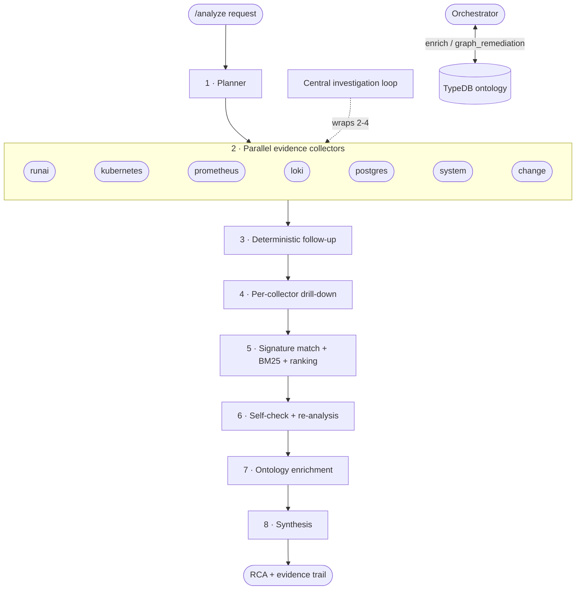

# RCA Pipeline

> **Lens:** How the Agent turns one alert into one grounded RCA — every stage,
> in order.
> **In this doc:** the orchestrator flow · planner · 7 collectors · central
> investigation loop · per-collector autonomous drill-down · signature matching +
> BM25 recall · ranking · self-check / re-analysis · synthesis · evidence
> presentation · safety envelope.

The Agent is **not** a single prompt. It is a component-oriented multi-agent
pipeline run by one orchestrator (`agent/app/services/orchestrator.py`) under a
single overall deadline. Every LLM stage is optional: with no LLM configured, or
on any failure, the pipeline degrades to its deterministic path and still
produces a report.

The whole run is wrapped in `asyncio.wait_for(analyze, ANALYSIS_DEADLINE_SECONDS)`
(default **1500s / 25 min**). On overrun it returns a graceful degraded report,
never a hang. Per-step ceilings are generous *on purpose* (deep evidence beats
fast-but-shallow); the overall deadline is the real bound. The backend's
`AGENT_REQUEST_TIMEOUT_SECONDS` (1560s) must stay above it.

---

## 1. Planner — think first

`agent/app/services/planner.py` builds an `InvestigationPlan` from the alert
labels, target, knowledge-graph context, and any vector-similar incidents
**before any collector runs**, so agents stop always scraping the whole Run:ai
control plane (the #1 accuracy complaint).

- **Deterministic core** (always): keyword/label heuristics scope each collector
  and order hypotheses by failure family.
- **Namespace routing**: a platform-namespace alert (`runai` / `runai-backend`)
  widens to broad k8s + system evidence; a user-workload namespace focuses on the
  Run:ai scheduler subsystem.
- **Optional LLM refine**: sharpens focus/hypotheses/strategy when an LLM is
  configured. Any failure → the deterministic plan stands.

## 2. Parallel evidence collectors (7)

Each collector owns one domain and returns a `CollectorResult` (summary +
`artifacts`). They run concurrently via `asyncio.gather`.

| Collector | Owns |
|---|---|
| **runai** | Run:ai API workload/project/queue/quota/version context (optionally via the [runai-mcp sidecar](#run-ai-mcp-sidecar), 426 APIs) |
| **kubernetes** | Workload pods/events, Run:ai control-plane pod health, node conditions, scheduling blockers; optional read-only pod-exec (allowlisted: `nvidia-smi`, …) |
| **prometheus** | Queue/project GPU metrics, pending/restart/resource signals |
| **loki** | Workload logs + `runai`/`runai-backend` control-plane logs |
| **postgres** | RCA-store health: pgvector, embeddings, feedback, persistence |
| **system** | Node infra below Kubernetes — dmesg/journalctl/syslog, NVIDIA XID/NVRM/OOM/MCE via a per-node DaemonSet |
| **change** | *"What changed?"* — recently-bumped controllers, new/deleting pods, node-condition transitions, recent events |

Collector ceilings are generous (120s each) so evidence is deep; a single slow
collector still fails gracefully to `unavailable`. Sensitive values are masked
(`agent/app/masking.py`) before any evidence leaves a collector.

## 3. Deterministic follow-up

Independent of the LLM, `k8s_followup` + `prometheus_followup` chase findings:
a `Pending` pod pulls its events → resourcequota → PVC → storageclass; an
OOM/restart pulls derived PromQL. This keeps collection iterative even when no
LLM is available.

## 4. Per-collector autonomous drill-down

`agent/app/services/drilldown.py` (`ENABLE_AGENT_DRILLDOWN`, Helm default on).
After the base gather, **each evidence agent runs its own bounded LLM loop** over
its own evidence and decides read-only follow-up queries in its own domain.

**Tool scoping is structural, not prompt-based** — each loop receives *only* its
domain's tool registry, so the kubernetes agent can never call the Run:ai API and
vice versa:

| Agent | Drill-down tool | Read-only guarantee |
|---|---|---|
| kubernetes | `k8s_read` | 18-kind allowlist, GET/LIST only (no secrets) |
| prometheus | `promql_query` | query endpoint only |
| loki | `logql_query` | range query only |
| runai | `runai_api_search` + `runai_api_get` | GET-only, path must start `/api/` (method hardcoded) |
| postgres | `sql_select` | single `SELECT`/`WITH`, READ ONLY transaction, auto `LIMIT 50` |

The postgres agent queries the **Run:ai control-plane database itself** when
`RUNAI_DB_DSN` is set (workloads/audit/authorization/… schemas) — not just the
RCA store. The tool description is enriched with schema ownership from the
[architecture topology](KNOWLEDGE-BASE.md#platform-architecture-topology), so the
loop knows where to look.

Bounds: `DRILLDOWN_MAX_STEPS` (4), 3 queries/step, unavailable collectors and
unconfigured data sources skipped, never raises. Untrusted log/event text feeds
these loops, so the [prompt-injection guard](#safety-envelope) rides on every
decision.

### Central investigation loop

Distinct from per-collector drill-down: `agent/app/services/investigator.py`
(`ENABLE_INVESTIGATION_LOOP`, Helm default on) is the **cross-domain router**. An
LLM decides which collector to probe next and can run ad-hoc read-only Kubernetes
reads across the same 18-kind allowlist. `MAX_INVESTIGATION_STEPS` (12). Synthesis
always waits for *all* collectors — an early/partial synthesis would produce a
confident-but-wrong RCA.

## 5. Signature matching + BM25 recall + ranking

The retrieval entry point is the **fine-grained signature match**, not the coarse
family ranker:

1. **Built-in alert** matched by name (`runai_alerts_catalog.yaml`).
2. **Known issue** matched by keyword signature, version-aware
   (`runai_known_issues.yaml` — issues fixed in the running version are dropped).
3. **Failure-mode symptom** matched by keyword across **all** families
   (`failure_modes.yaml`).
4. **NVIDIA XID** codes extracted from evidence + the alert's own text.

When no curated substring matches, a conservative **BM25 + synonym** pass
(`agent/app/bm25.py`, stdlib) recovers vocabulary drift (`evicted` → `preempt`/
`reclaim`, `job` → `workload`). It queries the alert text only, is tagged
`matched_via: "bm25"`, and never headlines a cause — it only surfaces candidates
the verify pass can still refute. See
[Knowledge Base](KNOWLEDGE-BASE.md) for the catalogs.

**Ranking** (`root_cause_ranking.py`, rules R1–R6) is a deterministic keyword
scorer that *orders* candidates and gates confidence — it is not the retrieval
engine. `_promote_signature_cause` then overrides the headline with the most
specific signature (XID > known-issue > symptom > ranker), so families the ranker
cannot even nominate (e.g. `gpu_hardware_error`) still headline correctly.

## 6. Self-check → re-analysis → verify

- **Refute** (`self_check.refute_top_cause`): a skeptical senior-SRE LLM tries to
  refute the top cause using only the gathered evidence, calibrates its confidence,
  and writes a one-line caveat + next check.
- **Re-analysis once**: if refuted, exactly one bounded re-analysis pass runs
  (`MAX_REANALYSIS_STEPS`, 6) leading with the next-best hypothesis. Hard-guarded
  to never re-enter `analyze()`.
- **Verify matches** (`verify_matches`): a skeptical pass drops keyword/signature
  matches (known issues, symptoms, XIDs) the evidence doesn't actually support.

All three are LLM-gated and best-effort: no LLM → nothing suppressed, matches
stand.

## 7. Ontology enrichment

The **orchestrator** consults the optional TypeDB knowledge graph (not a parallel
collector) — see [Knowledge Base](KNOWLEDGE-BASE.md#typedb-ontology):

- `enrich()`: node **blast radius** (how many workloads share the alerting node)
  and **prior same-alert incidents** with their stored RCA.
- `graph_remediation()`: `fixes_for_family`, `fixes_for_xid`, and reverse
  `leads_to` **root-XID chains** (fix the origin, not the downstream symptom).

Degrades to empty when TypeDB is off/unreachable; never raises.

## 8. Synthesis

`_detail_from` builds the deterministic report — **Problem → Root Cause →
Recommended Actions → Appendix** — the ~1-page document an operator (or a Word
export) reads. When `language=ko` and an LLM is configured, `_synthesize_korean`
rewrites summary + detail grounded **strictly** in the evidence, falling back to
the deterministic English report on any failure.

The **Troubleshooting Playbook** section appends, for any implicated platform
component, its failure effect, its BFS **dependency check order** (e.g.
`cluster-sync → status-updater → runai-backend-traefik`), and its ready-to-run
`kubectl` checks — from the [architecture topology](KNOWLEDGE-BASE.md#platform-architecture-topology).

## Evidence presentation

Every artifact is built for an operator to read at a glance:

- **`title`** — a human card name (`파드 조회`, `메트릭 조회 (PromQL)`, `DB 조회 (SQL)`).
- **`query`** — the *real* command to replay: `kubectl get pods t-0 -n runai`,
  raw PromQL/LogQL/SQL, `GET /api/v1/workloads?name=…` — never an internal param dump.
- **`highlights`** — problem signals extracted from the result
  (`salient_markers`: `CrashLoopBackOff`, `Xid 79`, `no space left`, … — scanning
  string leaves only, never JSON keys). The frontend marks these in red so the
  finding reads before the boilerplate.

## Safety envelope

- **Read-only by construction**: collectors and drill-down tools only read;
  Kubernetes reads are a kind allowlist; pod-exec is an exact-argv allowlist;
  Run:ai is GET-only under `/api/`; SQL is `SELECT` in a READ ONLY transaction.
- **Prompt-injection guard** (`agent/app/llm.py`): collected text (logs, events,
  alert annotations) is cluster-writable, so a guard is appended to **every** LLM
  system prompt declaring embedded instructions as data. `operator_prompt` is the
  one deliberate instruction channel.
- **Masking** (`agent/app/masking.py`): JWTs, bearer tokens, secrets, and custom
  `MASKING_REGEX_LIST_JSON` patterns are redacted before evidence leaves a
  collector or reaches an LLM.

## Run:ai MCP sidecar

When `RUNAI_MCP_URL` is set, the runai collector and the runai drill-down agent
reach the [runai-mcp](https://github.com/sejongjeong/runai-mcp) server (deployed
as a sidecar behind mcp-proxy) for spec-aware access to the 426 Run:ai APIs. The
Helm chart runs the sidecar and sets the URL by default (`runaiMcp.enabled:
true`). Any failure falls back to the fixed-endpoint direct-HTTP collector —
strictly additive, never breaks analysis.

## Configuration

See the [Configuration Reference](CONFIGURATION.md) for every env var. Pipeline
switches: `ENABLE_INVESTIGATION_LOOP`, `MAX_INVESTIGATION_STEPS`,
`ENABLE_AGENT_DRILLDOWN`, `DRILLDOWN_MAX_STEPS`, `RUNAI_DB_DSN`,
`ANALYSIS_DEADLINE_SECONDS`, `RUNAI_MCP_URL`.
