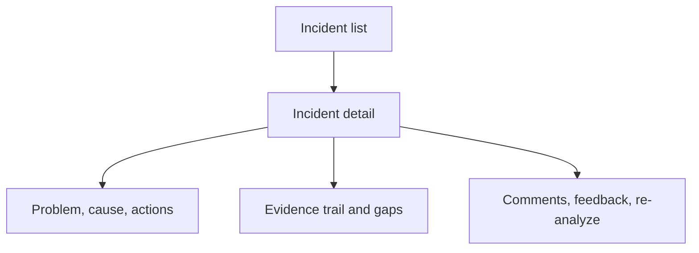

# UI Direction

> **Lens:** How it's built (UI) — the design contract for the operator console.
> **In this doc:** visual system · page model · interaction notes.

Run:AI RCA should feel like KubeRCA evolved for NVIDIA Run:ai operators.

**Who this is for:** designers and engineers shaping the operator console. The
screen should help someone answer three questions quickly: what happened, what
evidence supports it, and what safe next check should they run.

## Visual System

- Base: white and near-white surfaces.
- Accent: NVIDIA green `#76B900`.
- Text: graphite and charcoal, with green used for active state and healthy
  signals.
- Warnings: amber and red only for severity and error states.
- Layout: dense, scan-friendly, dashboard-first.

## Page Model

No separate agent-analysis pages are allowed in the MVP. Incident and Alert
detail pages must contain:

- Entity header: severity, status, cluster, project, queue, workload, node.
- RCA summary: concise final answer.
- RCA body: root cause, impact, evidence, action items, missing data,
  prevention.
- RCA report: a structured, scannable report view, exportable as a styled
  Word (`.docx`) incident report with Korean-capable fonts, GFM tables, and a
  page footer carrying the incident id and page numbers.
- Similar Incidents: past look-alike incidents from dense RCA-content matching,
  re-ranked by family and workload identity.
- Agent Evidence Trail: collector tabs in a single panel on the same page.
- Raw artifact viewer: collapsed by default.
- Chat panel: context-aware and tied to the current route.

## Interaction Notes

- The first screen is the dashboard, not a landing page.
- The user should be able to move from dashboard to detail and back without
  losing filters.
- Realtime analysis updates should be visible via status badges and SSE events.
- Missing integrations should be explicit but not noisy.
