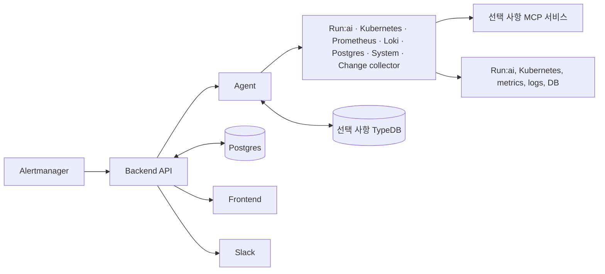
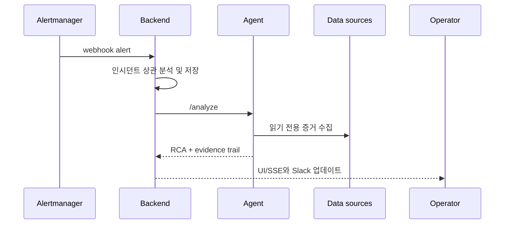

# Architecture

> **관점:** 어떻게 구축되었는가 — Alertmanager 웹훅에서 저장된 RCA에 이르기까지의 계약.
> **이 문서에서 다루는 것:** 런타임 흐름 · 세 개의 서비스 · 피드백/메모리 루프 · 온톨로지 지식 그래프 · Slack 알림 · 증거 계약.

Run:AI RCA는 세 개의 런타임 서비스를 중심으로 구성됩니다: Backend, Agent, Frontend.
Backend는 로컬 개발을 위해 인메모리 폴백(fallback)으로 실행할 수 있지만, 프로덕션 성격의
배포에서는 `DATABASE_URL`을 통해 Postgres를 제공해야 합니다. API는 UI 계약을 변경하지 않고
인시던트, 알림, 운영자 피드백, 코멘트, 유사 인시던트 벡터를 저장합니다.

Agent의 분석은 단일 프롬프트가 아니라 다단계 파이프라인(pipeline)입니다. 이 문서는
서비스 수준의 계약을 제공하며, [RCA 파이프라인](RCA-PIPELINE.md) 문서가 모든 단계를 상세히
설명하고, [Knowledge Base](KNOWLEDGE-BASE.md) 문서가 파이프라인이 참조하는 카탈로그와
온톨로지(ontology)를 다룹니다.

**쉽게 기억하는 방법:** Alertmanager는 초인종, Backend는 조정자와 기록 담당자, Agent는
조사자, Frontend는 운영자가 보는 사건 파일입니다. 데이터베이스는 사실을 보존하고, MCP
서비스는 조사자가 클러스터 시스템을 안전하게 읽도록 돕는 읽기 전용 어댑터입니다.



Backend는 알림을 받고 인시던트 기록을 관리합니다. Agent는 계획을 세우고 증거를 수집합니다.
MCP 서비스는 선택적으로 쓰는 연결 다리일 뿐, 스스로 판단하는 주체가 아닙니다. Postgres는 운영 이력을
저장하고 TypeDB는 승인된 토폴로지와 이력 문맥을 더합니다. Frontend와 Slack은 같은 조사 결과를
각자의 화면으로 보여 줍니다.

## Runtime Flow



이 흐름은 비동기입니다. 웹훅을 먼저 받고, 그 뒤 Agent가 데드라인 안에서 증거를 수집합니다.
일부 출처가 느리거나 응답하지 않아도 조사 전체가 멈추지 않고, 어떤 증거가 비었는지
그대로 드러낸 채 부분 증거로 진행합니다.

1. Alertmanager가 Backend로 `POST /webhook/alertmanager`를 전송합니다.
2. Backend는 각 알림을 정규화하고 레이블과 어노테이션에서 Run:ai 컨텍스트를 도출합니다.
3. Backend는 다음을 사용해 알림을 인시던트로 상관 지어(correlate) 묶습니다:
   `cluster + project + queue + namespace + workload`, 그다음 `cluster + node`,
   그다음 Alertmanager `groupKey`.
4. Backend는 인시던트와 알림 레코드를 생성하거나 업데이트하고, pgvector 유사 이전 인시던트와
   피드백 힌트를 첨부합니다.
5. Backend는 전체 데드라인(deadline) 하에서 Agent `POST /analyze`를 비동기로 호출합니다.
6. Agent **오케스트레이터(orchestrator)**는 조사를 계획한 뒤, 일곱 개의 증거 수집기(collector)를
   병렬로 실행합니다 — Run:ai, Kubernetes, Prometheus, Loki, Postgres, System, Change —
   중앙 조사 루프(investigation loop)와 수집기별 자율 드릴다운(drill-down)으로 심화됩니다
   (각 에이전트는 읽기 전용이며, 자기 도메인 도구만 사용).
7. 시그니처 매칭(signature match)(내장 알림 / known issue(알려진 이슈) / 실패 모드 증상 /
   NVIDIA XID, BM25 리콜 폴백 포함)과 결정론적 랭킹(ranking)(규칙 R1–R6)이 원인을 지목합니다.
   회의적인 자기 점검(self-check)이 제한된 재분석(re-analysis)을 한 번 유발할 수 있습니다.
   오케스트레이터는 노드 blast radius(영향 범위), 동일 알림의 이전 인시던트, 그래프에서 도출한
   교정 조치를 위해 선택적 TypeDB 온톨로지를 참조합니다.
8. Agent는 단일 RCA를 종합합니다 — Problem → Root Cause → Recommended Actions → Appendix —
   더불어 각 에이전트의 실제 쿼리, 요약, 강조된 발견 사항, 신뢰도, 상태를 보존하는 `artifacts`
   목록을 함께 생성합니다.
9. Backend는 분석 응답을 저장하고, SSE 업데이트를 브로드캐스트하며, 완료 시 인시던트 요약을
   Slack에 게시합니다(첫 분석은 스레드를 열고, 운영자의 재분석은 그 스레드에 답글로 달립니다).
10. Backend는 분석된 인시던트를 `incident_embeddings`에 기록하고, 이후 Agent 요청에 유사 이전
    인시던트와 피드백 힌트를 포함합니다.
11. Frontend는 동일한 인시던트 또는 알림 상세 페이지에서 최종 RCA와 에이전트 증거 추적을
    렌더링합니다.

## Services

### Agent

Agent는 단일 인프로세스 NeMo Agent Toolkit 워크플로
`agent/configs/runai_rca_engine.yml`을 사용하는 FastAPI 서비스입니다. RCA 파이프라인
단계는 NAT 함수이며, `runai_rca_pipeline` 컨트롤러 워크플로가 순서를 소유합니다.

이 Python 서비스는 시작 시 NAT 워크플로를 한 번 빌드합니다. 엔진을 시작할 수 없거나
요청별 엔진 실행이 실패하면, 동일한 파이프라인 단계가 프로세스 안에서 직접 실행되어 외부
Run:ai, Kubernetes, Postgres, Prometheus, Loki, LLM 자격 증명이 아직 없어도 로컬 개발과
테스트를 계속 실행할 수 있습니다.

모든 LLM 단계(플래너 정제, 조사 루프, 수집기별 드릴다운, 자기 점검, 한국어 종합)는 선택적이며
최선 노력(best-effort) 방식입니다. LLM이 없거나 어떤 실패가 발생하면, 오케스트레이터는
결정론적 경로로 저하(degrade)되며 여전히 리포트를 반환합니다. 전체 실행은
`ANALYSIS_DEADLINE_SECONDS`(기본값 900초)로 제한됩니다. Backend의
`AGENT_REQUEST_TIMEOUT_SECONDS`(960초)는 이보다 위에 유지되어, 우아하게 저하된 리포트가
결코 유실되지 않습니다. [RCA 파이프라인](RCA-PIPELINE.md)을 참조하십시오.

### Backend

Backend는 Go HTTP API입니다. `DATABASE_URL` 또는 `POSTGRES_DSN`이 구성되면 Postgres를
사용하고, 데이터베이스가 없는 로컬 스모크 테스트를 위해 인메모리 폴백을 유지합니다.

Backend가 담당하는 것:

- Alertmanager 웹훅 수신
- 인시던트 및 알림 상관 지음
- Agent 요청 수명 주기(비동기 실행, 데드라인, 오래된 실행 회수)
- 인시던트, 알림, 임베딩(embedding), 피드백, 코멘트, 분석 실행에 대한 Postgres 영속화
- **pgvector 유사도** — 이전 인시던트를 찾는 `incident_embeddings` 코사인 검색(HNSW, JSONB 폴백).
  결과는 각 Agent 요청에 `similar_incidents` + `feedback_hints`로 전달됩니다
- KubeRCA 스타일 `/api/v1/embeddings/search` 유사 인시던트 API
- SSE 이벤트 팬아웃(fanout)
- 분석 완료 시 Slack 알림(notification) — 인시던트 요약 + Recommended Action + Open-Incident 링크,
  인시던트별로 스레드화됨([Slack Notifications](#slack-notifications) 참조)
- 지식 그래프 기반 copilot용 채팅 프록시
- Frontend를 위한 통합 API 응답 형태

### Frontend

Frontend는 운영 대시보드에서 시작하는 React 앱입니다. 마케팅 스타일의 랜딩 페이지는 포함하지
않습니다.

핵심 상호작용은 통합 RCA 워크스페이스(Unified RCA Workspace)입니다:

- 상단에 요약 및 권장 조치
- 중간에 유사 인시던트, 운영자 투표/코멘트, 영향, 누락된 데이터, 예방
- 동일 페이지 하단에 collector 탭으로 구성된 단일 증거 추적(Evidence Trail) 패널

## Feedback And Memory Loop

1. 분석이 완료되면 Backend는 인시던트 텍스트, 레이블, 희소 텍스트 벡터로 `incident_embeddings`
   행을 생성하거나 업데이트합니다.
2. 운영자는 인시던트 또는 알림 어느 쪽에든 찬성/반대 투표를 하고 마크다운 코멘트를 남길 수
   있습니다. 이는 `rca_feedback`와 `rca_comments`에 저장됩니다.
3. 새 알림은 이전 인시던트 벡터와 비교됩니다. 상위 매칭은 상세 응답에 첨부되어 Agent에
   `similar_incidents`로 전송됩니다.
4. 유사 인시던트의 피드백 카운트와 코멘트는 `feedback_hints`로 변환되므로, Agent는 수용된 RCA
   패턴을 재사용하고 거부된 패턴을 반복하지 않을 수 있습니다.
5. 명시적으로 분석을 요청하는 새 운영자 코멘트와 채팅 메시지는 `analysis_runs`를 생성합니다.
   각 실행은 Agent가 독립적으로 처리하며, 분석 대시보드에서 자체 항목으로 표시됩니다.

## Ontology Knowledge Graph

선택적 TypeDB 지식 그래프(knowledge graph)(`typedb.enabled`, Helm에서 기본값 **on**)는
pgvector 유사도와 레이블 중첩으로는 표현할 수 없는 관계형 추론을 **오케스트레이터**에 제공합니다.
이는 오케스트레이터가 종합 시점 즈음에 참조하는 지식 자원이며, 병렬 증거 수집기도 아니고 별도의
에이전트도 아닙니다. 전체 상세: [Knowledge Base](KNOWLEDGE-BASE.md).

- **스키마**(`agent/ontology/schema.tql`): 타입이 지정된 엔티티(cluster, node, pod, workload,
  project, queue, namespace, alert, incident, symptom, root cause,
  `control_plane_component`, `xid_error`, ...)와 관계(`runs_on`, `submitted_to`,
  `grouped_into`, `indicates`, `depends_on`, `leads_to`, ...), 그리고 `sub` 타입으로 모델링된
  16개의 근본 원인(root cause) 패밀리.
- **수집(Ingestion)**(`agent/ontology/ingest.py`, CronJob): Dashboard 승인을 받고 유예 기간 이후
  해결된 `incidents`/`alerts`를 그래프로 결정론적으로 투영합니다(`requireApproval=true`가 기본값).
  운영자가 확인한 RCA를 재사용 가능한 지식으로 승격할 수 있습니다(`--promote-knowledge`).
- **강화(Enrichment)**(`agent/app/services/kg_enrichment.py`): 오케스트레이터는 평면
  수집기가 놓치는 사실을 그래프에 질의합니다 — 노드 blast radius, 저장된 RCA를 가진 동일 알림의
  이전 인시던트(`enrich`), 근본 원인 체인을 동반한 그래프 도출 패밀리/XID 교정
  (`graph_remediation`). TypeDB가 비활성화되었거나 도달 불가능할 때는 빈 컨텍스트로 저하되며,
  결코 예외를 발생시키지 않습니다.
- **랭킹**(`agent/app/services/root_cause_ranking.py`)은 고유한 typed fact 하나를 한 번만 계산하고,
  규칙/prior/토폴로지 보정과 contradiction gate를 기록한 뒤 숫자 점수보다 evidence 품질을 먼저
  적용해 실패 패밀리 순서를 정합니다(규칙 R1-R6). **시그니처 승격(signature promotion)**은 검증된
  가장 구체적인 매칭을 헤드라인으로 올리고 선두가 바뀌면 self-check를 다시 실행합니다. 이는
  유사도가 아니라 *원인*의 순위를 매깁니다 — "어떤 과거 인시던트가 유사한가"는
  여전히 pgvector(Backend가 소유)가 담당합니다.

그래프가 담고 있는 내용은 `python -m ontology.query` 또는 TypeDB Studio로 확인하십시오 —
[Knowledge Base → Querying the graph](KNOWLEDGE-BASE.md)를 참조하십시오. TypeDB는 단일 노드
StatefulSet(`charts/runai-rca/templates/typedb.yaml`)으로 실행됩니다. Community Edition은 단일
노드이므로, HA/클러스터링은 유료 Enterprise 티어가 필요합니다.

## Slack Notifications

분석 실행 완료 시 Backend는 간결한 인시던트 요약을 하나의 Slack 채널에 게시합니다
(`backend/internal/server/slack.go`). Backend가 자연스러운 소유자입니다: 실행 수명 주기, SSE
브로드캐스트, 인시던트의 Slack 스레드를 보유하기 때문입니다.

**전달 규칙**(인시던트 수준, 알림별 아님):

- 인시던트의 **첫** 완료 분석은 루트 채널 메시지(*"Initial Analysis"*)를 게시하고, 재시작 후에도
  스레드화가 유지되도록 인시던트 행에 `thread_ts`를 저장합니다.
- 이후 **운영자 주도** 재분석(`manual`/`comment`/`feedback`/`chat`)은 그 스레드에 답글을
  답니다(*"2nd Analysis"*, *"3rd Analysis"*, …). 인시던트의 `analysis_seq`로 추적됩니다.
- 후속 **자동/백필** 완료와 **실패한** 실행은 결코 Slack에 도달하지 않습니다 — 원시 알림은 이미
  다른 채널로 도착하고, 대시보드가 알림별 전체 이력을 유지합니다.

각 메시지에는 심각도 색상 바, **Root Cause** 요약, 첫 **Recommended Action** 줄, 주요 필드
(namespace/node/severity/알림 수)가 담기며, `DASHBOARD_URL`이 설정된 경우 **Open Incident**
딥링크 버튼이 함께 담깁니다. 장문 리포트는 UI에 남아 있으며, Slack은 리포트가 아니라 알림입니다.

수신 웹훅이 아니라 **봇 토큰**(`SLACK_BOT_TOKEN` + `SLACK_CHANNEL_ID`)이 필요합니다:
`chat.postMessage`는 답글을 스레드화하는 데 필요한 메시지 `ts`를 반환합니다. 전달은
발사 후 망각(fire-and-forget) 방식입니다 — 오류는 로그로 남을 뿐, 실행 영속화에 결코 영향을
주지 않습니다.

## Evidence Contract

Agent 응답에는 종합된 RCA와 소스 수준 아티팩트가 모두 포함됩니다.

```json
{
  "analysis_summary": "GPU allocation delayed by queue saturation",
  "analysis_detail": "## Root Cause ...",
  "capabilities": {
    "runai": "ok",
    "kubernetes": "partial",
    "postgres": "ok",
    "prometheus": "unavailable",
    "loki": "ok"
  },
  "artifacts": [
    {
      "agent": "kubernetes",
      "source": "kubernetes",
      "type": "adhoc_query",
      "status": "ok",
      "confidence": "medium",
      "title": "파드 조회",
      "query": "kubectl get pods train-0 -n runai",
      "summary": "signals: CrashLoopBackOff, OOMKilled",
      "highlights": ["CrashLoopBackOff", "OOMKilled"]
    }
  ]
}
```

`title`은 사람이 읽는 카드 이름, `query`는 운영자가 재실행할 수 있는 *실제* 명령이며,
`highlights`는 UI가 빨간색으로 표시하는 문제 신호로, 상용구보다 발견 사항이 먼저 읽히도록 합니다 —
[RCA 파이프라인 → Evidence presentation](RCA-PIPELINE.md)을 참조하십시오.

UI는 운영자를 별도의 에이전트 페이지로 라우팅해서는 안 됩니다. 상세 페이지 내부에서 아코디언이나
탭을 사용할 수는 있지만, 모든 증거는 맥락 안에 유지됩니다.
