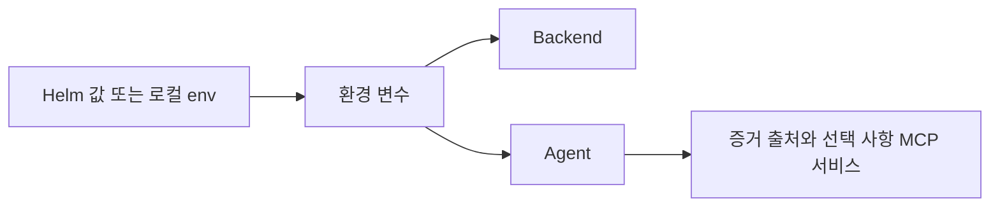

# 구성 레퍼런스

> **관점:** 무엇을 구성할 수 있는가 — 모든 설정을 다룹니다. 일반적인 경로는 README에서 설명합니다.
> **이 문서에서 다루는 것:** 환경 변수 · Helm 값 · 동작 참고 사항(pgvector, 레닥션).

Run:AI RCA에서 사용할 수 있는 모든 설정입니다. README는 일반적인 경로를 다루며, 이 문서는 전체 레퍼런스입니다.

**이 문서는 누구를 위한가:** 서비스를 설치하고 운영하는 사람을 위한 문서입니다. 먼저 Agent가
어디서 증거를 읽을지 정하고, timeout과 접근 경계를 설정한 뒤, 선택 사항인 학습/LLM 기능을
조정하세요. Helm 값은 이 선택을 실행 중인 컨테이너에 전달하고, 환경 변수는 프로세스가 실제로
받는 이름입니다.



## 환경 변수

### 작업별로 구성하기

표가 긴 이유는 전체 레퍼런스이기 때문입니다. 먼저 서비스 연결과 timeout 행을 읽고, 다음으로
증거 출처 URL과 자격 증명을 본 뒤, 안전, 지식, 선택 사항 LLM 제어를 확인하세요.

백엔드와 에이전트는 시작 시점에 이 값들을 읽으며, Helm은 아래 값에서 이들을 매핑합니다.

| Variable | Purpose |
| --- | --- |
| `PORT` | 백엔드 HTTP 포트. Helm은 이를 컴포넌트 서비스 포트에서 매핑합니다. 에이전트 포트는 컨테이너 커맨드에 고정돼 있습니다 |
| `AGENT_URL` | 백엔드에서 에이전트로 접근하는 URL. 기본값 `http://localhost:8000` |
| `BACKEND_URL` | 에이전트가 분석 진행 이벤트를 fire-and-forget 방식으로 백엔드에 보내기 위한 URL입니다. 비어 있으면 progress POST가 비활성화되며, Helm은 기본적으로 백엔드 서비스 주소로 설정합니다 |
| `AGENT_REQUEST_TIMEOUT_SECONDS` | 에이전트 `/analyze` 및 `/chat` 요청에 대한 백엔드 타임아웃. 기본값 `960`(에이전트의 `ANALYSIS_DEADLINE_SECONDS`보다 커야 합니다) |
| `MANUAL_AGENT_REQUEST_TIMEOUT_SECONDS` | 운영자가 직접 트리거한 에이전트 `/analyze` 요청에 대한 백엔드 타임아웃. 기본값 `960` |
| `TRASH_RETENTION_DAYS` | 휴지통 인시던트를 purge하기 전 백엔드 soft delete 보존 기간. 기본값 `30` |
| `SLACK_BOT_TOKEN` | 백엔드 Slack 봇 토큰(`xoxb-`, `chat:write` 스코프, 채널에 초대된 봇). 인시던트 분석 알림을 활성화하려면 `SLACK_CHANNEL_ID`와 함께 설정합니다. incoming webhook이나 `xapp-` 앱 토큰이 아니라 봇 토큰이 필요한 이유는 `chat.postMessage`가 재분석 스레딩에 사용되는 `ts`를 반환하기 때문입니다. Slack 앱을 재설치하면 이전 `xoxb-` 토큰은 무효화됩니다. 차트 시크릿 키 `slackBotToken` |
| `SLACK_CHANNEL_ID` | 백엔드가 인시던트 분석 요약을 게시하는 채널. 차트 시크릿 키 `slackChannelId` |
| `SLACK_APP_TOKEN` | 선택 사항인 앱 레벨 토큰(`xapp-`, `connections:write` 스코프). 메시지 내 Re-analyze 버튼을 활성화합니다. 클릭은 Socket Mode(아웃바운드 WebSocket)로 전달되므로 공개 엔드포인트가 필요 없습니다. 이 토큰은 `chat.postMessage`에 유효하지 않으므로 `SLACK_BOT_TOKEN`과 분리해 유지하십시오. Slack 앱 설정에서 Socket Mode와 Interactivity를 켜야 합니다. 차트 시크릿 키 `slackAppToken` |
| `DASHBOARD_URL` | 선택 사항인 외부 대시보드 URL. 설정하면 Slack 메시지에 "Open Incident" 딥링크 버튼이 추가됩니다(Helm 값 `backend.env.dashboardUrl`) |
| `LOG_LEVEL` | 에이전트 로그 레벨. 코드 기본값 `info`, Helm 차트 기본값은 `warning` |
| `LANGUAGE` | 백엔드/에이전트 응답 언어. `en` 또는 `ko` |
| `KUBERNETES_API_URL` | 클러스터 내부 Kubernetes API URL. 기본값 `https://kubernetes.default.svc` |
| `KUBERNETES_TOKEN_PATH` | 클러스터 내부 Kubernetes 수집을 위한 서비스 계정 토큰 경로 |
| `KUBERNETES_CA_PATH` | 클러스터 내부 Kubernetes 수집을 위한 서비스 계정 CA 경로 |
| `KUBERNETES_TIMEOUT_SECONDS` | Kubernetes API 요청 타임아웃 |
| `KUBERNETES_LIST_LIMIT` | 증거 수집을 위한 Kubernetes 파드/이벤트 목록 페이지 크기. 기본값 `50` |
| `KUBERNETES_NAMESPACES` | 워크로드로 해석된 Pod 읽기와 그 describe/log 후속 점검을 포함한 Kubernetes 직접 수집용 선택 사항인 쉼표 구분 네임스페이스 허용 목록 |
| `KUBERNETES_CLUSTER_SCOPE_ENABLED` | 노드 조회와 같은 클러스터 범위 Kubernetes 호출을 활성화합니다. Helm은 `agent.rbac.clusterWide`를 따릅니다 |
| `KUBERNETES_MCP_URL` | Kubernetes MCP shared service URL. 설정하면 Kubernetes get/list/log 수집과 드릴다운이 MCP를 먼저 호출하고, 실패 시 기존 Kubernetes API 직접 읽기로 폴백합니다. 별도로 게이트된 `pods/exec` 진단은 거부 목록(denylist) 기반이며, MCP 서비스에 exec 권한을 주지 않기 위해 Kubernetes WebSocket exec subresource를 통해 agent ServiceAccount로 실행합니다. |
| `RUNAI_BASE_URL` | Run:ai 컨트롤 플레인 URL. 차트 기본값은 없으며, `runaiMcp.enabled=true`일 때 `agent.env.runaiBaseUrl`로 반드시 지정해야 합니다 |
| `RUNAI_BEARER_TOKEN` | 선택 사항인 Run:ai bearer 토큰 시크릿 |
| `GRAFANA_SERVICE_ACCOUNT_TOKEN` | managed `grafanaMcp` 서비스가 Prometheus/Loki datasource read/query에 사용하는 Grafana service account token |
| `RUNAI_CLIENT_ID` | Run:ai 애플리케이션 클라이언트 ID |
| `RUNAI_CLIENT_SECRET` | Run:ai 애플리케이션 클라이언트 시크릿 |
| `RUNAI_TOKEN_URL` | Run:ai 클라이언트 자격 증명을 위한 선택 사항인 OAuth 토큰 URL |
| `RUNAI_WORKLOADS_PATH` | Run:ai 워크로드 API 경로. 기본값 `/api/v1/workloads` |
| `RUNAI_PROJECTS_PATH` | Run:ai 프로젝트 API 경로. 기본값 `/api/v1/projects` |
| `RUNAI_QUEUES_PATH` | Run:ai 큐 API 경로. 기본값 `/api/v1/queues` |
| `RUNAI_VERSION_PATH` | Run:ai 컨트롤 플레인 버전 API 경로. 기본값 `/api/v1/version` — 이미 수정된 알려진 이슈를 버전 기반으로 억제할 수 있게 합니다 |
| `RUNAI_TIMEOUT_SECONDS` | Run:ai API 요청 타임아웃. 기본값 `120` |
| `RUNAI_MCP_URL` | 공식 NVIDIA Run:ai MCP shared service URL(스트리머블 HTTP `/mcp`, 예: `http://runai-rca-runai-mcp:8080/mcp`). 설정하면 runai 수집기와 드릴다운이 집중된 읽기 전용 16개 도구 세트를 사용합니다. 엔드포인트는 OIDC로 보호되며, Helm은 이를 공유 ClusterIP 서비스로 배포하고 기본적으로 이 URL을 설정합니다(`runaiMcp.enabled: true`). 어떤 실패든 Run:ai 직접 HTTP 읽기로 폴백합니다. |
| `RUNAI_LOG_NAMESPACES` | 쉼표로 구분된 Run:ai 컨트롤 플레인 로그 네임스페이스. 기본값 `runai,runai-backend` |
| `PROMETHEUS_URL` | Prometheus 기본 URL |
| `PROMETHEUS_TIMEOUT_SECONDS` | Prometheus 쿼리 타임아웃 |
| `PROMETHEUS_MCP_URL` | Prometheus tool을 위한 Grafana MCP URL. managed `grafanaMcp`가 켜져 있으면 Helm이 ClusterIP 서비스 URL로 설정하고, 실패 시 `PROMETHEUS_URL`로 폴백합니다 |
| `LOKI_URL` | Loki 기본 URL. Helm에서는 일반적으로 인증 게이트웨이가 아니라 직접 읽기/쿼리 서비스를 가리켜야 합니다(예: `http://loki-read.monitoring.svc.cluster.local:3100`). |
| `LOKI_TIMEOUT_SECONDS` | Loki 쿼리 타임아웃 |
| `LOKI_QUERY_LIMIT` | Loki 쿼리 그룹당 요청하는 최대 로그 라인 수. 기본값 `20` |
| `LOKI_MCP_URL` | Loki tool을 위한 Grafana MCP URL. managed `grafanaMcp`가 켜져 있으면 같은 ClusterIP 서비스 URL로 설정하고, 실패 시 `LOKI_URL`로 폴백합니다 |
| `ENABLE_SYSTEM_AGENT` | 노드 인프라 System 수집기(노드별 DaemonSet을 통한 dmesg/journalctl/syslog)를 활성화합니다. 기본값 `true`. `SYSTEM_AGENT_URL`이 설정되지 않으면 `unavailable`로 축소됩니다 |
| `SYSTEM_AGENT_URL` | 노드별 System 에이전트 DaemonSet 엔드포인트(`GET /logs?source=dmesg\|journal\|syslog`). 과거 incident 수집에서는 정확한 RFC3339 시간창을 `journal`에 전달하며, dmesg/syslog는 현재 상태 tail로만 취급합니다. |
| `SYSTEM_AGENT_TOKEN` | System 에이전트 엔드포인트용 선택 사항인 bearer 토큰 |
| `SYSTEM_AGENT_TIMEOUT_SECONDS` | System 에이전트 요청 타임아웃. 기본값 `120` |
| `ENABLE_POD_EXEC` | Kubernetes 수집기의 거부 목록(denylist) 기반 읽기 전용 pod-exec를 허용합니다. 상태를 바꾸는 명령, shell/인터프리터, shell 메타문자를 차단하고 shell 없이 단일 argv만 실행합니다. 기본값 `true` |
| `POD_EXEC_TIMEOUT_SECONDS` | pod-exec 타임아웃. 기본값 `120` |
| `DATABASE_URL` | 인시던트, 알림, 임베딩, 피드백, 코멘트, 분석 실행을 저장하는 백엔드 Postgres 저장소 DSN |
| `DATABASE_CONNECT_TIMEOUT_SECONDS` | 백엔드 Postgres 시작 연결 타임아웃. 기본값 `5` |
| `POSTGRES_DSN` | 에이전트 Postgres 진단 DSN. Helm에서는 기본적으로 `DATABASE_URL`로 설정됩니다 |
| `POSTGRES_TIMEOUT_SECONDS` | 에이전트 Postgres 진단 쿼리 타임아웃 |
| `RUNAI_DB_DSN` | Run:ai 컨트롤 플레인 Postgres에 대한 선택 사항인 읽기 전용 DSN. 설정하면 postgres 에이전트의 드릴다운이 문제 해결 중에 플랫폼 데이터(워크로드, 감사, 클러스터 등)를 `SELECT`할 수 있습니다. READ ONLY 트랜잭션 내의 단일 문장 SELECT입니다. 읽기 전용 DB 역할을 프로비저닝하세요. |
| `POSTGRES_MCP_URL` | Postgres MCP shared service URL. Postgres 수집기와 드릴다운은 MCP를 먼저 호출하고, 실패 시 `RUNAI_DB_DSN`, 그 다음 `POSTGRES_DSN` 순서로 폴백합니다 |
| `TROUBLESHOOTING_CASES_FILE` | 로컬 알려진 사례/플레이북 마크다운 경로 |
| `ARCHITECTURE_FILE` | Run:ai 플랫폼 토폴로지 YAML(컴포넌트, depends_on, DB 스키마 소유권). 기본값 `knowledge/runai_architecture.yaml` — 플레이북 점검 경로와 postgres 드릴다운 스키마 힌트를 구동합니다 |
| `AGENT_SOULS_FILE` | 에이전트 역할 계약 프롬프트 경로. 기본값 `prompts/agent_souls.md` |
| `FAMILIES_FILE` | root-cause family 카탈로그 YAML 경로. 기본값 `knowledge/families.yaml`. 로드 실패 시 내장 카탈로그로 폴백합니다 |
| `COLLECTORS` | 쉼표로 구분된 수집기 레지스트리 allowlist. 비어 있거나 기본값이면 모든 내장 수집기를 활성화합니다. 알 수 없는 이름은 활성화에서 제외되지만 모든 분석 경고와 Agent `/healthz`의 `collectors.unknown`에 표시됩니다 |
| `EVAL_MIN_TOP1` | 명시적인 `--min-top1`이 없을 때 CI/run script가 사용하는 eval gate 최소 Top-1 정확도 |
| `MASKING_REGEX_LIST_JSON` | 사용자 정의 레닥션 정규식의 선택 사항인 JSON 배열 |
| `BUILTIN_REDACTION_ENABLED` | 내장 시크릿 레닥션을 활성화합니다. 기본값 `true` |
| `BUILTIN_REDACTION_HASH_MODE` | 시크릿을 `[MASKED]` 대신 안정적인 짧은 해시로 대체합니다. 기본값 `false` |
| `NVIDIA_API_KEY` | NeMo Agent Toolkit 워크플로용 NIM 키 |
| `LLM_BASE_URL` | NAT가 관리하는 기본 LLM과 운영자 채팅 코파일럿용 OpenAI 호환 기본 URL |
| `LLM_MODEL` | OpenAI 호환 모델 이름(예: `auto-router`) |
| `LLM_MODEL_PLANNER` / `LLM_MODEL_INVESTIGATION` / `LLM_MODEL_DRILLDOWN` / `LLM_MODEL_SELF_CHECK` / `LLM_MODEL_SYNTHESIS` / `LLM_MODEL_CHAT` / `LLM_MODEL_INSIGHT` | 단계별 모델 override. 비어 있으면 `LLM_MODEL`로 폴백합니다 |
| `LLM_API_KEY` | OpenAI 호환 API 키 시크릿. 세 가지 LLM 변수가 모두 설정되면 대화형 채팅 응답이 활성화됩니다 |
| `LLM_REQUEST_TIMEOUT_SECONDS` | 호출당 LLM 요청 타임아웃(채팅과 직접 폴백 추론). 기본값 `300`, `0` = 무제한 |
| `LLM_PRICING_JSON` | 모델별 추정 LLM 비용을 위한 선택 사항 JSON map. 각 모델에 `prompt_per_mtok`, `completion_per_mtok` 값을 둡니다 |
| `ENABLE_NAT_RUNTIME` | 인프로세스 NeMo Agent Toolkit 엔진을 통해 분석을 실행합니다. 기본값 `true` |
| `NAT_CONFIG_FILE` | 내부 NeMo 엔진 워크플로 구성 경로. 기본값 `configs/runai_rca_engine.yml` |
| `ENABLE_INVESTIGATION_LOOP` | 중앙 LLM 조사 루프: 계획 → 가장 관련성 높은 에이전트 탐색 → 관찰 → 재계획. 기본값 `false`(Helm은 `true`로 설정) |
| `OPEN_WORLD_RCA_MODE` | `off`, `shadow`, `assist`, `authoritative` 중 하나입니다. 기본값은 `shadow`이며 headline RCA를 바꾸지 않고 open-world 추론을 기록합니다. |
| `MAX_INVESTIGATION_STEPS` | 레거시 호환 제한입니다. 기본값 `0`은 전체 analysis deadline 안에서 의미적 완료까지 조사합니다. |
| `MAX_REANALYSIS_STEPS` | 재분석 레거시 호환 제한입니다. 기본값 `0`은 전체 analysis deadline 안에서 의미적 완료까지 조사합니다. |
| `ENABLE_AGENT_DRILLDOWN` | 수집기별 자율 드릴다운: 각 증거 에이전트(kubernetes/prometheus/loki/runai)가 자기 도메인의 서로 다른 읽기 전용 probe를 완료·반복 쿼리·분석 deadline까지 계속 수행합니다. 기본값 `false`(Helm은 `true`로 설정) |
| `LLM_SYNTHESIS_MAX_TOKENS` | 최종 한국어 JSON 보고서의 completion 예산. 기본값 `16384`. |
| `ANALYSIS_DEADLINE_SECONDS` | 분석당 전체 하드 상한(초과 시 우아하게 축소된 리포트). 기본값 `900`(15분), `0` = 상한 없음. 백엔드 `AGENT_REQUEST_TIMEOUT_SECONDS`를 이 값보다 크게 유지하세요. |
| `ENABLE_RCA_OUTPUT_HARNESS` | 최종 RCA를 live evidence와 safety gate로 검증합니다. 기본값 `true` |
| `MAX_RCA_REPAIR_ATTEMPTS` | harness 검증 뒤 최종 보고서를 수정하는 최대 횟수. 기본값 `3` |
| `RCA_HARNESS_PASS_SCORE` | non-fatal RCA를 degraded로 표시하는 score 기준(0..100). 기본값 `70` |
| `MAX_AUTO_ANALYZE_FANOUT` | 백엔드: 웹훅당 시작되는 최대 분석 수. 기본값 `50` |
| `MAX_CONCURRENT_AGENT_RUNS` | 백엔드: 에이전트에 대해 동시에 실행되는 최대 분석 수. 기본값 `50` |
| `FLAPPING_GROUP_WINDOW_MINUTES` | 백엔드: 반복되는 알림이 또 다른 발생이 아니라 NEW 인시던트가 되기 전의 정적 구간. 코드 기본값 `120`(Helm은 `360`으로 설정) |
| `AUTO_REANALYZE_COOLDOWN_MINUTES` | 백엔드: 자동 재발 알림이 기존 실행을 제자리에서 재분석하기 전의 쿨다운. 기본값 `360`; `0` 이하는 자동 재분석을 비활성화합니다. env 전용(Helm 값으로 노출되지 않음)이므로 env override로 설정합니다. |
| `ANALYSIS_BACKFILL_INTERVAL_SECONDS` | 백엔드: RCA를 완료하지 못한 채 남은 알림을 다시 처리하는 주기. 기본값 `300`(`0`은 비활성화) |
| `ANALYSIS_BACKFILL_BATCH` | 백엔드: 백필 틱당 다시 처리하는 알림 수. 기본값 `10` |
| `ANALYSIS_BACKFILL_RETRY_COOLDOWN_SECONDS` | 백엔드: 실패한 알림을 재시도하기 전의 쿨다운. 기본값 `900` |
| `EMBEDDING_URL` | 백엔드: 유사 인시던트 검색을 위한 OpenAI 호환 `/embeddings` 엔드포인트. 비어 있으면 오프라인 피처 해시 폴백(기본값, 어휘 기반) |
| `EMBEDDING_MODEL` | 백엔드: 임베딩 모델 이름(`EMBEDDING_URL`과 함께 사용) |
| `EMBEDDING_DIM` | 백엔드: 임베딩 벡터 차원. 기본값 `384`. 모델과 일치해야 하며, 변경하면 기존 행을 다시 임베딩해야 합니다 |
| `EMBEDDING_API_KEY` | 백엔드: 임베딩 엔드포인트용 API 키(시크릿 키 `embeddingApiKey`) |
| `ENABLE_TYPEDB` | TypeDB 온톨로지의 마스터 스위치. 기본값 `false`(Helm은 `typedb.enabled`에서 설정하며 기본적으로 켜짐). 연결 변수는 아래에 있으며, 자세한 내용은 [데이터 스토어](DATABASE.md)를 참고하세요 |
| `TYPEDB_ADDRESS` | TypeDB 서버 주소. 기본값 `localhost:1729`. 클러스터 내부에서는 `<release>-typedb:1729` |
| `TYPEDB_DATABASE` | TypeDB 데이터베이스 이름. 기본값 `runai_rca` |
| `TYPEDB_USERNAME` / `TYPEDB_PASSWORD` | TypeDB 자격 증명. 기본값 `admin` / `password`(CE 기본값 — PoC 이후에는 재정의) |
| `TYPEDB_TLS_ENABLED` | TypeDB 연결에 TLS를 사용합니다. 기본값 `false` |
| `TYPEDB_TIMEOUT_SECONDS` | TypeDB 쿼리 타임아웃. 기본값 `60` |

기본 배포에서는 Loki를 클러스터 내부 읽기/쿼리 서비스를 통해 쿼리하는 것으로 가정하기 때문에
Helm 차트는 Loki 자격 증명 값을 노출하지 않습니다.
배포에서 인증된 외부 Loki 엔드포인트를 호출해야 한다면
`agent.extraEnv`로 `LOKI_BEARER_TOKEN`, `LOKI_BASIC_USERNAME` / `LOKI_BASIC_PASSWORD`,
또는 `LOKI_TENANT_ID`를 명시적으로 주입하세요.

NeMo Agent Toolkit 워크플로:

- `agent/configs/runai_rca_engine.yml`이 런타임 워크플로입니다. 일곱 RCA 파이프라인
  단계(`enrich`, `plan`, `evidence`, `rank`, `self_check`, `synthesize`, `harness`)를 NAT
  함수로 선언하고 인프로세스 `runai_rca_pipeline` 컨트롤러로 실행합니다.
  분석 중 기본 LLM 전송을 NAT가 소유하게 하려면 환경 변수나 Helm Secret 값으로
  `LLM_BASE_URL`, `LLM_MODEL`, `LLM_API_KEY`를 제공하세요.
- `NAT_CONFIG_FILE`은 에이전트 이미지에 고정 경로로 포함된 내부 값입니다. 배포에서
  재정의하는 것은 지원하지 않습니다.

LiteLLM/OpenAI 호환 엔드포인트를 위한 Helm 재정의 예시:

```bash
helm upgrade --install runai-rca charts/runai-rca \
  --set-string agent.env.llmBaseUrl=https://litellm.example.com/v1 \
  --set-string agent.env.llmModel=auto-router \
  --set-string secrets.llmApiKey='<llm-api-key>'
```

## Helm 값

자주 조정하는 Helm 값:

| Value | Purpose |
| --- | --- |
| `nameOverride` / `fullnameOverride` | 기존 명명 규칙에 맞출 때 생성된 Kubernetes 리소스 이름을 재정의합니다 |
| `global.imageRegistry` / `imagePullSecrets` | 모든 런타임 이미지에 적용되는 프라이빗 레지스트리 접두사와 pull 시크릿 |
| `{backend,agent,frontend,postgresql}.image.*` | 컴포넌트별 이미지 리포지토리, 태그, pull 정책. 태그가 비어 있으면 차트 앱 버전으로 기본 설정됩니다 |
| `{backend,agent,frontend}.replicaCount` | 무상태 런타임 컴포넌트를 스케일링합니다. 번들 Postgres는 레플리카 하나로 유지하세요 |
| `{backend,agent,frontend,postgresql}.resources` | 프로덕션 스케줄링을 위한 CPU/메모리 requests 및 limits |
| `backend.env.agentUrl` | 에이전트가 외부 또는 원격에 있을 때 백엔드에서 에이전트로 접근하는 URL을 재정의합니다 |
| `backend.env.language` / `agent.env.language` | RCA 언어를 `en` 또는 `ko`로 설정합니다 |
| `backend.env.databaseConnectTimeoutSeconds` / `agentRequestTimeoutSeconds` / `manualAgentRequestTimeoutSeconds` | 백엔드 시작 DB 타임아웃, 자동/채팅 에이전트 타임아웃, 운영자가 트리거한 분석 타임아웃 |
| `secrets.keys.*` | DB, Run:ai, Grafana, NVIDIA, LLM 자격 증명에 대한 기존 Secret 키 이름 |
| `secrets.existingSecret` | Run:ai/NVIDIA/LLM 자격 증명, 그리고 기본적으로 DB 키를 위한 기존 Secret |
| `secrets.databaseExistingSecret` | `DATABASE_URL` / `POSTGRES_DSN`에만 사용되는 기존 Secret |
| `postgresql.enabled` / `postgresql.auth.*` | 번들 Postgres를 설치하고 생성된 DSN의 사용자, 비밀번호, 데이터베이스를 설정합니다 |
| `agent.rbac.clusterWide` | Kubernetes 증거 수집에 ClusterRole을 사용합니다. 기본값 `true` |
| `agent.rbac.namespaces` | `agent.rbac.clusterWide=false`일 때 Role/RoleBinding을 받는 네임스페이스. 기본값은 릴리스 네임스페이스 |
| `agent.env.kubernetesNamespaces` | 에이전트 측 Kubernetes 네임스페이스 허용 목록. 비어 있고 `clusterWide=false`이면 Helm이 `agent.rbac.namespaces`에서 유도합니다 |
| `agent.serviceAccount.annotations` | 워크로드 아이덴티티 통합을 위한 ServiceAccount 어노테이션 |
| `{backend,frontend,postgresql}.automountServiceAccountToken` | 클러스터 API 접근이 필요 없는 파드의 Kubernetes API 토큰 마운트를 비활성화합니다. 기본값 `false` |
| `agent.automountServiceAccountToken` | 에이전트 Kubernetes API 토큰 마운트. 직접 Kubernetes 수집이 서비스 계정 토큰을 사용하므로 기본값은 `true` |
| `agent.env.runaiBaseUrl` / `agent.env.runaiTokenUrl` | Run:ai API와 선택 사항인 OAuth 토큰 엔드포인트. `agent.env.runaiBaseUrl`에는 기본값이 없으며 `runaiMcp.enabled=true`일 때 반드시 지정해야 합니다. Run:ai HTTP 401을 방지하려면 `secrets.runaiBearerToken` 또는 클라이언트 자격 증명을 제공하세요. 클라이언트 자격 증명 토큰 엔드포인트(예: `/api/v1/token`)를 사용하고, 대화형 `/auth/token` 경로는 사용하지 마세요. |
| `runaiMcp.oidcIssuerUrl` | 공식 Run:ai MCP의 토큰 `iss` URL(선택 사항)입니다. `<runaiBaseUrl>/.well-known/openid-configuration`이 HTML을 반환할 때 설정하면, 파드 내부 프록시가 discovery 요청만 `<issuer>/.well-known/openid-configuration`으로 전달하고 일반 Run:ai API 호출은 계속 `agent.env.runaiBaseUrl`을 사용합니다. |
| `agent.env.runaiWorkloadsPath`, `runaiProjectsPath`, `runaiQueuesPath` | 서로 다른 Run:ai 버전을 위한 Run:ai API 경로 재정의 |
| `agent.env.runaiLogNamespaces` | Run:ai 컨트롤 플레인/백엔드 로그의 네임스페이스. 기본값 `runai,runai-backend` |
| `agent.env.prometheusUrl` | 클러스터 내부 Prometheus URL(예: `http://prometheus-kube-prometheus-prometheus.monitoring.svc.cluster.local:9090`) |
| `agent.env.lokiUrl` | 클러스터 내부 Loki 쿼리 URL(예: `http://loki-read.monitoring.svc.cluster.local:3100`). 차트는 기본적으로 인증된 `loki-gateway` 경로를 의도적으로 피합니다. |
| `grafanaMcp.enabled` / `grafanaMcp.grafanaUrl` / `grafanaMcp.grafanaOrgId` | Prometheus/Loki datasource tool을 위한 shared Grafana MCP ClusterIP 서비스를 실행합니다. 기본값은 `true`, Grafana URL은 `http://prometheus-grafana.monitoring.svc.cluster.local:80`, 조직은 `1`입니다. 토큰은 `secrets.existingSecret`의 `GRAFANA_SERVICE_ACCOUNT_TOKEN`을 사용하며 두 datasource를 나열하고 쿼리할 권한이 있어야 합니다 |
| `kubernetesMcp.enabled` | 자체 읽기 전용 ServiceAccount/RBAC로 shared Kubernetes MCP ClusterIP 서비스를 실행합니다. 기본값 `true`이며, `secrets`와 `pods/exec` 권한은 부여하지 않습니다 |
| `postgresMcp.enabled` | `runai-rca-postgres-mcp` 래퍼 이미지 기반 shared Postgres MCP ClusterIP 서비스를 실행합니다. 기본값 `true`입니다 |
| `agent.env.prometheusMcpUrl` / `agent.env.lokiMcpUrl` / `agent.env.kubernetesMcpUrl` / `agent.env.postgresMcpUrl` | managed shared service를 쓰지 않을 때 지정하는 원격 MCP 엔드포인트 |
| `agent.env.llmBaseUrl` / `agent.env.llmModel` / `secrets.llmApiKey` | 인프로세스 NAT 엔진을 위한 LiteLLM/OpenAI 호환 엔드포인트, 모델, Secret 기반 API 키 |
| `agent.env.*TimeoutSeconds` | Kubernetes, Run:ai, Prometheus, Loki, Postgres의 요청/런타임 타임아웃 |
| `agent.env.enableRcaOutputHarness` / `maxRcaRepairAttempts` / `rcaHarnessPassScore` | 최종 RCA 하네스 스위치, 수정 횟수, 품질 기준 |
| `typedb.ingest.requireApproval` | Dashboard 승인(`user_approved_at`) 인시던트만 적재. 기본 `true`; `requireReview`는 deprecated |
| `typedb.traceV3Backfill.enabled` / `batchSize` / `maxBatches` | 승인된 trace-v3 조사 기록을 TypeDB에 멱등적으로 투영합니다. legacy v1/v2 기록은 변환하지 않습니다. `maxBatches=0`은 모든 페이지를 처리합니다. |
| `typedb.packageMirror.enabled` / `schedule` / `limit` | Backend knowledge package를 TypeDB에 자문용으로 복사합니다. 기본 스케줄은 매시 정각(`0 * * * *`)이며, 승인·활성화의 기준은 여전히 Backend입니다. |
| `agent.env.kubernetesListLimit` / `agent.env.lokiQueryLimit` | Kubernetes 목록 호출과 Loki 로그 쿼리 그룹의 증거 볼륨 제어 |
| `agent.env.troubleshootingCasesFile` / `agent.env.agentSoulsFile` | 주입되는 문제 해결 메모리와 에이전트 역할 계약의 경로 |
| `agent.env.maskingRegexListJson` / `builtinRedaction*` | 클러스터별 시크릿 마스킹 정규식과 내장 레닥션 활성화/해시 제어 |
| `frontend.config.apiBaseUrl` | 번들 nginx `/api` 프록시를 사용하지 않을 때의 브라우저 API 오리진. 기본 프록시는 비워 두고, 외부 백엔드에는 절대 URL 또는 localhost host:port를 사용하세요 |
| `frontend.nginx.*` | REST, 웹훅, SSE 트래픽에 대한 프런트엔드 nginx 프록시 타임아웃과 본문 크기 제어. 기본값은 이벤트 스트림을 한 시간 동안 열어 둡니다 |
| `backend.extraEnv`, `agent.extraEnv`, `frontend.extraEnv` | 배포별 설정을 위한 추가 컨테이너 env 항목 |
| `podAnnotations` / `podLabels` | 백엔드, 에이전트, 프런트엔드, 번들 Postgres에 적용되는 전역 파드 메타데이터 |
| `{backend,agent,frontend,postgresql}.podAnnotations` / `.podLabels` | 전역 메타데이터 위에 병합되는 컴포넌트별 파드 메타데이터 |
| `podSecurityContext` / `securityContext` | 전역 파드 및 컨테이너 보안 컨텍스트 |
| `{backend,agent,frontend,postgresql}.podSecurityContext` / `.securityContext` | 컴포넌트별 파드 및 컨테이너 보안 컨텍스트 |
| `priorityClassName` / `topologySpreadConstraints` / `nodeSelector` / `affinity` / `tolerations` | 모든 파드에 대한 전역 스케줄링 정책 |
| `{backend,agent,frontend,postgresql}.priorityClassName` / `.topologySpreadConstraints` | 컴포넌트별 우선순위 및 분산 스케줄링 재정의 |
| `{backend,agent,frontend,postgresql}.nodeSelector` / `.affinity` / `.tolerations` | 컴포넌트별 노드 배치 재정의. 지정하지 않으면 전역 스케줄링 값으로 폴백합니다 |
| `{backend,agent,frontend}.service.type` / `.port` | 각 런타임 컴포넌트의 서비스 노출 유형과 포트 |
| `{backend,agent,frontend,postgresql}.service.annotations` | 클라우드/로드 밸런서 또는 메시 통합을 위한 서비스 어노테이션 |
| `ingress.*` | 프런트엔드 서비스를 위한 선택 사항인 Ingress 호스트, 경로, 클래스, 어노테이션, TLS 설정 |
| `{backend,agent,frontend}.readinessProbe` / `.livenessProbe` | 각 서비스에 대한 HTTP 프로브 재정의 |
| `postgresql.readinessProbe` / `postgresql.livenessProbe` | 번들 Postgres 프로브 재정의. 비어 있으면 `postgresql.auth.username`을 기반으로 한 `pg_isready` 기본값을 사용합니다 |
| `postgresql.persistence.*` | 번들 Postgres를 위한 PVC 활성화, 스토리지 클래스, 크기 |

## 동작 참고 사항


점(.)이나 슬래시(/)가 포함된 어노테이션 키의 경우 작은 values 파일을 사용하는 것이 좋습니다.
`--set`을 사용한다면 점을 이스케이프하고 `--set-string`을 사용하세요. 예시:

```bash
helm upgrade --install runai-rca charts/runai-rca \
  --set-string 'backend.service.annotations.service\.beta\.kubernetes\.io/aws-load-balancer-type=nlb'
```

`DATABASE_URL`이 구성되면 백엔드는 `incidents`, `alerts`, `incident_embeddings`,
`rca_feedback`, `rca_comments`, `analysis_runs`를 생성하고 사용합니다. 인시던트에는
`user_approved_at`, `archived_at`, `deleted_at` 라이프사이클 컬럼이 포함되고, 분석 실행에는
`llm_usage` 같은 값을 담기 위한 `metadata` JSONB가 포함됩니다. `context.llm_usage`에는
단계별 토큰 breakdown인 `nat` 하위 키(`{stage: {calls, prompt_tokens,
completion_tokens, total_tokens}}`)가 포함될 수 있으며, 최상위 키가 권위 있는 합계입니다.
명시적으로 분석을 요청하는 코멘트와 채팅
요청은 별도의 분석 실행을 생성하므로, Analysis Dashboard가 원본 RCA를 덮어쓰지 않고 이를
추적할 수 있습니다. 시작 시 `CREATE EXTENSION vector`가 성공하면 `pgvector=enabled`를 로그로
남기고, `incident_embeddings`에 dense `embedding vector(384)` 컬럼과 HNSW 코사인 인덱스를
추가합니다. dense 벡터는 부호가 있는 피처 해싱으로 인시던트 텍스트에서 결정론적으로
유도되며(임베딩 모델 의존성이 없으므로 백엔드는 에이전트 옆에서 자족적으로 유지됩니다),
자유 텍스트 메모리 검색은 pgvector `<=>` 코사인 연산자를 통해 Postgres에서 실행됩니다.
pgvector 확장을 사용할 수 없으면 백엔드는 여전히 sparse 텍스트 벡터를 JSONB에 저장하고
인프로세스 코사인 유사도로 유사 인시던트 검색을 제공합니다. `POSTGRES_DSN`이 구성되면
Postgres 에이전트는 연결성, 활성 연결, 장기 실행 트랜잭션, pgvector 가용성, 예상되는 RCA
테이블 존재 여부를 점검합니다. 구성되지 않으면 에이전트는 나머지 RCA를 차단하지 않고
Postgres 증거를 사용 불가로 표시합니다.

선택 사항인 Run:ai 컨트롤 플레인 데이터베이스(`RUNAI_DB_DSN`)에서 audit/history 읽기는 UTC
세션 시간을 사용합니다. timezone 없는 audit 타임스탬프는 UTC로 처리하며 관찰 결과에
`naive_timestamps_assumed_utc`를 표시합니다. audit 테이블 하나가 실패해도 성공한 테이블 읽기를
버리지 않고 부분 증거로 보고하며, 발견은 history/audit/event 이름을 우선하고 제한된 스캔에서
건너뛴 테이블을 보고합니다.

Agent HTTP 클라이언트는 리다이렉트를 따릅니다. MCP 단일 호출은 한 번 재시도하며, 재시도되는
MCP 배치는 첫 세션에서 완료되지 않은 호출만 재개합니다.

Soft delete된 인시던트는 `TRASH_RETENTION_DAYS`가 지나기 전까지 trash 뷰에서 조회할 수
있습니다. 이 기간 동안 active 인시던트 매칭, 알림 backfill, 채팅 폴백, 대시보드 알림
목록, 유사 인시던트 메모리 검색에서는 제외됩니다. purge 루프는 시작 직후 1회 실행되고 이후
1시간마다 실행됩니다.

새 데이터베이스에서 이 RCA 테이블을 위한 별도의 마이그레이션 명령은 필요하지 않습니다.
백엔드 시작은 멱등적인 `CREATE TABLE IF NOT EXISTS`, `CREATE INDEX IF NOT EXISTS`,
`ALTER TABLE ... ADD COLUMN IF NOT EXISTS` 문장을 사용합니다. 외부 Postgres에서는 여전히
데이터베이스/사용자가 존재해야 하고, 사용자에게 스키마/테이블 생성 및 읽기/쓰기 권한이
있어야 합니다.

민감한 값은 증거가 백엔드로 반환되거나 NeMo 종합에 전달되기 전에 레닥션됩니다. 내장
레닥터는 일반적인 시크릿 키, Authorization 헤더, JWT 유사 값, 토큰 쿼리 파라미터, Postgres
URL 비밀번호, 긴 base64 블롭, Kubernetes env 값, 명령 플래그, 민감한 어노테이션 키,
임베디드 어노테이션 시크릿을 마스킹합니다. 필요할 때 `MASKING_REGEX_LIST_JSON`으로
클러스터별 패턴을 추가하세요.
