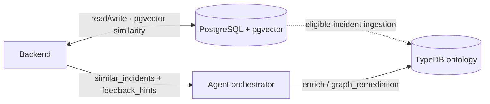
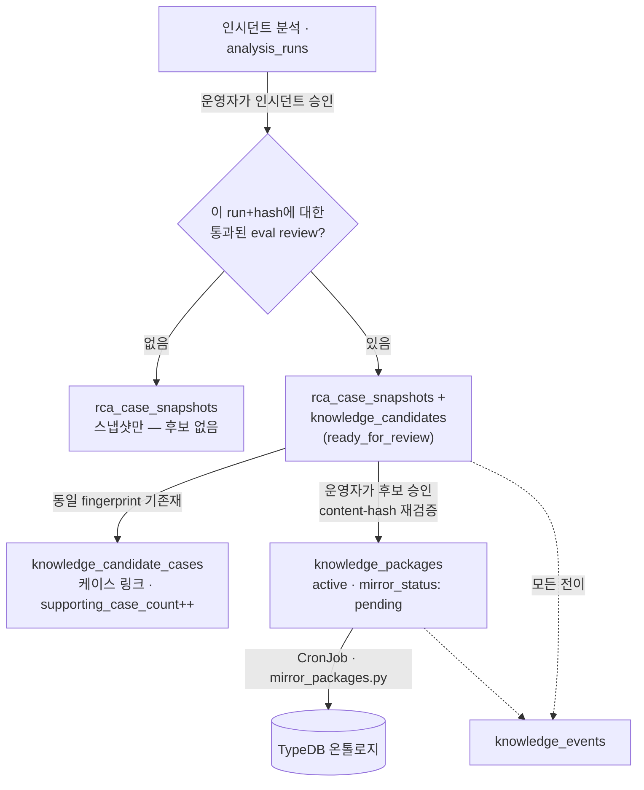

# Data Stores

> **관점:** 어떻게 만들어졌는가(데이터) — 두 개의 저장소와 각각이 소유하는 것.
> **이 문서에서 다루는 것:** PostgreSQL 테이블 · TypeDB 온톨로지 · 인제스트 경로 · 연결 설정.

Run:AI RCA는 서로 다른 역할을 가진 두 개의 저장소를 사용합니다. 런타임 흐름은
[Architecture](ARCHITECTURE.md)를 참조하십시오. 이 문서는 데이터 구조 참조입니다.

**이 문서는 누구를 위한가:** 기록이 어디에 있는지 알아야 하는 운영자와, 한 배포에 왜 두
데이터베이스가 있는지 이해해야 하는 개발자를 위한 문서입니다. PostgreSQL은 작업 중인 사건
파일이고, TypeDB는 그 파일의 승인된 부분으로 만든 선택 사항 관계 인덱스입니다.

| 저장소 | 역할 | 소유자 | 필수 여부 |
|---|---|---|---|
| **PostgreSQL** | 운영 신뢰의 원천: 인시던트, 알림, RCA 결과, 운영자 피드백, 유사도 벡터 | Go 백엔드 | 예 (로컬 개발용 인메모리 폴백 제공) |
| **TypeDB** | 온톨로지 지식 그래프: 합성 시점의 관계형 추론을 위한 타입 지정 엔티티 + 관계 | 에이전트 | 아니요 (`typedb.enabled`, Helm 기본값 on) |

그래프는 Postgres로부터 **파생**됩니다 — 두 번째 신뢰의 원천이 아닌 적격성 게이트 기반
투영입니다. Dashboard 승인을 받고 grace period가 지난 resolved 인시던트만 담습니다
(`typedb.ingest.requireApproval=true`가 기본값).

**pgvector** 유사도는 에이전트가 아니라 **백엔드**(Go)가 소유합니다: 백엔드가 코사인
검색을 실행하고 그 매칭 결과를 각 `/analyze` 요청에 전달합니다. 에이전트
**오케스트레이터**는 **TypeDB** 측을 소유합니다 — 분석 중에 그래프를 참조합니다.
[RCA Pipeline](RCA-PIPELINE.md)과 [Knowledge Base](KNOWLEDGE-BASE.md)를 참조하십시오.

---

## 1. PostgreSQL (운영)

### 작업에 따라 데이터 찾기

현재 인시던트와 그 알림, analysis run, 운영자 피드백, 유사도 검색, 그리고 승인 지식 학습
파이프라인은 PostgreSQL을 사용합니다. TypeDB는 선택 사항인 토폴로지와 승인 이력 관계에만
사용하며, 두 번째 운영 신뢰 원천이 아닙니다.

테이블은 시작 시 백엔드가 자동 생성합니다(`backend/store_postgres.go`). 백엔드 소유 테이블은
12개이며, 역할별로 묶으면 다음과 같습니다. 나머지 둘 — `rca_dataset`와
`ontology_backfill_cursors` — 는 Go 백엔드가 아니라 에이전트의 Python 오프라인 잡이 생성합니다.

**수집 & 분석**

| 테이블 | 목적 | 주요 컬럼 |
|---|---|---|
| `incidents` | 상관된 알림 그룹 — RCA와 Slack 스레드의 단위 | `incident_id` (PK), `correlation_key`, `status`, `fired_at`, `resolved_at`, `alert_count`, `analysis_seq`, `user_approved_at` |
| `alerts` | 개별 알림. 같은 알림의 재발은 여기 누적 | `alert_id` (PK), `incident_id`, `fingerprint`, `occurrence_count`, `occurrence_pods` (JSONB), `labels`/`annotations` (JSONB), `thread_ts` |
| `analysis_runs` | **RCA 신뢰의 원천** — 매 분석 실행의 전체 산출물 | `run_id` (PK), `source` (`auto`/`manual`/`chat`/`feedback`), `status`, `target_type`/`target_id`, `analysis_summary`/`analysis_detail`, `analysis_quality`, `root_cause_family`, `capabilities`/`missing_data`/`warnings`/`artifacts` (JSONB) |
| `incident_embeddings` | 유사도 메모리 — 과거의 닮은 인시던트 검색. 승인된 인시던트당 한 행(`alert_id`는 유지되지만 항상 빈 값) | `incident_id`, `alert_id`(`''`), `analysis_summary`/`analysis_detail`, `vector_json` (JSONB), `embedding vector(N)`(N = `EMBEDDING_DIM`, 기본 384) + HNSW cosine index |

> `alerts`의 알림별 RCA 컬럼(`analysis_*`, `capabilities`, …)은 **제거되었습니다** — RCA는
> `analysis_runs`에 있습니다. 백엔드는 더 이상 이 컬럼들을 생성하거나 읽지 않으며, 기존
> DB에 남은 컬럼은 수동으로 DROP하십시오(`store_postgres.go`에 명시).

**운영자 피드백 & 평가**

| 테이블 | 목적 | 주요 컬럼 |
|---|---|---|
| `rca_feedback` | 운영자 투표 **및** 코멘트(대상은 다형성) | `feedback_id` (PK), `kind` (`vote`/`comment`), `target_type`/`target_id`, `vote`, `body`, `author` |
| `rca_eval_reviews` | 정량 품질 리뷰 — 점수·하드 게이트·실제 해결 결과. 지식 학습의 **게이트** | `review_id` (PK), `run_id`, `analysis_hash`, `reviewer`, `scores`/`hard_gates` (JSONB), `resolution_outcome`, `effective_action`, `expected_family` |

> `rca_comments`는 **폐기 예정**입니다 — 존재할 경우에만 읽어서 기존 행을 `rca_feedback`로
> 이관하고, 이후 수동 DROP 가능합니다. 새 코멘트는 `kind='comment'`인 `rca_feedback` 행입니다.

**승인 지식 학습 파이프라인** — 아래 [학습 파이프라인](#학습-파이프라인-인시던트가-지식이-되기까지) 참조.

| 테이블 | 목적 | 주요 컬럼 |
|---|---|---|
| `rca_case_snapshots` | **운영자가 승인한** RCA의 불변 스냅샷 — 학습과 온톨로지의 입력 | `case_id` (PK = `run_id:hash`), `incident_id`, `run_id`, `analysis_hash`, `approval_state` (`active`/`revoked`/`superseded`), `mechanism_fingerprint`, `snapshot` (JSONB) |
| `knowledge_candidates` | 스냅샷에서 뽑은 지식 후보. 리뷰 상태머신을 따라 이동 | `candidate_id` (PK), `case_id`, `knowledge_fingerprint`, `supporting_case_count`, `status` (`generated` → `ready_for_review`/`shadow` → `active` / `validation_failed` / `rejected` / `superseded`), `content_hash`, `payload` (JSONB) |
| `knowledge_candidate_cases` | M:N 링크 — 한 후보를 뒷받침하는 승인 케이스들(교차 인시던트 dedup) | `candidate_id` + `case_id` (복합 PK), `linked_at` |
| `knowledge_packages` | 발행된 지식. TypeDB로 미러 | `package_id` (PK = `KPK-<case>`), `candidate_id`, `status` (`active`/`shadow`/`retired`), `payload` (JSONB), `mirror_status` |
| `knowledge_events` | 모든 수명주기 전이의 append-only 감사 로그 | `event_id` (PK), `candidate_id`, `package_id`, `event_type`, `actor`, `note`, `created_at` |

**챗봇 & 오프라인**

| 테이블 | 목적 | 주요 컬럼 |
|---|---|---|
| `chat_conversations` | 챗봇 대화 스레드. 인시던트/알림 컨텍스트에 연결 | `conversation_id` (PK), `incident_id`, `alert_id`, `messages` (JSONB), `context_label` |
| `rca_dataset` | 오프라인 eval 데이터셋 — CronJob이 라벨된 인시던트를 누적, curated 세트로 export | `dataset_id` (PK), `incident_id`, `alertname`, `expected_family`, `approved`, `question` (JSONB) |
| `ontology_backfill_cursors` | 일회성 백필 북킵(스냅샷 → TypeDB) | `cursor_name` (PK), `approved_at`, `case_id` |

**유사도 검색**: `incident_embeddings.embedding`(pgvector, HNSW cosine)이 기본 경로이며,
OpenAI 호환 embedding endpoint가 설정된 경우 기본 경로입니다. 저장된 메모리는 RCA
summary/detail을 포함하지만, 질의는 유입 알림의 제목·심각도·annotation·label로 구성됩니다
(발화 중인 알림에는 아직 RCA가 없습니다). 같은 family와 정규화된 workload identity 신호가
랭킹을 보강합니다. endpoint 또는 dense 검색을 사용할 수 없으면 Backend는 결정론적인 384차원
희소 feature-hash cosine 검색으로 폴백합니다. embedding basis/model/dimension이 변경되면
파생 벡터를 다시 생성하며, embedding 오류가 발생해도 인시던트 저장과 검색은 계속 사용할
수 있습니다. `labels`/`annotations` JSONB는 인제스트가 소비하는 가장 풍부한 엔티티
소스입니다(cluster/node/queue/etc.).

### 학습 파이프라인: 인시던트가 지식이 되기까지

승인된 RCA는 게이트가 걸린 단계들을 거쳐 재사용 가능한 지식이 됩니다. **두 개의 사람 게이트가
품질을 지킵니다** — 무엇도 자동으로 라이브되지 않습니다.

| 단계 | 트리거(언제) | 쓰기 | 게이트 |
|---|---|---|---|
| **스냅샷** | 운영자가 인시던트 승인(`user_approved_at`) | `rca_case_snapshots` (불변, `case_id = run_id:hash`) | 최신 analysis run이 `complete`이고 hash가 바인딩되어 있어야 함 |
| **후보** | 같은 승인, 단일 트랜잭션 | `knowledge_candidates` (`ready_for_review` / `validation_failed`) + `knowledge_events` (`candidate_generated`) | 그 run+hash에 바인딩된 **통과한 `rca_eval_reviews`**, family 일치, evidence/harness 게이트 — 아니면 스냅샷만 |
| **링크** | 동일 `knowledge_fingerprint` 후보가 이미 존재 | `knowledge_candidate_cases`, `supporting_case_count` 증가 | 교차 인시던트 dedup — 중복 후보 생성 안 함 |
| **발행** | 운영자가 후보 승인(`POST /api/v1/knowledge-candidates/…`) | `knowledge_packages` (`active`, `mirror_status=pending`); 동일 fingerprint의 이전 package → `retired` | content-hash **재검증** — 후보가 여전히 `ready_for_review`이고 hash가 안정적이어야 함 |
| **미러** | `typedb-package-mirror-job` CronJob(`ontology/mirror_packages.py`) | TypeDB upsert; `knowledge_packages.mirror_status` → `current`/`failed` | **Advisory** — 미러 실패는 활성화를 막지 않음 |
| **감사** | 위 모든 전이 | `knowledge_events` (append-only) | — |

**shadow** 발행(`ShadowKnowledgeCandidate`)은 패키지를 리뷰용으로 스테이징하되 활성 런타임
스냅샷에는 노출하지 않습니다. 승인이 실수로 RCA 랭킹을 바꾸지 못하게 하려는 것이며, 이후
명시적 활성화로 승격됩니다.

### 승격 증거 경로

Candidate 생성은 완전한 trace-v3 ledger 경로를 우선합니다. family가 일치하는
selected/supported 가설, 최소 두 source group의 canonical supporting evidence, 해당 가설에
연계된 probe 실행이 필요합니다. Ledger가 불완전하지만 snapshot family와 일치하는
supported root-cause claim 및 반증 없는 canonical supporting evidence가 있으면, 감사 가능한
두 번째 `harness_claim` 경로를 사용할 수 있습니다. `harness_claim` 경로는 두 source group과
연계 probe를 요구하지 않으며, 빈 `probe_template_ids` 목록을 내보내고
`evidence_source`와 `provenance.promotion_path`를 모두 `harness_claim`으로 표시합니다.
평가를 다시 저장하면 부적격 candidate의 최신 validation error가 갱신되고, gate를 통과하면
`ready_for_review`로 돌아올 수 있습니다.

---

## 2. TypeDB (온톨로지 지식 그래프)

스키마: `agent/ontology/schema.tql` (TypeQL 3.x). 세 개의 계층.

### 인프라 계층 — *인제스트로 채워짐*
`cluster`, `node`, `namespace`, `project`, `queue`, `workload`, `pod`,
`control_plane_component`.
GPU는 별도 엔티티가 아니라 `node`/`queue`/`project`의 속성(`gpu_allocated`,
`gpu_requested`)으로 모델링됩니다.

### 인시던트 / RCA 계층 — *인제스트로 채워짐*
`alert`, `incident`(이전 RCA를 질의할 수 있도록 `analysis_summary` 소유),
`analysis_run`.

### 지식 계층 — *큐레이션됨; `knowledge/` 카탈로그에서 시드됨*
`symptom`(매칭용 `keyword` 소유), `root_cause`, `action`, 그리고 `xid_error` GPU 결함
카탈로그(`leads_to` 체인 포함)와 `control_plane_component` 플랫폼 토폴로지(`depends_on`
포함). 이는 오케스트레이터가 참조하는 "이 증상 → 이 원인 → 이 조치로 수정됨" 지식입니다.
다섯 개의 로더가 공급합니다 — [How data gets in](#3-how-data-gets-in)과
[Knowledge Base](KNOWLEDGE-BASE.md) 문서를 참조하십시오.

### 근본 원인 분류 체계 (16개 패밀리, `sub root_cause`)
`node_kubelet_pressure`, `runai_scheduling_quota`, `k8s_scheduling_error`,
`runai_control_plane_error`, `k8s_control_plane_error`, `workload_startup_error`,
`image_pull_error`, `gpu_hardware_error`, `network_fabric_error`,
`cluster_network_error`, `k8s_storage_error`, `storage_backend_error`,
`workload_runtime_error`, `observability_accuracy`, `platform_auth_error`,
`platform_lifecycle_change`
(+ `insufficient_evidence`). 로더의 `FAMILIES` 집합 및
`agent/app/services/root_cause_ranking.py`와 동기화 상태를 유지해야 하며, 가드레일
테스트가 이를 강제합니다.

### 관계
- **토폴로지**: `scopes` (cluster→node/project), `runs_on` (node→pod),
  `belongs_to` (workload→pod), `in_project`, `submitted_to` (workload→queue),
  `contains` (namespace→pod/workload/component), `depends_on` (component→component)
- **인시던트**: `grouped_into` (incident←alert), `analyzed_by`, `similar_to`
- **지식**: `has_symptom`, `indicates` (symptom→cause), `has_cause`,
  `fixed_by` (cause→action), `resolved_by` (symptom→action), `supported_by`
  (←evidence), `emits`, `applies_to` (xid→gpu_model), `leads_to` (xid→xid)

### 채워짐 vs 모델링됨
| 상태 | 엔티티 / 관계 |
|---|---|
| ✅ 채워짐 (`ontology/ingest.py`) | 인프라 + 인시던트 계층 + 토폴로지/`grouped_into` |
| ✅ 지식 (`load_knowledge` / `load_troubleshooting` / 기타 `load_*`) | symptom/cause/action과 실행형 runbook 단계·전이·결론·조치, XID, component 의존성 |
| 🟦 승격됨 (`ingest.py --promote-knowledge`) | 운영자가 확인한 RCA로부터 `confirmed:<alert>` 증상 → 패밀리 → 조치 |
| ⬜ 모델링됨, 아직 미공급 | `evidence`, `analysis_run`, `similar_to`, `supported_by`, GPU 속성 |

---

## 3. How data gets in

| 경로 | 스크립트 | 소스 | 게이트 |
|---|---|---|---|
| Schema + functions | `load_schema` / `load_functions` | `schema.tql` / `functions.tql` | Helm post-install/upgrade 훅 (`typedb-schema-job.yaml`) |
| Curated knowledge | `load_knowledge`, `load_troubleshooting`, `load_xids`, `load_alerts`, `load_known_issues`, `load_architecture` | `knowledge/` 카탈로그들 | 버전 관리되는 파일, 스키마 잡에서 실행 |
| Topology + incidents | `ontology/ingest.py` (CronJob) | Postgres `incidents`/`alerts` | Dashboard 승인(`user_approved_at`) 후 resolved 상태로 `resolvedGraceHours` 이상 경과. `requireReview`는 deprecated |
| Knowledge promotion | `ingest.py --promote-knowledge` | 운영자가 확인한 RCA | resolved + 순긍정 피드백 |

**오케스트레이터**는 분석 중에 TypeDB를 참조합니다
(`agent/app/services/kg_enrichment.py`): 노드 blast radius(영향 범위), 동일 알림의 이전
인시던트, 그래프에서 파생된 조치 방안. TypeDB가 꺼져 있거나 도달 불가일 때는 빈 컨텍스트로
격하됩니다. 그래프는 `python -m ontology.query`(`--incident` / `--recent` / `--count`)
또는 TypeDB Studio로 조사하십시오.

---

## 4. 연결 / 설정

| 환경 변수 | 기본값 | 비고 |
|---|---|---|
| `ENABLE_TYPEDB` | `false` (Helm이 `typedb.enabled`에서 설정) | 마스터 스위치 |
| `TYPEDB_ADDRESS` | `localhost:1729` | 클러스터 내부: `<release>-typedb:1729` |
| `TYPEDB_DATABASE` | `runai_rca` | |
| `TYPEDB_USERNAME` / `TYPEDB_PASSWORD` | `admin` / `password` | CE 기본값 — PoC를 넘어서면 재정의 |
| `POSTGRES_DSN` | — | 백엔드 Postgres(에이전트 수집기/인제스트도 읽음) |
| `RUNAI_DB_DSN` | — | **Run:ai 컨트롤 플레인** Postgres에 대한 선택적 읽기 전용 DSN; 플랫폼 스키마(workloads/audit/…)에 대한 postgres 드릴다운의 `sql_select`를 활성화합니다. 읽기 전용 롤을 사용하십시오. |

수집에 `RUNAI_DB_DSN`을 사용하면 audit/history 읽기는 UTC 세션에서 실행됩니다.
`timestamp without time zone` 값은 Run:ai UTC로 해석하고, 결과 관찰에는
`naive_timestamps_assumed_utc: true`를 선언합니다. audit-table 실패는 격리되므로
성공한 테이블은 계속 사용할 수 있고, 실패하거나 발견 제한으로 건너뛴 테이블은
partial/missing data로 보고됩니다. Run:ai 컨트롤 플레인 DB 연결 실패도 정상 Postgres 점검이나
인과 증거가 아니라 사용 불가 문맥으로 명시적으로 보입니다.

TypeDB는 단일 노드 `StatefulSet` + PVC로 배포됩니다
(`charts/runai-rca/templates/typedb.yaml`). Community Edition은 단일 노드이며,
HA/클러스터링은 유료 Enterprise 등급입니다.
