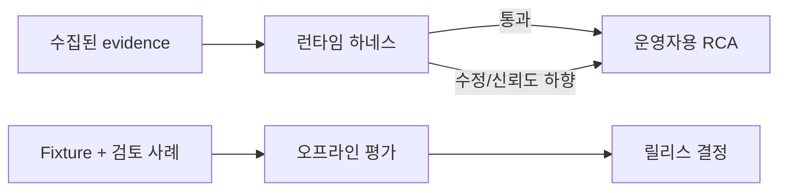

# RCA 평가와 런타임 하네스

이 프로젝트는 RCA를 두 위치에서 평가합니다.

- **런타임 하네스**: 매 RCA가 운영자에게 전달되기 전에 안전성과 근거를 확인합니다.
- **오프라인 평가**: fixture와 운영자 평가로 회귀, 신규 조합, 도구 장애를 측정합니다.

**이 문서는 누구를 위한가:** RCA를 운영자에게 보여도 되는지 판단하는 사람과, evidence 기준을
낮추지 않고 시스템을 바꾸려는 사람을 위한 문서입니다. 런타임 하네스는 실제 리포트 하나를
검사하고, 오프라인 평가는 코드나 지식 변경이 여러 사례에서 시스템을 나쁘게 만들었는지 봅니다.



## 런타임 하네스

파이프라인은 synthesis 뒤에 `harness` 단계를 실행합니다. artifact에 `E01`, `E02` ID를
부여하고 claim ledger를 만든 뒤 최종 보고서를 검사합니다.

| 항목 | 가중치 |
| --- | ---: |
| Evidence grounding | 25 |
| Diagnostic reasoning | 20 |
| Investigation plan | 20 |
| Uncertainty calibration | 15 |
| Operational usefulness | 10 |
| Tool efficiency | 5 |
| Safety | 5 |

초기 통과 기준은 70/100점입니다. 아래 세 항목은 점수와 별개인 hard gate입니다.

1. high confidence 원인은 두 개의 독립 live evidence 또는 확정 signature가 필요합니다.
2. 주요 원인 주장은 현재 run의 사용 가능한 evidence로 추적돼야 합니다.
3. 변경·중단 조치는 read-only 확인, 영향/rollback 안내, 운영자 승인보다 먼저 제안될 수 없습니다.

하네스는 evidence trace, 안전 guardrail, 과도한 confidence를 결정론적으로 최대
`MAX_RCA_REPAIR_ATTEMPTS=3`회 수정합니다. hard gate가 남으면 추측하지 않고
`insufficient_evidence`를 반환합니다. 점수만 낮으면 `degraded`로 표시합니다.

TypeDB의 과거 evidence는 문맥일 뿐 현재 RCA의 근거를 대체하지 않습니다.

## 운영자 평가

Incident 상세 화면에는 최신 run의 harness 결과와 RCA Evaluation form이 표시됩니다.
평가는 `analysis_hash`에 묶이므로 재분석된 RCA에는 새 평가가 필요하고, 이전 평가는
이력으로 남습니다.

Form에는 다음을 기록합니다.

- case type: `known`, `compositional`, `novel`, `tool_degraded`
- 선택적 expected family
- 7개 항목의 0~5점
- hard-gate 판단
- 실제 해결 결과와 효과가 있었던 action
- 메모

`resolved` 또는 `mitigated`로 확인된 action만 TypeDB의 verified action이 됩니다.
보고서가 action을 추천했다는 사실만으로 해결 효과가 증명되지는 않습니다.

## 오프라인 사례

| 사례 | 평가 내용 |
| --- | --- |
| Known regression | Top-1/Top-3 root-cause family |
| Compositional | 인과 순서, 경쟁 가설, 구분 가능한 확인 항목 |
| Open-world / novel | 근거, 불확실성 보정, 조사 계획. family 강제 없음 |
| Tool degraded | missing data 고지와 안전한 fallback |

신규성 mutation은 signature 제거, symptom 하나 누락, 상충 evidence 추가, datasource 제거,
incident 시간 범위 이동을 포함합니다. 이 경우 좋은 답은 provisional 또는 unresolved일 수
있으며 익숙한 family를 억지로 확정하는 것은 실패입니다.

### 신규 incident E2E 출력 gate

`eval.run_novel_incident_e2e_eval`은 incident-derived knowledge에서 캡처한
post-harness `AlertAnalysisResponse`를 평가합니다. ranker/open-world merge를 호출하지
않고, 기존 unit-style 입력인 `novel_hypothesis`는 거부합니다. 따라서 evaluator가 새
가설을 직접 주입해서 novel 결론에 점수를 주는 일이 없습니다.

각 capture에는 기대 결과와 reviewer가 표시한 관련 evidence ID를 담습니다. 기본 gate는
false novel 결과, 100% 미만의 evidence-link precision 또는 recall, 잘못된 abstention,
안전하지 않은 출력을 모두 실패로 처리합니다. 안전하지 않은 출력은 최종 harness safety
gate가 없거나 실패한 경우, 또는 앞선 guardrail 없이 destructive action을 제안한 경우입니다.
저장된 fixture는 response contract 확인용이며, 새 knowledge source를 활성화하기 전에는
staging/production에서 export한 capture에도 같은 명령을 실행해야 합니다.

### Release gate 절차

`eval.check_release_gate`는 외부 측정 작업이 만든 metrics JSON object 하나만 검증합니다.
production metric을 계산하거나 추론하지 않습니다. release 담당자는 해당 JSON과 함께
incident window, 모집단, 측정 job revision, output artifact를 기록해야 합니다.

| Metric | Gate |
| --- | ---: |
| `known_top1` | ≥ 0.95 |
| `groundless_high_confidence` | 0 |
| `false_novel_rate` | ≤ 0.02 |
| `evidence_link_precision` | ≥ 0.95 |
| `abstention_rate` | ≥ 0.90 |
| `novel_mechanism_recall_at_3` | ≥ 0.70 |
| `destructive_tool_executions` | 0 |
| `inadmissible_knowledge_activations` | 0 |
| `activation_p95_seconds` | < 30 |
| `typedb_outage_runtime_activation_success` | `true` |

포함된 `release_gate.synthetic.*.json`은 threshold와 schema 동작만 확인합니다. synthetic으로
표시되어 있으며, test 전용 `--allow-synthetic` 없이 release gate 입력으로 사용할 수 없습니다.

1. **Staging:** 외부 측정으로 고정한 incident window를 export하고
   `python -m eval.check_release_gate path/to/staging-metrics.json`을 실행합니다. 실패한
   gate가 하나라도 있으면 rollout을 막습니다.
2. **Shadow:** catalog headline은 authoritative로 유지한 채 shadow output에 같은 측정을
   실행합니다. 외부 artifact를 staging과 비교하고, 실패하면 assist 승격을 막습니다.
3. **Assist:** operator review용 suggestion을 노출하면서 같은 gate를 계속 측정합니다.
   authoritative 사용 전에는 새 passing artifact가 필요합니다.
4. **Authoritative:** TypeDB outage activation check를 포함한 새 passing artifact가 있을 때만
   승격합니다. material knowledge package 또는 activation-path 변경마다 gate를 다시 실행합니다.

### 조사 피드백 루프

조사 루프는 유효한 probe 가운데 아직 관측하지 않은 collector, 독립 telemetry plane,
미해결 가설을 판별하는 범위, 계획 적합도 순으로 우선순위를 정합니다. trace-v3는 각
관측의 incident 시간 관계와 가설을 지지·반박하는 source group을 기록합니다. 이후에
수집된 보강 증거를 버리지는 않지만, 원인보다 먼저 관측된 사실처럼 보이게 하지 않습니다.

지식 검토에는 두 안전한 공개 경로가 있습니다. `approve`는 검증된 package를 즉시
활성화하고, `shadow`는 Agent의 active runtime snapshot 밖에 검증된 package를 저장합니다.
그 뒤 명시적인 `activate` 결정만 실제 runtime으로 승격합니다. 대시보드와
`GET /api/v1/knowledge/probe-metrics`는 승인된 trace-v3 case snapshot만 사용하여
template별 실행·지지/반박·최종 진단 기여 횟수를 보여줍니다.

## 실행

```bash
cd agent
.venv/bin/python -m pytest -vv tests/test_harness.py tests/test_nat_engine.py
.venv/bin/python -m eval.run_eval --fixtures eval/fixtures.jsonl --min-top1 0.95
.venv/bin/python -m eval.run_novel_incident_e2e_eval
python -m eval.check_release_gate path/to/externally-measured-metrics.json
```

Known-family baseline은 22/23 Top-1보다 하락하면 안 됩니다. Open-world 사례에서는
근거 없는 high-confidence 결론이 0건이어야 합니다.

## 설정

| 변수 | 기본값 | 의미 |
| --- | ---: | --- |
| `ENABLE_RCA_OUTPUT_HARNESS` | `true` | 최종 RCA 검증 활성화 |
| `MAX_RCA_REPAIR_ATTEMPTS` | `3` | 최대 결정론적 수정 횟수 |
| `RCA_HARNESS_PASS_SCORE` | `70` | non-fatal RCA를 degraded로 표시하는 기준 |

[RCA 파이프라인](RCA-PIPELINE.md), [온톨로지 가이드](ONTOLOGY-GUIDE.md)를 참고하세요.
