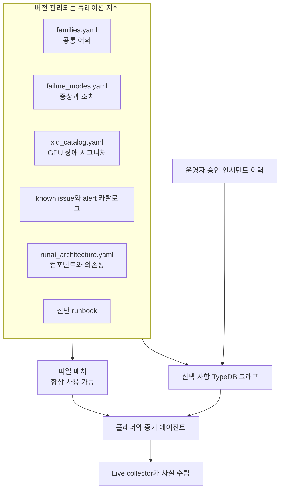
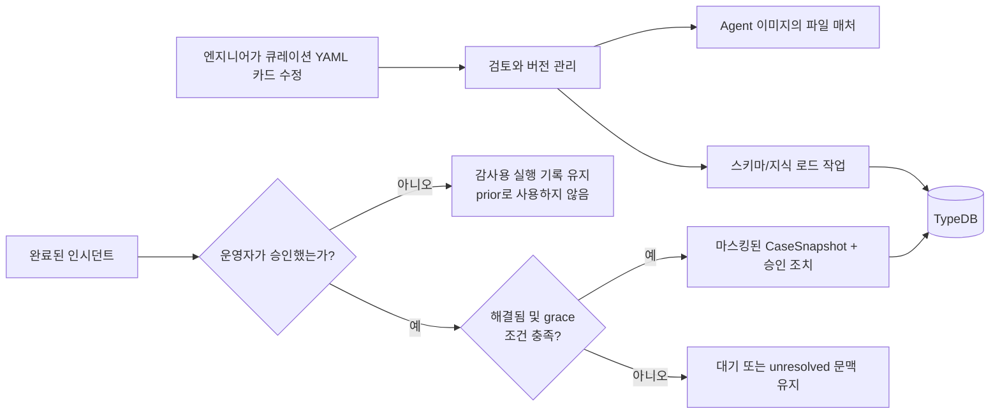
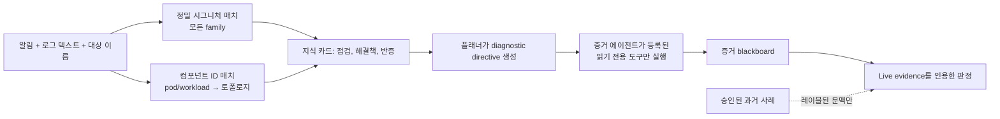

# 지식 베이스

> **쉽게 말하면:** 지식 베이스는 팀의 시니어 엔지니어 노트입니다. AI가 인시던트를 보기 전에
> 믿을 만한 맥락을 제공하지만, 지금 시스템에서 수집한 사실을 대신하지는 않습니다.

알림에는 “GPU 비정상”처럼 짧은 말만 있을 수 있습니다. 숙련된 운영자는 어떤 컴포넌트를 봐야
하는지, 어떤 증상이 중요한지, 어떤 과거 조치를 참고할 수 있는지 압니다. 지식 베이스는 이
공통 경험을 버전 관리되는 카드와 선택 사항인 TypeDB 관계 그래프로 담습니다. 현재 사실은
언제나 live collector가 결정합니다.

## 1. 알림 전에 Agent가 아는 것

| 계층 | 쉬운 설명 | 주된 출처 | 도움되는 일 |
| --- | --- | --- | --- |
| 어휘 | 제품이 말할 수 있는 장애 종류의 이름 | `families.yaml` | 일관된 RCA 레이블 |
| 시그니처 카드 | 구체적 단어, XID, 증상, 점검, 해결책 | `failure_modes.yaml`, XID/issue/alert 카탈로그 | 올바른 조사 경로 찾기 |
| 토폴로지 | 플랫폼 컴포넌트의 의존 관계 | `runai_architecture.yaml` | 올바른 순서로 서비스 점검 |
| 승인 이력 | 사람이 검토한 과거 사례 | Backend Postgres → TypeDB | 증명이 아닌 레이블된 문맥 제공 |

그림은 왼쪽에서 오른쪽으로 읽으면 됩니다. 큐레이션 파일은 TypeDB가 꺼져도 작동합니다.
그래프는 “이 컴포넌트가 저 컴포넌트에 의존한다” 또는 “승인 사례가 이 패밀리였다” 같은
관계를 더하지만, collector를 대체하지는 않습니다.

### 어휘를 일관되게 유지하기

`families.yaml`과 `failure_modes.yaml`은 하나의 failure-family 어휘를 공유합니다. 새 family를
추가할 때는 두 파일 **모두**와 `agent/app/knowledge.py`의 builtin catalog mirror를 수정해야
합니다. schema/loader 테스트가 이 일치를 검사합니다. family ranker는 지식을 검색하지 않고,
정밀 매치가 발견된 뒤 후보 순서와 대략적인 원인 설명만 제공합니다.

## 2. 지식이 시스템에 들어오는 방법

| 유입 경로 | 승인 필요? | 남기는 내용 |
| --- | --- | --- |
| 큐레이션 카탈로그 | 코드/콘텐츠 검토 | 통제된 시그니처, 점검, 토폴로지 |
| 인시던트 메모리 | **예: `user_approved_at`** | 마스킹된 승인 스냅샷과 증거 참조 |
| 지식 패키지 | 승인/활성화 워크플로 | 검증된 요약과 기존 probe-template ID |

이는 의도적으로 보수적입니다. 승인되지 않은 분석은 담당 운영자에게는 유용할 수 있어도
유사 인시던트 prior가 되거나 지식으로 ingest되지 않습니다. 승인은 “이 사례에서 배워도
안전하다”는 사람의 확인입니다. 원시 로그, 자격 증명, 임의 명령은 TypeDB로 복사하지 않습니다.

인시던트 기반 candidate는 기본적으로 family가 일치하는 selected/supported 가설, 최소 두
source group의 canonical evidence, 연계된 probe 실행을 가진 완전한 trace-v3 ledger에서
생성됩니다. Ledger가 불완전하면 snapshot family와 일치하는 supported harness root-cause
claim, canonical하고 반증이 없는 supporting evidence, 최소 하나의 supporting evidence ID가
있는 경우에 한해 별도로 감사 가능한 `harness_claim` 경로를 사용할 수 있습니다. 이 경로는
probe를 만들어 내지 않고 두 source group도 요구하지 않으며, payload에
`evidence_source: "harness_claim"`과 빈 `probe_template_ids` 목록을 기록합니다. 평가를
다시 저장하면 실패한 candidate의 최신 validation 사유가 갱신되고 모든 gate를 통과할 때
다시 review 대상으로 돌아올 수 있습니다.

## 3. 분석 중 지식이 사용되는 방법

검색의 시작점은 **정밀 시그니처 매치**입니다. 큐레이션 증상, NVIDIA XID 코드, 알림 텍스트,
known issue를 *모든* family에서 찾습니다. exact 매치가 우선이고 BM25/동의어 리콜은 보수적인
폴백입니다. family ranker는 이후 순서만 돕기 때문에 다른 family의 정밀 카드를 숨길 수 없습니다.

컴포넌트 이름도 별도 진입점입니다. 예를 들어 `nvidia-driver-daemonset-...` Pod 알림은 오류
문자열이 없어도 GPU Operator 의존성 체인에 도달할 수 있습니다. directive에는 질문, 점검,
반증, 선언형 probe template이 담깁니다. placeholder는 alert scope에서만 채워집니다. 이것은
shell 명령이 아니며, 각 Agent의 읽기 전용 tool registry가 실제 권한 경계입니다.

## 4. 전체 예시: NVIDIA Xid 79

**상황:** 워크로드 알림에 `NVRM: Xid ... 79`, “GPU has fallen off the bus”가 나타납니다.

| 단계 | 시스템이 하는 일 | 운영자가 보는 것 |
| --- | --- | --- |
| 1. 인식 | XID/시그니처 카드가 `79`를 `gpu_hardware_error`로 매핑 | 일반적인 “노드 문제”가 아닌 구체적 GPU 후보 |
| 2. 안내 | 카드가 driver/GPU 점검을, 토폴로지가 NVIDIA driver/GPU Operator 경로를 제공 | 순서가 있는 읽기 전용 점검과 반증 조건 |
| 3. 수집 | System, Kubernetes, Loki, Prometheus Agent가 각자 허용된 증거 평면을 조회 | 시간 있는 Xid 라인, 노드 상태, 메트릭 증거 카드 |
| 4. 판정 | blackboard가 지지와 반증을 비교 | RCA evidence ID, 신뢰도, 다음 점검 또는 `insufficient_evidence` |

카드는 GPU가 실패했다고 선언하지 않습니다. 그 주장을 믿을 만하게 만드는 조건과 반대 증거를
알려 줍니다. live evidence가 없거나 모순되면 리포트는 신중하게 유지됩니다.

## 5. 자세히 보기: 선택 사항 TypeDB 보강

TypeDB는 큐레이션 토폴로지와 승인 이력을 미러링하여 오케스트레이터가 “이 컴포넌트에 무엇이
의존하는가?”, “이 노드를 공유하는 워크로드는 무엇인가?”, “승인된 유사 사례가 있는가?”를
묻게 합니다. 선택 사항이므로 사용할 수 없으면 Agent는 경고를 남기고 YAML/Python 경로로
계속 동작합니다.

큐레이션 사실은 이중으로 로드됩니다. `agent/app/knowledge.py`는 파일을 직접 사용하고,
`agent/ontology/load_*.py`는 같은 사실을 TypeDB에 미러링합니다. 토폴로지 항목에는 layer,
purpose, failure effect, `depends_on` 경로, `owns_schema`, 안전한 점검 텍스트도 들어갑니다.
따라서 Postgres drill-down은 스키마 소유권을 설명할 수 있고, 런타임은 진단 runbook을
TypeDB에서 먼저 로드한 뒤 그래프를 사용할 수 없을 때만 인접 YAML로 폴백합니다.

승인 흐름은 [Learning and Ontology](LEARNING-AND-ONTOLOGY.md), 그래프 모델과 TypeDB 쿼리는
[Ontology Guide](ONTOLOGY-GUIDE.md)를 참고하세요.
