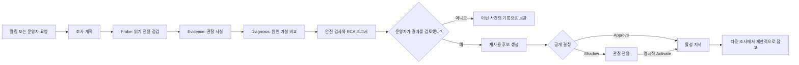
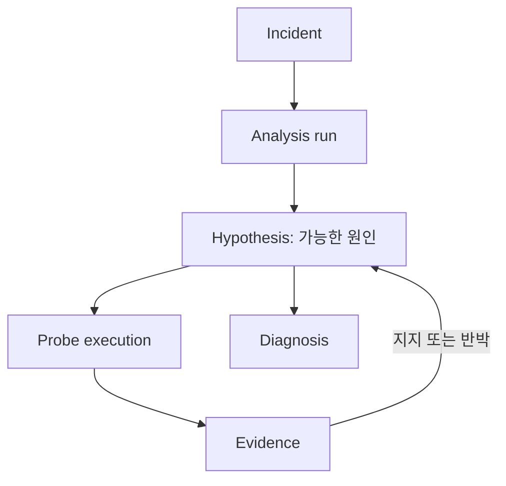
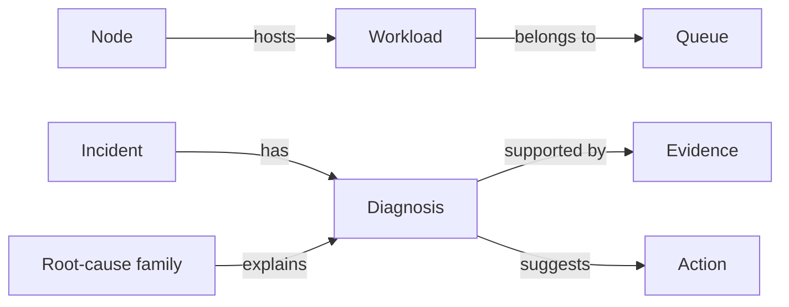

# 조사 기록, 온톨로지, 학습 지식: 처음 보는 사람을 위한 안내

> **한 줄 요약:** Run:AI RCA는 장애 원인을 바로 단정하지 않습니다. 여러 곳에서 사실을 확인하고 근거를 남긴 뒤, 사람이 검토한 사례만 다음 조사에 제한적으로 재사용합니다.

이 문서는 새 구조를 비전공자도 읽을 수 있게 설명합니다. 세부 API보다 정보가 **어디서 왔고**, **언제 믿을 수 있으며**, **어떻게 다음 분석에 쓰이는지**에 초점을 둡니다.

## 먼저 알아둘 네 가지 말

| 말 | 쉬운 뜻 | 예 |
| --- | --- | --- |
| **Incident (인시던트)** | 실제로 발생한 장애 사건 | `Pending` 상태로 오래 머문 워크로드 알림 |
| **Diagnosis (진단)** | 그 사건의 원인에 대한 한 번의 판단 | "GPU quota 부족일 가능성이 높다" |
| **Probe (점검)** | 판단을 확인하거나 반박하는, 작고 읽기 전용인 질문 | 파드 이벤트 또는 메트릭 조회 |
| **Evidence (근거)** | probe가 가져온 관찰 결과 | `Insufficient gpu` 이벤트 |

핵심은 **진단은 주장이고, evidence는 그 주장을 지지하거나 반박하는 관찰**이라는 점입니다. 과거에 비슷한 장애가 있었다는 사실만으로 현재 원인을 확정하지 않습니다.

## 장애 하나를 조사하는 흐름



Agent는 처음부터 모든 시스템을 훑지 않습니다. 알림과 현재 상황으로 계획을 세운 뒤 필요한 probe를 실행합니다. Probe는 Kubernetes, Run:ai, Prometheus, Loki, Postgres 등 서로 다른 관측 지점에 던지는 읽기 전용 질문입니다.

중앙 조사 루프는 다음 순서로 다음 probe를 고릅니다.

1. 아직 보지 않은 수집기부터 확인합니다.
2. 이미 본 결과와 독립적인 관측 지점을 우선합니다. 같은 로그를 한 번 더 읽는 것보다 이벤트와 메트릭을 함께 보는 편이 교차 확인에 도움이 됩니다.
3. 아직 결론 나지 않은 가설을 가장 잘 구분할 수 있는 점검을 고릅니다.
4. 마지막으로 최초 조사 계획과의 관련도를 반영합니다.

Probe는 수정 명령이 아닙니다. Kubernetes는 허용된 GET/LIST, Prometheus·Loki는 조회, Run:ai는 GET, Postgres는 읽기 전용 `SELECT`만 사용합니다. 그래서 "조사"가 워크로드를 바꾸지 않습니다.

## trace-v3: 조사 과정을 남기는 영수증

`trace-v3`는 최종 답만 저장하는 대신, **어떤 가설에 대해 어떤 probe를 언제 실행했고 어떤 evidence가 나왔는지**를 남기는 조사 영수증입니다.



- evidence가 장애 시점보다 전인지, 동시에 관측됐는지, 나중에 보강됐는지를 기록합니다. 나중에 얻은 증거도 유용하지만 장애보다 먼저 원인을 알았던 것처럼 보이지 않게 합니다.
- evidence의 source group을 기록합니다. 같은 로그를 여러 번 읽은 결과보다 서로 다른 관측 지점의 일치가 더 강한 근거가 될 수 있기 때문입니다.
- 최종 하네스는 높은 신뢰도의 진단에 독립적인 live evidence 두 개 또는 확정 시그니처를 요구합니다. 충족하지 못하면 그럴듯한 추측 대신 `insufficient_evidence`를 냅니다.

## 온톨로지: 정보를 표가 아니라 관계로 보는 방법

온톨로지는 어려운 AI 용어가 아니라 **정보 사이의 관계를 명시적으로 저장하는 지도**입니다. TypeDB에는 다음과 같은 관계를 저장합니다.



이 구조 덕분에 "이 노드가 문제라면 영향 받을 워크로드는 무엇인가?", "같은 증상을 가진 승인된 과거 사건은 있었는가?", "특정 원인에서 효과가 확인된 조치는 무엇인가?"를 물을 수 있습니다.

온톨로지는 live collector를 대체하지 않습니다. 현재 장애의 사실은 여전히 live probe가 수집하고, 그래프는 계획과 보고서에 관계형 문맥만 제공합니다. TypeDB가 꺼져 있거나 잠시 장애여도 RCA는 계속 생성됩니다.

## 기존 정보와 새 구조의 관계

새 구조는 기존 데이터를 지우거나 강제로 다시 쓰지 않는 **추가형 변경**입니다.

- 예전 RCA, evidence, 진단은 그대로 남습니다.
- `trace-v3` backfill은 **운영자 승인 조건을 만족하는 v3 조사 기록만** TypeDB에 투영합니다. v1/v2 또는 형식이 맞지 않는 기존 기록을 v3로 꾸며내지 않습니다.
- 일반 인시던트 적재도 `resolved` 상태, 유예 시간 경과, Dashboard 승인 같은 게이트를 통과한 데이터만 대상으로 합니다.
- 따라서 과거 자료가 새 구조에 모두 들어가지 않는 것은 누락이 아니라, 근거가 불충분한 기록을 새 학습 지식으로 오인하지 않기 위한 안전 장치입니다.

## 검토된 사례가 지식이 되는 과정

운영자가 RCA 결과와 조치 결과를 기록하면, 시스템은 trace-v3가 완전하고 모순이 없는지 확인한 뒤 **knowledge candidate(재사용 후보)**를 만듭니다. 후보에는 원본 로그나 쿼리, 자격 증명이 아니라 검증에 필요한 최소 요약과 승인된 probe 템플릿 식별자만 담깁니다.

| 상태/행동 | 의미 | 다음 분석에 미치는 영향 |
| --- | --- | --- |
| `ready_for_review` | 검증 가능한 후보가 만들어짐 | 영향 없음 |
| `reject` | 부정확하거나 불필요하다고 판단 | 영향 없음 |
| `shadow` | 실제 적용 전 관찰 대상으로 보관 | active snapshot에 들어가지 않음 |
| `activate` | shadow 후보를 명시적으로 승인 | active snapshot에 포함 |
| `approve` | 검증 후 바로 활성화 | active snapshot에 포함 |
| `retired` | 더 이상 쓰지 않음 | active snapshot에서 제거 |

`shadow`는 새 지식이 맞아 보이더라도 바로 RCA의 결론을 바꾸지 않는 안전장치입니다. 운영자가 효과를 확인한 뒤에만 `activate`합니다. `DYNAMIC_KNOWLEDGE_MODE=shadow`가 기본값인 것도 같은 이유입니다.

대시보드의 probe metrics와 `GET /api/v1/knowledge/probe-metrics`는 승인된 trace-v3 사례만 집계합니다. 템플릿별 실행 수, 가설 지지/반박 수, 최종 진단 기여도를 보고 어떤 점검이 실제로 도움이 됐는지 판단할 수 있습니다.

## Package mirror는 무엇을 하나

활성 또는 보관 중인 knowledge package의 요약과 템플릿 연결은 Backend Postgres가 기준입니다. `typedb-package-mirror` CronJob은 이 내용을 TypeDB에도 **비동기 복사**해 그래프에서 관계를 조회할 수 있게 합니다.

- Backend가 승인, 활성화, 은퇴의 최종 권한을 갖습니다. mirror가 실패하거나 늦어도 package를 활성화하거나 비활성화하지 않습니다.
- 기본 스케줄은 매시 정각(`0 * * * *`)입니다. 재시도와 은퇴 상태 반영을 위해 Helm 업그레이드와 별도로 동작합니다.
- `package mirror: no packages` 로그는 동기화할 package가 아직 없다는 뜻입니다. 오류가 아니며, 후보가 shadow/approve 되어 package가 만들어진 뒤에만 복사할 대상이 생깁니다.
- TypeDB 미러를 끄면 RCA와 active runtime 지식은 계속 동작하지만, TypeDB에서 보는 package 관계는 최신 상태가 아닐 수 있습니다.

## 운영자가 확인할 것

1. 분석 보고서에 evidence ID와 부족한 근거가 투명하게 표시되는지 확인합니다.
2. 새 후보는 곧바로 활성화하지 말고 `shadow`에서 결과를 관찰합니다.
3. probe metrics와 실제 운영 결과가 일치할 때만 `activate`합니다.
4. TypeDB 적재 상태는 읽기 전용 명령으로 확인합니다.

```bash
kubectl exec -n <namespace> deploy/<release>-agent -- \
  python -m ontology.query --count
kubectl exec -n <namespace> deploy/<release>-agent -- \
  python -m ontology.query --recent 20
```

세부 용어와 TypeQL 조회는 [온톨로지 및 데이터 적재 가이드](ONTOLOGY-GUIDE.md), 실제 조사 단계는 [RCA 파이프라인](RCA-PIPELINE.md), 운영 설정은 [설정 레퍼런스](CONFIGURATION.md)를 참고하세요.
