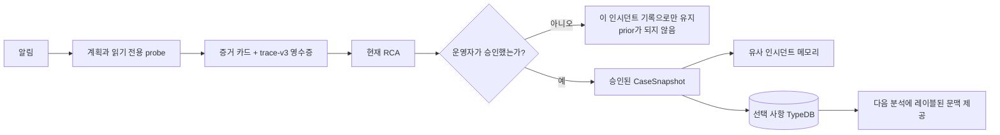
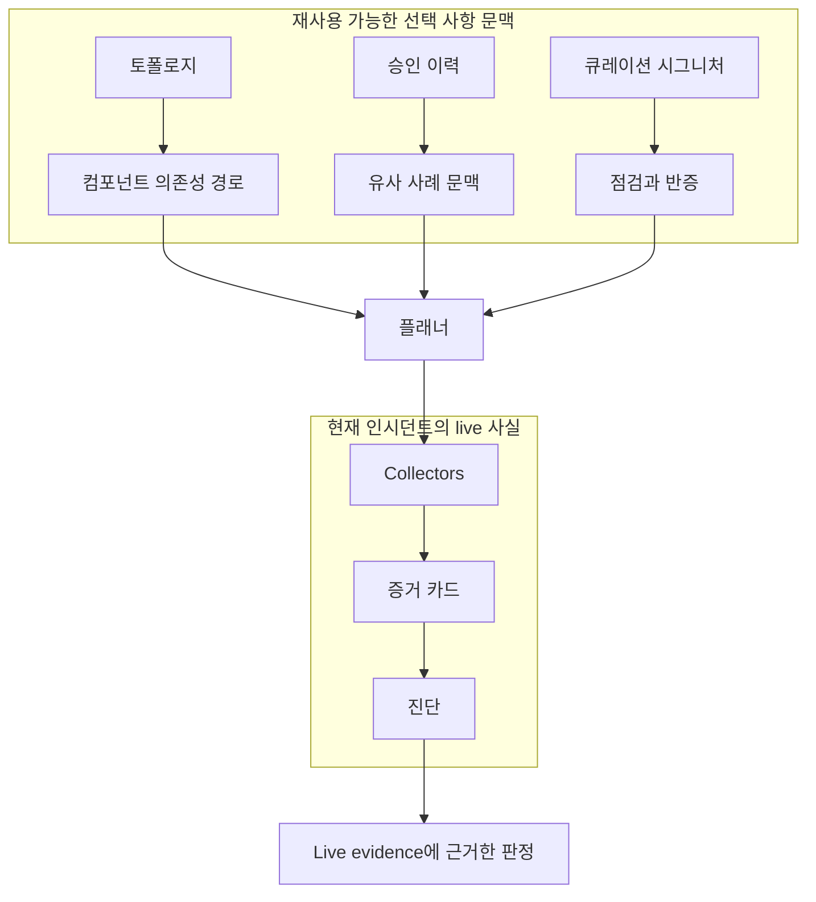
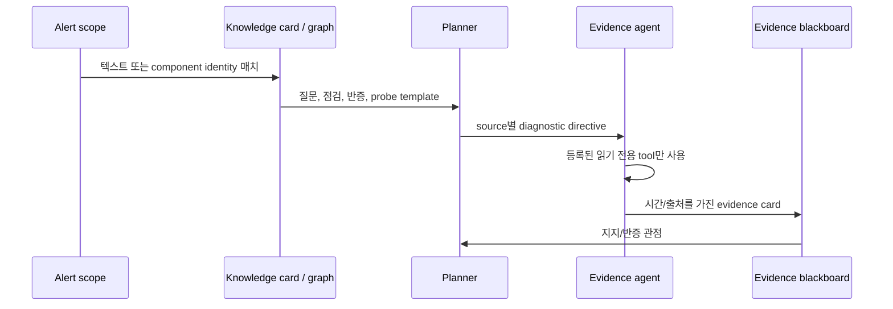

# 학습과 온톨로지: 쉬운 설명

> **쉽게 말하면:** 학습은 팀의 검토된 사례집입니다. 비행 기록 장치와 시니어 엔지니어의
> 노트를 합친 것처럼, 사람이 믿을 수 있다고 확인한 사례만 기억합니다.

Run:AI RCA는 현재 진단과 재사용할 지식을 분리합니다. 진단은 하나의 인시던트에 대한 하나의
주장이고, 증거는 그 주장을 지지하거나 반박하는 live 관찰입니다. 비슷한 과거 인시던트는
질문을 제안할 수 있지만 오늘의 원인을 증명할 수는 없습니다.

| 용어 | 쉬운 뜻 | 예시 |
| --- | --- | --- |
| 인시던트 | 실제 운영 장애 사건 | 학습 작업이 GPU를 잃음 |
| 진단 | 그 사건 원인에 대한 주장 | “GPU/driver 경로가 실패했을 수 있음” |
| Probe | 범위가 정해진 읽기 전용 점검 | 노드 journal 라인 읽기 |
| 증거 카드 | Probe가 실제로 본 결과 | 시간이 있는 `Xid 79` 라인 |
| 온톨로지 | 사물과 관계를 나타낸 지도 | GPU Operator → driver daemonset |

## 1. 학습 흐름과 승인 게이트

| 게이트 | 필요한 이유 | 결과 |
| --- | --- | --- |
| 운영자 승인 | 추측이 시스템을 가르치지 않게 함 | 미승인 실행은 prior가 되지 않음 |
| ingest용 해결/grace 조건 | 피드백과 재분석이 안정될 시간 제공 | 안정된 승인 사례만 TypeDB에 들어감 |
| 마스킹된 투영 | 원시 민감 정보 복사를 방지 | 로그/시크릿이 아닌 요약과 증거 참조 |

이는 자동 자기 학습이 아닙니다. `user_approved_at`이 있는 사례만 유사 인시던트 메모리로
매치되고 TypeDB에 ingest됩니다. 승인되었지만 해결되지 않은 RCA는 unresolved 문맥으로
남을 수 있으나 양성 인과 지식으로 승격되지는 않습니다. 재분석은 같은 run의 그래프 edge를
갱신하므로 오래된 증거가 남지 않습니다.

## 2. 온톨로지가 더하는 것

| 지식 계층 | 답할 수 있는 질문 | 할 수 없는 일 |
| --- | --- | --- |
| 큐레이션 시그니처 | “Xid 79이면 보통 무엇을 점검해야 하나?” | 오늘 GPU가 실패했다고 선언 |
| 컴포넌트 토폴로지 | “이 서비스 전후에 무엇을 점검해야 하나?” | 컴포넌트 장애를 만들어 냄 |
| 승인 이력 | “검토된 유사 사례가 있었나?” | high-confidence 증명 제공 |

TypeDB는 선택 사항 보강입니다. 비활성화되었거나 사용할 수 없으면 파일 기반 카탈로그가 여전히
플래너를 안내하고 collector는 RCA를 만듭니다. 리포트는 그래프 추론이 있었던 것처럼 숨기지
않고 그 공백을 기록합니다.

## 3. 안내가 안전한 조사로 바뀌는 방법

diagnostic directive는 의도적으로 선언형입니다. “이 alert의 node에서 driver daemonset을
확인하라”라고 안내할 수 있지만 실행 가능한 명령은 아닙니다. alert scope에 이미 있는
placeholder만 해결됩니다. Kubernetes, Loki, Prometheus, Run:ai, Postgres Agent는 각각
자신의 tool registry를 유지하며, 이것이 실제 권한 경계입니다.

`trace-v3`는 조사 영수증입니다. 가설, probe, 시간 관계, source group, 관찰이 주장을
지지했는지 반박했는지를 기록합니다. 나중의 보강 증거가 알림 시점에 이미 알고 있던 사실처럼
보이지 않게 합니다.

## 4. 전체 예시: Xid 79가 알림에서 판정까지

1. 알림 또는 Loki/System 라인에 `NVRM: Xid ... 79`, “GPU has fallen off the bus”가
   나타납니다. 큐레이션 XID 카드는 family ranker보다 먼저 매치됩니다.
2. 카드는 GPU hardware 경로와 “driver가 지속적인 device loss를 보고하는가?” 같은 질문,
   그리고 깨끗한 driver journal 같은 반증 조건을 제공합니다.
3. 플래너는 관련 Agent에 선언형 읽기 전용 probe를 줍니다. `nvidia-driver-daemonset-...` 같은
   component 이름은 XID 텍스트가 없어도 같은 토폴로지 경로에 도달할 수 있습니다.
4. 운영자는 시간이 있는 Xid 라인, 영향 노드, 수집 공백, RCA가 사용한 정확한 evidence ID를 봅니다.
5. 독립적인 live signal이 일치하면 판정이 이를 인용합니다. 그렇지 않으면 리포트는
   `insufficient_evidence`를 말하고, 카드는 장애 주장 대신 다음 점검 안내로 남습니다.

## 5. 자세히 보기: 패키지와 그래프 미러

Backend Postgres가 패키지 승인, 활성화, 은퇴의 권위자입니다. `shadow` 패키지는 관찰만 하고
활성화되지 않으며, `activate`는 명시적으로 켭니다. `approve`는 검증 후 바로 활성화하고,
`reject`/`retired`는 런타임 사용에서 제외합니다. TypeDB package-mirror CronJob은 그래프 질의를
위해 요약과 승인된 template binding을 복사할 뿐 활성화 상태를 바꾸지 않습니다.

active와 shadow 패키지가 실제로 실시간 분석에 어떻게 반영되는지는 런타임 활성화 사다리
(`DYNAMIC_KNOWLEDGE_MODE`: off/shadow/assist/authoritative)가 결정합니다 —
[지식 베이스](KNOWLEDGE-BASE.md#3-how-knowledge-is-used-during-an-analysis) 참조.

Candidate 생성은 완전한 trace-v3 ledger 경로를 우선합니다. Ledger가 불완전해도 approved
snapshot과 family가 일치하고 supporting evidence가 canonical하며 반증이 없고 비어 있지
않은 supported harness claim이면 두 번째 승격 경로를 사용할 수 있습니다. harness-claim
경로는 두 source group이나 연계 probe 실행을 요구하지 않고 probe ID를 만들어 내지 않으며,
감사를 위해 `evidence_source: "harness_claim"`으로 표시됩니다. 평가를 다시 저장하면 정확한
run/hash를 기준으로 재검증하고, 부적격 candidate가 유지될 때 최신 실패 사유를 갱신합니다.

## 6. 외부 지원 사례 prior

어떤 교훈은 우리 클러스터 밖 — 큐레이션된 엔터프라이즈 지원 사례 — 에서 옵니다.
마스킹된 v2.0 payload로 도착하며, **외부 참고 사례일 뿐 증거가 아닌 것**으로 다룹니다:

- **커밋 전 비식별화.** 원본 번들에는 실제 지원 케이스 번호가 들어 있습니다.
  `agent/knowledge/external_cases/sanitize.py`가 번호를 모든 곳(identity, manifest
  파일명, 산문)에서 제거하고, 케이스 키를 불투명 해시로 바꾸고, 타임스탬프를 날짜로
  뭉갭니다. 비식별화된 사본만 커밋됩니다 — known-issues 카탈로그와 같은
  "기록이 아니라 교훈을 공개" 관행입니다. 번호가 남은 파일은 sanitizer가 출력을
  거부합니다.
- **승인은 명시적.** Helm 스키마 로드 Job은 운영자가 지정한 승인자
  (`typedb.externalCases.approvedBy`)가 있을 때만 로더를 실행하고, 그 값을 모든 사례에
  기록합니다 — 1절과 동일한 승인 게이트입니다.
- **지식 계층 권위가 될 수 없음.** TypeDB에는 사례 로컬 symptom을 가진 라벨된 case
  snapshot으로 들어가지만, 로더는 지식 계층이 요구하는 `indicates`/`resolved_by` 엣지를
  구조적으로 절대 만들지 않으므로, 원인을 단정하는 카탈로그 규칙이 될 수 없습니다.
- **에러 시그니처로 검색.** 이후 분석은 에러 시그니처(예: `ibv_modify_qp failed with 19
  No such device`)가 그 실행의 관측 증거에 실제로 나타날 때만 사례를 표면화합니다. 그때
  사용 등급(`evaluation_only`, `mitigated_context`, `unresolved_context`)이 붙은 과거
  맥락으로 나타납니다. 시도된 조치 — **효과가 없었던** 것 포함 — 는 "과거 외부 사례에서
  시도됨"으로만 표시되며, 현재 사건의 검증된 해결책으로는 절대 제시되지 않습니다.

비식별화 계약과 사례 추가 방법은 `agent/knowledge/external_cases/README.md`를 참고하세요.

카탈로그 지도는 [Knowledge Base](KNOWLEDGE-BASE.md), entity/relation 및 안전한 TypeDB Studio
점검은 [Ontology Guide](ONTOLOGY-GUIDE.md)를 참고하세요.
