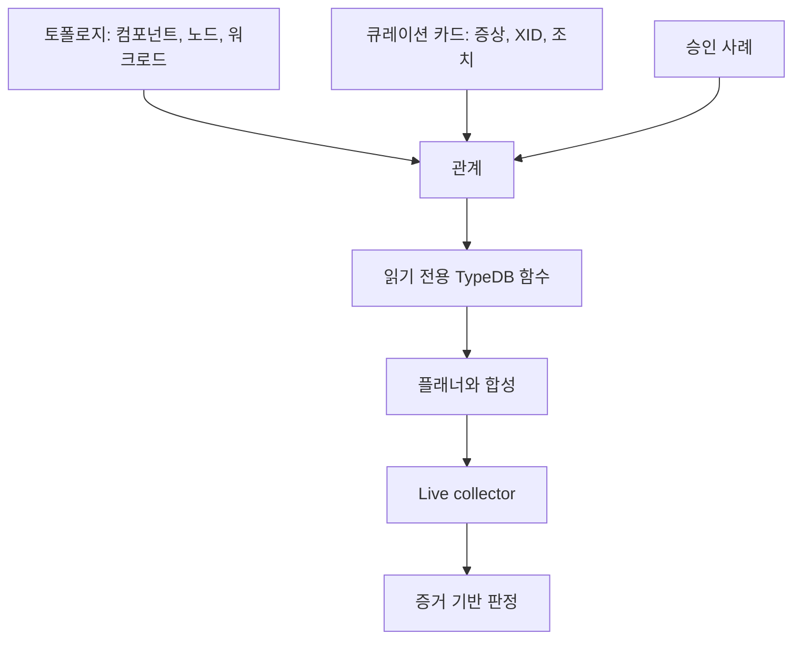
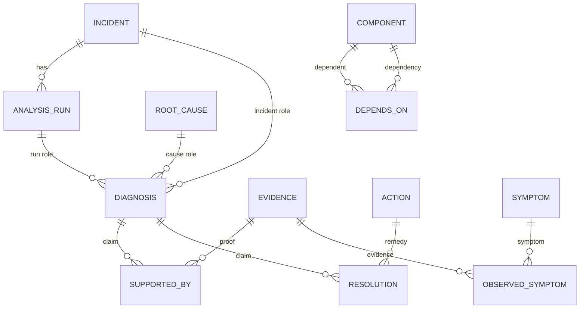
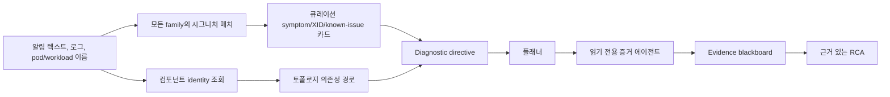

# 온톨로지와 승인 RCA 인제스트

> **쉽게 말하면:** 온톨로지는 플랫폼과 검토된 경험에 이름표를 붙인 지도입니다. 지하철
> 노선도처럼 어디가 연결되는지는 알려 주지만, 지금 막힌 곳을 알기 위해서는 여전히 실시간
> 교통 정보, 즉 live evidence가 필요합니다.

TypeDB는 Run:AI RCA가 선택적으로 사용하는 관계형 지식 계층입니다. "지금 무슨 일이
벌어지고 있는가"는 collector가 확인하고, 온톨로지는 정리된 플랫폼 구조(토폴로지)와
운영자가 승인한 과거 사례를 보태 줍니다. TypeDB를 사용할 수
없어도 Agent는 YAML/Python 경로로 계속 동작하며 그 공백을 기록합니다.

## 1. 서로 연결된 네 가지 지식 계층



| 계층 | 저장하는 것 | 중요한 이유 |
| --- | --- | --- |
| 토폴로지 | 컴포넌트와 의존성 | 합리적인 점검 순서를 제공 |
| 큐레이션 지식 | 증상, 패밀리, 조치, XID 체인, runbook | 시그니처를 질문으로 바꿈 |
| 승인 이력 | 검토된 인시던트와 실행 | 레이블된 비교 문맥 제공 |
| Live evidence | 현재 collector 관찰 | 현재 증명의 유일한 근거 |

그림은 위에서 아래로 읽으면 됩니다. 그래프는 *어디를 볼지* 추천할 수 있지만,
현재 증거 없이 리포트에 *무슨 일이 있었는지* 말해 줄 수는 없습니다.

## 2. TypeDB 스키마: entity, relation, role



| 스키마 용어 | 뜻 | 예시 |
| --- | --- | --- |
| Entity | 이름을 가진 대상 | incident, component, evidence, action |
| Attribute | 대상의 속성 | `incident_id`, confidence, 마스킹된 summary |
| Relation | 의미 있는 연결 | `supported_by`, `depends_on` |
| Role | relation 안에서 참여자의 역할 | diagnosis는 주장, evidence는 증명 |

`root_cause`는 `gpu_hardware_error` 같은 재사용 가능한 family입니다. `diagnosis`는 하나의
인시던트에 대해 한 run이 한 주장입니다. evidence는 전체 family가 아니라 그 diagnosis를
지지합니다. `observed_symptom`은 증상과 그 증거를 함께 기록하고, `resolution`은 운영자가
`resolved` 또는 `mitigated`를 기록했을 때만 작성됩니다.

## 3. 안전한 지식이 TypeDB로 들어오는 과정

```mermaid
flowchart LR
  Y[버전 관리 YAML] --> L[스키마와 지식 loader]
  L --> T[(TypeDB)]
  I[인시던트 + analysis run] --> A{user_approved_at이 있는가?}
  A -->|아니오| N[적재하지 않고, 유사 사례(prior)로도 검색되지 않음]
  A -->|예| E{해결됨 및 grace 조건을 충족하는가?}
  E -->|예| M[마스킹된 승인 snapshot + evidence 참조]
  E -->|아니오| U[양성 승격 없이 unresolved 문맥 유지]
  M --> T
```

| 출처 | 게이트 | 안전 속성 |
| --- | --- | --- |
| 스키마/함수/카탈로그 | 버전 관리 load job | 파일 매처와 같은 큐레이션 사실 |
| 인시던트/RCA | 운영자 승인, 보통 해결 및 grace | 미승인 분석은 prior가 되지 않음 |
| 검증된 조치 | 승인된 non-abstained 결과 | 현재 증명이 아닌 과거 안내 |

ingest CronJob은 승인 시점에 고정된 스냅샷(CaseSnapshot)을 사용하고, 이후에 실행된
run으로 그 내용을 덮어쓰지 않습니다. 재분석은 해당 run의 이전 diagnosis/support edge를 교체합니다. 원시 artifact,
토큰, 자격 증명, 임의 명령은 제외되고 TypeDB에는 마스킹된 summary와 `{run_id}:E##` 참조만
들어갑니다.

## 4. Live 분석 중 검색 과정



| 함수 사용 | 결과 | 경계 |
| --- | --- | --- |
| `causes_for_symptom` | 큐레이션 후보 family | 여전히 live 매치 필요 |
| `dependencies_for_component` / `checks_for_component_path` | 의존성 인식 점검 | 장애 주장 아님 |
| `affected_workloads_for_node` | blast-radius 문맥 | 인과 증명 아님 |
| 승인 사례/action 함수 | 레이블된 과거 문맥 | evidence gate 통과 불가 |

정밀 시그니처 매치가 검색의 시작점입니다. failure-mode symptom, NVIDIA XID 코드, alert text,
known issue를 모든 family에서 찾습니다. family ranker는 후보 순서와 설명만 제공할 뿐입니다.
대상 component 이름도 독립적으로 토폴로지에 도달합니다. 예를 들어 driver daemonset alert은
오류 라인이 없어도 GPU Operator 의존성을 보여 줄 수 있습니다.

플래너는 안내를 `diagnostic_directive`로 바꿉니다. 여기에는 질문, 점검, 대안 분기, 반증,
선언형 probe template이 들어갑니다. alert scope의 placeholder만 해결되며 directive 자체는
아무것도 실행하지 않습니다. 각 Agent에 등록된 tool set이 권한을 강제하는 경계입니다.

## 5. 전체 예시: NVIDIA Xid 79

| 단계 | 시스템 동작 | 운영자가 보는 결과 |
| --- | --- | --- |
| 알림 도착 | `NVRM: Xid ... 79`가 XID/시그니처 카드에 매치 | 구체적인 GPU hardware 후보 |
| 문맥 발견 | 카드와 토폴로지가 driver/GPU Operator 점검을 식별 | 순서가 있는 점검과 반증 조건 |
| 증거 수집 | 관련 Agent가 로그, 노드 상태, 메트릭을 읽음 | 출처/범위가 있는 시간 기반 evidence 카드 |
| 판정 | blackboard가 지지와 반증을 비교 | Evidence ID 또는 `insufficient_evidence` |

덕분에 뭉뚱그린 “GPU 문제”가 아니라 구체적인 후보에서 출발하지만, Xid 텍스트만으로
판정을 내리지는 않습니다. 대상 범위가 없거나 해결 후 관찰이거나 live evidence가 모순되면 증명이 아니라
문맥으로 남습니다.

## 6. Studio 점검과 운영

스키마 적용과 승인 사례 적재가 끝난 뒤 상태를 확인할 때는 읽기 전용 CLI를 사용합니다.

```bash
kubectl exec -n <ns> deploy/<release>-agent -- python -m ontology.query --recent 20
kubectl exec -n <ns> deploy/<release>-agent -- python -m ontology.query --incident INC-...
kubectl exec -n <ns> deploy/<release>-agent -- python -m ontology.query --count
```

### 자세히 보기: 함수와 Studio 참고

| 함수 | 묻는 내용 |
| --- | --- |
| `causes_for_symptom` | 하나의 live-matched symptom에 맞는 큐레이션 family는 무엇인가? |
| `dependencies_for_component` / `checks_for_component_path` | 이 컴포넌트는 무엇에 의존하며 무엇을 점검해야 하는가? |
| `affected_workloads_for_node` | 노드의 blast radius는 무엇인가? |
| `approved_incidents_for_cause` / `evidence_for_approved_cause` | 어떤 승인 사례가 유용한 레이블된 문맥인가? |
| `verified_actions_for_family` | 운영자가 확인한 어떤 조치가 과거 안내가 되는가? |

```typeql
# 하나의 run에 속한 주장과 이를 지지하는 evidence
match
  $r isa analysis_run, has run_id "ANL-...";
  $d isa diagnosis, links (run: $r, incident: $i, cause: $c);
  $s isa supported_by, links (claim: $d, proof: $e);
  $e has evidence_id $eid, has source $source, has summary $summary;
  $c has subtype $family;
select $family, $eid, $source, $summary;
```

Helm schema hook은 ingest CronJob보다 먼저 추가형 스키마/함수를 적용합니다. `runai_rca`를
다시 만들지 마세요. 임시 데이터베이스로 검증하고 삭제해야 TypeDB Studio에 테스트 데이터베이스가
쌓이지 않습니다.

## 용어집 (Glossary)

| 용어 | 뜻 |
| --- | --- |
| Ontology | 대상과 의미 있는 관계를 함께 나타낸 지도 |
| TypeDB | 그 지도를 저장하고 질의하는 선택 사항 데이터베이스 |
| Entity / relation / attribute | 대상 / 대상 간 연결 / 대상의 속성 |
| Family | 카탈로그가 공유하는 넓은 root-cause 분류 |
| Signature | symptom 또는 known issue를 알아보는 구체적 텍스트나 코드 |
| Symptom | XID나 scheduling event처럼 이름 붙은 관찰 패턴 |
| Known issue | 버전 인식 문맥이 있는 큐레이션 제품 동작/버그 |
| Probe | 범위가 정해진 하나의 읽기 전용 evidence 점검 |
| Diagnostic directive | 질문, 점검, 분기, 안전한 template을 담은 플래너 안내 |
| Blackboard | 지지 증거와 반증 증거를 나란히 놓고 비교하는 증거 장부 |
| Evidence card | 하나의 probe 관찰을 운영자가 읽을 수 있게 만든 기록 |

[Knowledge Base](KNOWLEDGE-BASE.md), [Learning and Ontology](LEARNING-AND-ONTOLOGY.md),
[RCA Pipeline](RCA-PIPELINE.md)을 참고하세요.
