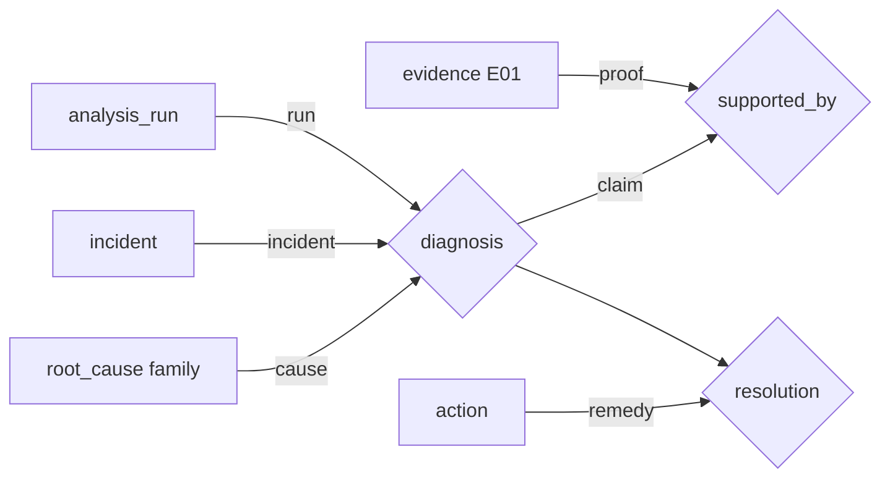

# 온톨로지와 승인 RCA 적재

TypeDB는 RCA의 관계형 지식 계층입니다. 현재 장애의 사실은 live collector가
수집하고, TypeDB는 큐레이션된 토폴로지와 **승인된 과거 사례**를 보강합니다.

## 모델 읽는 법

| 개념 | TypeDB 표현 | 의미 |
| --- | --- | --- |
| Object | entity | `incident`, `analysis_run`, `symptom`, `root_cause`, `evidence`, `action`, component |
| Property | attribute | ID, 상태, confidence, 점수, 요약, 승인 시각 |
| Relationship | relation | `diagnosis`, `observed_symptom`, `supported_by`, `resolution`, `depends_on` |
| Role | relation role | 관계 안에서의 역할. 예: `diagnosis(run, incident, cause)` |
| Reasoning function | `fun` | 관계를 따라 읽기 전용으로 도출하는 TypeQL 함수 |

중요한 점은 `root_cause`가 재사용되는 family이고, `diagnosis`는 **한 실행이 한
incident에 대해 한 주장**이라는 것입니다. 따라서 evidence는 전역 family가 아니라
해당 diagnosis를 지지합니다.



`observed_symptom(run, incident, symptom, evidence)`는 어떤 evidence가 symptom을
관측하게 했는지 기록합니다. `resolution(diagnosis, action)`은 운영자가 효과를
`resolved` 또는 `mitigated`로 확인한 경우에만 생성합니다.

## 승인과 적재

정기 ingest는 다음 조건을 모두 만족하는 incident만 TypeDB에 넣습니다.

- Dashboard Approve가 기록되어 `user_approved_at`이 존재함
- Alertmanager 상태가 `resolved`이고 grace period가 지남
- RCA snapshot이 있으면 active immutable CaseSnapshot을 사용하며, 적재는 승인된 snapshot을
  더 나중의 analysis run으로 대체하지 않음

승인됐지만 원인을 확정하지 못한 RCA도 topology와 evidence 이력으로는 적재합니다.
다만 `diagnosis_state=unresolved`로 기록하며 원인 지식으로 승격하지 않습니다.
원본 로그, artifact result, token, credential은 TypeDB에 넣지 않고, 마스킹된 summary와
`{run_id}:E##` 참조만 저장합니다.

재분석은 같은 run ID를 갱신하므로 ingest가 기존 run의 diagnosis/support 관계를 먼저
지우고 최신 hash와 artifact를 기록합니다. 이전 evidence가 현재 결론을 지지하는 상태로
남지 않습니다.

## Agent가 쓰는 함수

| 함수 | 역할 | Agent 사용 위치 |
| --- | --- | --- |
| `causes_for_symptom` | live에서 매칭한 symptom의 family 후보 | 제한된 ranking 보강 |
| `dependencies_for_component` / `checks_for_component_path` | component 의존성·확인 명령 재귀 조회 | 조사 계획 |
| `affected_workloads_for_node` | 노드 blast radius | 영향 범위 |
| `approved_incidents_for_cause` / `evidence_for_approved_cause` | 승인된 과거 사례 | synthesis 문맥만 |
| `verified_actions_for_family` | 운영자가 효과를 확인한 조치 | 과거 해결 가이드 |

과거 evidence는 현재 RCA의 근거가 될 수 없고, TypeDB prior만으로 high confidence가
만들어지지 않습니다. graph bonus는 최대 2점이며 live evidence 또는 확정 signature가
여전히 필요합니다.

## TypeDB Studio 확인 쿼리

```typeql
# 승인된 incident만 존재하는지 확인
match $i isa incident, has incident_id $id, has approved_at $at;
select $id, $at;
```

```typeql
# 특정 run의 diagnosis와 supporting evidence
match
  $r isa analysis_run, has run_id "ANL-...";
  $d isa diagnosis, links (run: $r, incident: $i, cause: $c);
  $s isa supported_by, links (claim: $d, proof: $e);
  $e has evidence_id $eid, has source $source, has summary $summary;
  $c has subtype $family;
select $family, $eid, $source, $summary;
```

```typeql
# component dependency 추론
match let $name in dependencies_for_component("runai-container-toolkit");
select $name;
```

```typeql
# live에서 이미 관측된 symptom의 family 후보
match let $family in causes_for_symptom("RunAIWorkloadPending");
select $family;
```

TypeDB를 사용할 수 없으면 Agent는 warning을 남기고 YAML/Python 경로로 fallback합니다.
RCA 자체는 계속 생성됩니다.

## 운영 주의사항

Helm schema hook이 ingest CronJob보다 먼저 additive schema와 function을 적용합니다.
이 변경을 위해 `runai_rca` DB를 다시 만들지 마세요. Live validation은 임시 DB 하나에서
실행하고 `finally`에서 삭제하여 Studio에 검증 DB가 남지 않게 합니다.

[지식 베이스](KNOWLEDGE-BASE.md), [RCA 파이프라인](RCA-PIPELINE.md),
[평가](EVALUATION.md)를 함께 참고하세요.
