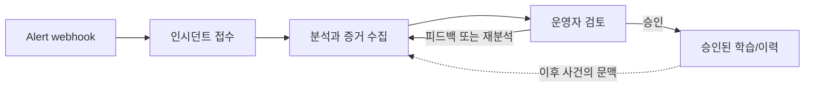

# Operating Model

> **관점:** 시스템이 어떻게 동작하는가 — 시스템이 무엇을 하고, 어떤 선은 넘지 않는가.
> **이 문서에서 다루는 것:** 지원 신호 · 인제스트/분석 트리거 · 런타임 상태 의미 · 에이전트 역할 계약 · RCA 경계 · 저하 모드.

Run:AI RCA는 기본적으로 읽기 전용입니다.

**쉽게 기억하는 방법:** 이 서비스는 사건 접수 창구와 같습니다. 신호를 받고, 사건을 열고,
읽기 전용 질문을 하며, 운영자가 답을 검토한 뒤에만 그 검토된 사례가 다음 조사에 도움을 줍니다.

이 흐름은 자동 복구(auto-remediation)가 아니라 사람이 검토하는 업무 흐름입니다. 피드백은 새 분석을 요청할 수 있습니다. 승인은
학습 여부를 사람이 통제하는 별도의 결정이며, 클러스터 리소스를 바꾸지 않습니다.

## Supported Signals

- Alertmanager 웹훅
- Run:ai 컨트롤 플레인 메타데이터
- Kubernetes 파드, 워크로드, 이벤트, 노드, 매니페스트 상태
- Postgres RCA 스토어, pgvector, 연결, 쓰기 경로 상태
- Prometheus 메트릭
- Loki 로그

## Intake And Analysis Triggers

자동 RCA는 웹훅으로 구동됩니다. Alertmanager는 일치하는 알림을 Backend
`POST /webhook/alertmanager`로 라우팅해야 합니다. 동일한 알림을 Slack에서 받았다는
사실은 Slack 수신기가 일치했다는 것만 증명할 뿐입니다. 그것은 RCA 웹훅 수신기가
일치했다거나 Alertmanager가 Backend 서비스에 도달할 수 있었다는 것을 증명하지 않습니다.

승인된 모든 웹훅 알림은 저장되고, 인시던트로 상관 분석된 후, 비동기 Agent `/analyze`
호출을 시작합니다. 운영자는 인시던트 분석, 코멘트/피드백 재분석, 또는 새로운 분석을
명시적으로 요청하는 채팅 요청에서 수동으로 분석 실행을 생성할 수도 있습니다. 채팅이
대상 인시던트나 알림을 지정하지 않으면, Backend는 미해결 알림이 있을 경우 가장 최근의
미해결 알림을 선택합니다. Analysis Dashboard는 `/api/v1/analysis-runs`를 기반으로 합니다.
이 목록이 비어 있다면, 아직 어떤 분석 트리거도 Backend에 도달하지 않은 것입니다.

이미 분석된 알림이 `AUTO_REANALYZE_COOLDOWN_MINUTES`(기본값 `360`) 안에 자동 재발하면,
Backend는 기존 실행을 변경 없이 반환합니다. 쿨다운이 지난 뒤에는 그 실행을 제자리에서
재분석하므로, 인시던트마다 하나의 RCA 실행이 계속 갱신됩니다. 재분석이 진행 중이거나
실패해도 마지막 정상 RCA 내용과 아직 전송되지 않은 Slack 알림은 보존되며, 새로 성공한
경우에만 보고서가 교체됩니다. `0` 이하로 설정하면 자동 재분석이 비활성화되어 항상 기존
실행을 재사용합니다. 재활성화된 인시던트는 최근 활동 기준으로 인시던트 목록 맨 위로 이동합니다.

## Runtime Status Semantics

Kubernetes `Running`과 Agent `/healthz`는 프로세스가 살아 있음을 확인해 주지만,
수집기 증거가 생성되었다는 의미는 아닙니다. Agents 뷰는 최근 RCA 데이터에 해당 수집기의
아티팩트가 하나 이상 포함된 경우에만 수집기를 `ok`로 표시합니다. 아직 아티팩트가 첨부되지
않았다면, 모든 파드가 정상이더라도 UI는 `pending`을 표시합니다.

Agent `/healthz`는 `nemo_runtime`을 `enabled` 또는 `fallback`으로 보고합니다.
`enabled`는 인프로세스 NAT 엔진이 파이프라인 단계를 오케스트레이션한다는 의미입니다.
`fallback`은 엔진이 비활성화되었거나 실패해서 동일한 파이프라인이 직접 실행되었다는
의미입니다. 두 모드 모두 인프로세스이며 완전한 RCA를 생성합니다. 이것은 채팅 전용 LLM
준비 상태 신호가 아닙니다.

## Agent Role Contracts

- RunAI Agent는 워크로드, 프로젝트, 큐, 쿼터, 우선순위, 스케줄링 컨텍스트에 대해 Run:ai
  API를 사용합니다. 기본적으로 `runai` CLI를 실행하지 않습니다.
- Kubernetes Agent는 워크로드 파드/이벤트, Run:ai 컨트롤 플레인 파드 상태, 네임스페이스
  스캔, 노드 조건, Kubernetes 스케줄링 차단 요소를 검사합니다.
- Prometheus Agent는 큐/프로젝트 GPU 메트릭과 파드 또는 네임스페이스 리소스 신호를
  검사합니다.
- Loki Agent는 워크로드 로그와 함께 기본적으로 `runai` 및 `runai-backend`의 Run:ai
  컨트롤 플레인/백엔드 로그를 검사합니다.
- Postgres Agent는 RCA 스토어 연결성, pgvector, 임베딩, 피드백, 코멘트, 메모리 상태를
  검사합니다. `RUNAI_DB_DSN`이 설정되어 있으면 드릴다운 중에 Run:ai 컨트롤 플레인
  데이터베이스(workloads/audit/… 스키마)도 읽을 수 있습니다.
- 스토어/Postgres 소유권에는 대상 데이터베이스가 존재하는지, 백엔드 사용자가 RCA 테이블을
  생성/업데이트할 수 있는지, 그리고 참 pgvector 준비 상태가 필요할 때 `CREATE EXTENSION vector;`로
  pgvector가 설치되고 활성화되었는지 확인하는 것이 포함됩니다. pgvector가 없으면, 백엔드는
  JSONB 희소 벡터 메모리 폴백으로 정상 상태를 유지해야 합니다.
- System Agent는 Kubernetes 아래의 노드 인프라를 검사합니다 — 커널, GPU 드라이버 /
  NVIDIA XID, OOM, 하드웨어 오류에 대한 dmesg/journalctl/syslog를 노드별 DaemonSet을 통해
  검사합니다.
- Change Agent는 알림 시간대 주변에서 "무엇이 바뀌었는가?"에 답합니다: 최근 버전이 올라간
  컨트롤러, 새로 생성/삭제 중인 파드, 노드 조건 전이, 최근 이벤트 등입니다.

각 증거 에이전트는 추가로 자체 도메인의 도구로 범위가 한정된, 경계가 있는 읽기 전용
드릴다운 루프(`ENABLE_AGENT_DRILLDOWN`)를 실행할 수 있습니다. 이들을 하나로 묶는
오케스트레이션 흐름은 [RCA 파이프라인](RCA-PIPELINE.md)입니다.

타임스탬프가 있는 알림에서 수집기는 발생 5분 전부터 해결 5분 후까지의 수집 시간 창을
유지합니다(firing 알림은 15분으로 제한됨). 해결 후 에필로그는 복구 문맥으로 계속 보이지만,
Postgres, Change, System, Loki의 발생 증거는 해결 시각에 끝나는 인과 시간 창 안에서만 승격됩니다.
Change 이력은 발생 시각 1시간 전부터 시작하며, 드릴다운 `lookback_seconds`는 이 과거 범위를
발생 시각 기준 60~86,400초로 넓힐 수 있습니다. 성공한 Change 결과는 한 분석 안에서만 약
120초 캐시되므로 이후 재분석은 새로 수집합니다.
- Analysis Agent는 KubeRCA 스타일의 대시보드 RCA를 생성합니다: 근본 원인, 신뢰도, 영향,
  누락된 데이터, 권장 수동 조치, 예방, 증거 커버리지입니다.
- Chat Agent는 읽기 전용 cross-domain 드릴다운 도구 위에서 에이전트 루프를 실행하고,
  필요 시 on-demand RCA를 트리거할 수 있습니다. 과거 사례, family별 지식, blast radius를
  포함해 파이프라인과 같은 TypeDB 지식 그래프에 기반합니다. 드릴다운은 기본적으로 로드된
  인시던트/알림 대상으로 범위가 한정되며, frontend context picker로 명시적인 cluster
  scope를 선택할 수 있습니다. 결정론적 컨텍스트 기반 답변은 chat LLM이 구성되지 않았을
  때만 사용하는 폴백입니다.
  첨부된 인시던트나 알림 RCA 내용 없이 대시보드 페이지에서 채팅이 열리면, Backend는 대시보드 및
  분석 실행 상태를 첨부하여 Chat이 현재 알림 수, 최신 실행 상태, 에이전트 타임아웃/실패 경고,
  데이터베이스 상태, 런타임 모드를 보고할 수 있도록 합니다.

## RCA Boundaries

시스템이 할 수 있는 것:

- 유력한 근본 원인 설명
- 뒷받침하는 증거 나열
- 누락된 증거 식별
- 수동 다음 단계 권장
- 이전 인시던트와 비교

시스템이 해서는 안 되는 것:

- 워크로드 삭제
- 큐 또는 쿼터 변경
- 파드 재시작
- Kubernetes 리소스 변경
- 자율적 자동 복구 수행

## Degraded Mode

각 수집기는 `ok`, `partial`, `unavailable`을 보고합니다. 최종 RCA는 모든 통합이 정상
작동한 것처럼 가장하기보다 투명한 부분적 답변을 선호해야 합니다.
