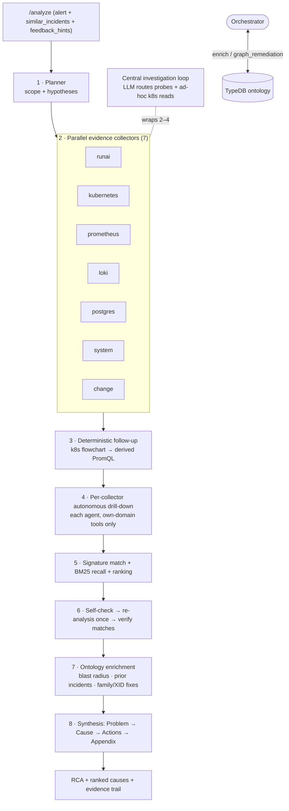

# RCA Pipeline

> **관점:** Agent가 하나의 알림을 하나의 근거 있는 RCA로 바꾸는 방법 — 모든 단계를 순서대로.
> **이 문서에서 다루는 것:** 오케스트레이터 흐름 · 플래너 · 7개 수집기 · 중앙 조사 루프 ·
> 수집기별 자율 드릴다운 · 시그니처 매칭 + BM25 리콜 · 랭킹 · 자기 점검 / 재분석 · 종합 ·
> 증거 표현 · 안전 봉투(safety envelope).

Agent는 단일 프롬프트가 **아닙니다**. 단일 전체 데드라인(deadline) 하에서 하나의
오케스트레이터(orchestrator)(`agent/app/services/orchestrator.py`)가 실행하는 컴포넌트 지향
다중 에이전트 파이프라인(pipeline)입니다. 모든 LLM 단계는 선택적입니다: LLM이 구성되지 않았거나
어떤 실패가 발생하면, 파이프라인은 결정론적 경로로 저하(degrade)되며 여전히 리포트를 생성합니다.

전체 실행은 `asyncio.wait_for(analyze, ANALYSIS_DEADLINE_SECONDS)`로 감싸집니다
(기본값 **1500초 / 25분**). 초과 시 멈춤(hang) 없이 우아하게 저하된 리포트를 반환합니다.
단계별 상한은 *의도적으로* 넉넉합니다(깊은 증거가 빠르지만 얕은 것보다 낫습니다). 전체 데드라인이
실제 한계입니다. Backend의 `AGENT_REQUEST_TIMEOUT_SECONDS`(1560초)는 이보다 위에 유지되어야
합니다.

---

## 1. Planner — think first

`agent/app/services/planner.py`는 알림 레이블, 대상, 지식 그래프(knowledge graph) 컨텍스트,
그리고 벡터 유사 인시던트를 바탕으로 **어떤 수집기가 실행되기 전에** `InvestigationPlan`을
구성하여, 에이전트가 항상 Run:ai 컨트롤 플레인(control plane) 전체를 긁어모으지 않도록 합니다
(정확도 관련 1순위 불만).

- **결정론적 코어**(항상): 키워드/레이블 휴리스틱이 각 수집기의 범위를 정하고 실패
  패밀리(failure family)별로 가설의 순서를 매깁니다.
- **네임스페이스 라우팅**: 플랫폼 네임스페이스 알림(`runai` / `runai-backend`)은 광범위한
  k8s + 시스템 증거로 확대되고, 사용자 워크로드(workload) 네임스페이스는 Run:ai 스케줄러
  (scheduler) 서브시스템에 집중합니다.
- **선택적 LLM 정제**: LLM이 구성되면 초점/가설/전략을 날카롭게 다듬습니다. 어떤 실패든 →
  결정론적 계획이 유지됩니다.

## 2. Parallel evidence collectors (7)

각 수집기(collector)는 하나의 도메인을 담당하며 `CollectorResult`(요약 + `artifacts`)를
반환합니다. `asyncio.gather`를 통해 동시에 실행됩니다.

| Collector | Owns |
|---|---|
| **runai** | Run:ai API 워크로드/프로젝트/큐/쿼터/버전 컨텍스트(선택적으로 [runai-mcp 사이드카](#run-ai-mcp-sidecar), 426개 API 경유) |
| **kubernetes** | 워크로드 파드/이벤트, Run:ai 컨트롤 플레인 파드 상태, 노드 컨디션, 스케줄링 차단 요인; 선택적 읽기 전용 pod-exec(허용 목록: `nvidia-smi`, …) |
| **prometheus** | 큐/프로젝트 GPU 메트릭, 대기/재시작/리소스 신호 |
| **loki** | 워크로드 로그 + `runai`/`runai-backend` 컨트롤 플레인 로그 |
| **postgres** | RCA 스토어 상태: pgvector, 임베딩(embedding), 피드백, 영속화 |
| **system** | Kubernetes 아래 노드 인프라 — dmesg/journalctl/syslog, 노드별 DaemonSet을 통한 NVIDIA XID/NVRM/OOM/MCE |
| **change** | *"무엇이 바뀌었나?"* — 최근 업데이트된 컨트롤러, 신규/삭제 중인 파드, 노드 컨디션 전이, 최근 이벤트 |

수집기 상한은 넉넉하여(각 120초) 증거가 깊습니다. 느린 수집기 하나가 있어도 여전히 `unavailable`로
우아하게 실패합니다. 민감한 값은 증거가 수집기를 떠나기 전에 마스킹(masking)됩니다
(`agent/app/masking.py`).

## 3. Deterministic follow-up

LLM과 무관하게, `k8s_followup` + `prometheus_followup`이 발견 사항을 추적합니다:
`Pending` 파드는 이벤트 → resourcequota → PVC → storageclass를 끌어오고, OOM/재시작은 도출된
PromQL을 끌어옵니다. 이는 LLM이 없을 때에도 수집을 반복적으로 유지합니다.

## 4. Per-collector autonomous drill-down

`agent/app/services/drilldown.py`(`ENABLE_AGENT_DRILLDOWN`, Helm 기본값 on). 기본 수집 이후,
**각 증거 에이전트는 자기 증거에 대해 자체적으로 제한된 LLM 루프를 실행**하고 자기 도메인 내에서
읽기 전용 후속 쿼리를 결정합니다.

**도구 스코핑은 프롬프트 기반이 아니라 구조적입니다** — 각 루프는 *오직* 자기 도메인의 도구
레지스트리만 받으므로, kubernetes 에이전트는 결코 Run:ai API를 호출할 수 없으며 그 반대도
마찬가지입니다:

| Agent | Drill-down tool | Read-only guarantee |
|---|---|---|
| kubernetes | `k8s_read` | 18종 허용 목록, GET/LIST 전용(시크릿 없음) |
| prometheus | `promql_query` | query 엔드포인트 전용 |
| loki | `logql_query` | range query 전용 |
| runai | `runai_api_search` + `runai_api_get` | GET 전용, 경로는 `/api/`로 시작해야 함(메서드 하드코딩) |
| postgres | `sql_select` | 단일 `SELECT`/`WITH`, READ ONLY 트랜잭션, 자동 `LIMIT 50` |

postgres 에이전트는 `RUNAI_DB_DSN`이 설정되면 RCA 스토어뿐 아니라 **Run:ai 컨트롤 플레인
데이터베이스 자체**에 질의합니다(workloads/audit/authorization/… 스키마). 도구 설명은
[아키텍처 토폴로지](KNOWLEDGE-BASE.md)의 스키마 소유권으로 강화되므로, 루프는 어디를 봐야 할지
압니다.

한계: `DRILLDOWN_MAX_STEPS`(4), 스텝당 3개 쿼리, 사용 불가한 수집기와 구성되지 않은 데이터
소스는 건너뛰며, 결코 예외를 발생시키지 않습니다. 신뢰할 수 없는 로그/이벤트 텍스트가 이 루프에
공급되므로, [프롬프트 인젝션 가드](#safety-envelope)가 모든 결정에 함께 실립니다.

### Central investigation loop

수집기별 드릴다운과 구별됩니다: `agent/app/services/investigator.py`
(`ENABLE_INVESTIGATION_LOOP`, Helm 기본값 on)는 **교차 도메인 라우터**입니다. LLM이 다음에 어떤
수집기를 조사할지 결정하고, 동일한 18종 허용 목록에 걸쳐 임시(ad-hoc) 읽기 전용 Kubernetes 읽기를
실행할 수 있습니다. `MAX_INVESTIGATION_STEPS`(12). 종합은 항상 *모든* 수집기를 기다립니다 —
조기/부분 종합은 확신에 찬 그러나 잘못된 RCA를 만들 것입니다.

## 5. Signature matching + BM25 recall + ranking

검색 진입점은 거친 패밀리 랭커가 아니라 **세분화된 시그니처 매칭(signature match)**입니다:

1. **내장 알림**을 이름으로 매칭(`runai_alerts_catalog.yaml`).
2. **known issue(알려진 이슈)**를 키워드 시그니처로 매칭, 버전 인지
   (`runai_known_issues.yaml` — 실행 중인 버전에서 수정된 이슈는 제외).
3. **실패 모드 증상**을 **모든** 패밀리에 걸쳐 키워드로 매칭(`failure_modes.yaml`).
4. 증거 + 알림 자체 텍스트에서 추출한 **NVIDIA XID** 코드.

큐레이션된 부분 문자열이 매칭되지 않으면, 보수적인 **BM25 + 동의어** 패스
(`agent/app/bm25.py`, 표준 라이브러리)가 어휘 변형을 복구합니다(`evicted` → `preempt`/
`reclaim`, `job` → `workload`). 이는 알림 텍스트만 질의하고, `matched_via: "bm25"`로 태그되며,
결코 원인을 헤드라인으로 올리지 않습니다 — 검증 패스가 여전히 반박할 수 있는 후보만 노출합니다.
카탈로그에 대해서는 [Knowledge Base](KNOWLEDGE-BASE.md)를 참조하십시오.

**랭킹**(`root_cause_ranking.py`, 규칙 R1–R6)은 후보의 *순서를 매기고* 신뢰도를 게이트하는
결정론적 키워드 채점기이며, 검색 엔진이 아닙니다. 그다음 `_promote_signature_cause`가 가장
구체적인 시그니처(XID > known-issue > 증상 > 랭커)로 헤드라인을 덮어쓰므로, 랭커가 후보로조차
지명할 수 없는 패밀리(예: `gpu_hardware_error`)도 여전히 올바르게 헤드라인에 오릅니다.

## 6. Self-check → re-analysis → verify

- **반박**(`self_check.refute_top_cause`): 회의적인 시니어 SRE LLM이 오직 수집된 증거만 사용해
  최상위 원인을 반박하려 시도하고, 신뢰도를 보정하며, 한 줄 주의 사항 + 다음 점검을 작성합니다.
- **재분석 1회**: 반박되면, 차선의 가설을 앞세운 제한된 재분석 패스가 정확히 한 번 실행됩니다
  (`MAX_REANALYSIS_STEPS`, 6). `analyze()`에 재진입하지 않도록 강하게 가드됩니다.
- **매칭 검증**(`verify_matches`): 회의적인 패스가 증거가 실제로 뒷받침하지 않는 키워드/시그니처
  매칭(known issue, 증상, XID)을 제거합니다.

세 가지 모두 LLM 게이트이며 최선 노력 방식입니다: LLM이 없으면 → 아무것도 억제되지 않고, 매칭이
유지됩니다.

## 7. Ontology enrichment

**오케스트레이터**는 선택적 TypeDB 지식 그래프(병렬 수집기가 아님)를 참조합니다 —
[Knowledge Base](KNOWLEDGE-BASE.md)를 참조하십시오:

- `enrich()`: 노드 **blast radius(영향 범위)**(알림이 발생한 노드를 공유하는 워크로드 수)와
  저장된 RCA를 가진 **동일 알림의 이전 인시던트**.
- `graph_remediation()`: `fixes_for_family`, `fixes_for_xid`, 그리고 역방향 `leads_to`
  **근본 XID 체인**(하류 증상이 아니라 기원을 수정).

TypeDB가 꺼져 있거나 도달 불가능할 때는 빈 값으로 저하되며, 결코 예외를 발생시키지 않습니다.

## 8. Synthesis

`_detail_from`은 결정론적 리포트를 구성합니다 — **Problem → Root Cause →
Recommended Actions → Appendix** — 운영자(또는 Word 내보내기)가 읽는 약 1페이지 분량의
문서입니다. `language=ko`이고 LLM이 구성된 경우, `_synthesize_korean`이 요약 + 상세를 **엄격히**
증거에 근거하여 다시 작성하며, 어떤 실패든 발생하면 결정론적 영어 리포트로 폴백(fallback)합니다.

**Troubleshooting Playbook** 섹션은 연루된 모든 플랫폼 컴포넌트에 대해 그 실패 영향, BFS
**의존성 점검 순서**(예: `cluster-sync → status-updater → runai-backend-traefik`), 그리고 바로
실행 가능한 `kubectl` 점검을 [아키텍처 토폴로지](KNOWLEDGE-BASE.md)에서 가져와 덧붙입니다.

## Evidence presentation

모든 아티팩트는 운영자가 한눈에 읽을 수 있도록 구성됩니다:

- **`title`** — 사람이 읽는 카드 이름(`파드 조회`, `메트릭 조회 (PromQL)`, `DB 조회 (SQL)`).
- **`query`** — 재실행할 *실제* 명령: `kubectl get pods t-0 -n runai`, 원시 PromQL/LogQL/SQL,
  `GET /api/v1/workloads?name=…` — 결코 내부 파라미터 덤프가 아닙니다.
- **`highlights`** — 결과에서 추출한 문제 신호(`salient_markers`: `CrashLoopBackOff`, `Xid 79`,
  `no space left`, … — 문자열 리프만 스캔하며, 결코 JSON 키가 아님). Frontend는 이를 빨간색으로
  표시하여 상용구보다 발견 사항이 먼저 읽히도록 합니다.

## Safety envelope

- **구조적으로 읽기 전용**: 수집기와 드릴다운 도구는 읽기만 합니다. Kubernetes 읽기는 종별 허용
  목록, pod-exec는 정확한 argv 허용 목록, Run:ai는 `/api/` 아래 GET 전용, SQL은 READ ONLY
  트랜잭션의 `SELECT`.
- **프롬프트 인젝션 가드**(`agent/app/llm.py`): 수집된 텍스트(로그, 이벤트, 알림 어노테이션)는
  클러스터 쓰기가 가능하므로, 임베디드 명령을 데이터로 선언하는 가드가 **모든** LLM 시스템
  프롬프트에 덧붙여집니다. `operator_prompt`가 유일하게 의도된 명령 채널입니다.
- **마스킹(masking)**(`agent/app/masking.py`): JWT, 베어러 토큰, 시크릿, 커스텀
  `MASKING_REGEX_LIST_JSON` 패턴은 증거가 수집기를 떠나거나 LLM에 도달하기 전에 편집(redact)
  됩니다.

## Run:ai MCP sidecar

`RUNAI_MCP_URL`이 설정되면, runai 수집기와 runai 드릴다운 에이전트는
[runai-mcp](https://github.com/sejongjeong/runai-mcp) 서버(mcp-proxy 뒤 사이드카로 배포)에
접근하여 426개 Run:ai API에 스펙 인지 방식으로 접근합니다. 어떤 실패든 고정 엔드포인트 직접-HTTP
수집기로 폴백합니다 — 엄격히 부가적이며, 결코 분석을 깨뜨리지 않습니다.

## Configuration

모든 환경 변수는 [Configuration Reference](CONFIGURATION.md)를 참조하십시오. 파이프라인 스위치:
`ENABLE_INVESTIGATION_LOOP`, `MAX_INVESTIGATION_STEPS`, `ENABLE_AGENT_DRILLDOWN`,
`DRILLDOWN_MAX_STEPS`, `RUNAI_DB_DSN`, `ANALYSIS_DEADLINE_SECONDS`, `RUNAI_MCP_URL`.
