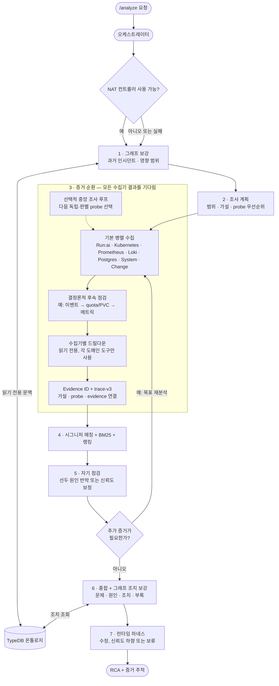
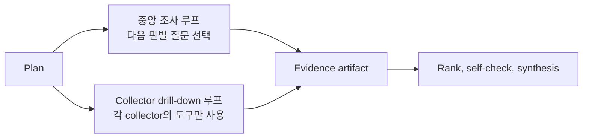

# RCA Pipeline

> **관점:** Agent가 하나의 알림을 하나의 근거 있는 RCA로 바꾸는 방법 — 모든 단계를 순서대로.
> **이 문서에서 다루는 것:** 오케스트레이터 흐름 · 플래너 · 7개 수집기 · 중앙 조사 루프 ·
> 수집기별 자율 드릴다운 · 시그니처 매칭 + BM25 리콜 · 랭킹 · 자기 점검 / 재분석 · 종합 · 런타임 하네스 ·
> 증거 표현 · 안전 봉투(safety envelope).

Agent는 단일 프롬프트가 **아닙니다**. 단일 전체 데드라인(deadline) 하에서 하나의
오케스트레이터(orchestrator)(`agent/app/services/orchestrator.py`)가 실행하는 컴포넌트 지향
다중 에이전트 파이프라인(pipeline)입니다. 모든 LLM 단계는 선택적입니다: LLM이 구성되지 않았거나
어떤 실패가 발생하면, 파이프라인은 결정론적 경로로 저하(degrade)되며 여전히 리포트를 생성합니다.
일곱 파이프라인 단계는 시작 시 한 번 빌드되는 `runai_rca_pipeline` 컨트롤러 워크플로
(`agent/configs/runai_rca_engine.yml`) 아래에서 NAT 함수로 실행됩니다. NAT 엔진이
비활성화되었거나 실패하면, 동일한 단계가 실패 폴백으로 프로세스 안에서 직접 실행됩니다.

**쉽게 기억하는 방법:** 이 파이프라인은 신중한 조사 체크리스트입니다. 먼저 알림의 범위를
파악하고, 사실을 모은 뒤, 스스로의 결론을 반박해 보고, 마지막으로 RCA가 사실보다 더 많은
말을 하지 않는지 확인합니다.

`trace-v3`만 공개·영속 reasoning 계약으로 사용합니다. 최종 선택은 정확한
`selected_hypothesis_id`로 기록하며, open-world 선택은 `mechanism_fingerprint`도
포함합니다. 내부 hypothesis ledger는 일시적인 작업 데이터로만 유지하고, 운영 budget
종료 정보는 trace가 아니라 로그와 progress event에 남깁니다.

전체 실행은 `asyncio.wait_for(analyze, ANALYSIS_DEADLINE_SECONDS)`로 감싸집니다
(기본값 **900초 / 15분**). 초과 시 멈춤(hang) 없이 우아하게 저하된 리포트를 반환합니다.
단계별 상한은 *의도적으로* 넉넉합니다(깊은 증거가 빠르지만 얕은 것보다 낫습니다). 전체 데드라인이
실제 한계입니다. Backend의 `AGENT_REQUEST_TIMEOUT_SECONDS`(960초)는 이보다 위에 유지되어야
합니다.

## 단계 안내: 무엇이 들어오고, 무엇이 나오며, 무엇이 멈추게 하는가

| 단계 | 입력 → 출력 | 멈추거나 제한하는 조건 |
| --- | --- | --- |
| Enrich | alert target → 승인 이력/토폴로지 문맥 | TypeDB는 선택 사항이며, 그래프 부재는 중단이 아닌 경고 |
| Plan | alert + 문맥 → 범위가 정해진 가설과 probe | 레이블이 부족하면 범위만 줄고 쓰기 권한이 생기지 않음 |
| Evidence | plan → collector artifact | 출처별 실패는 partial/unavailable evidence가 됨 |
| Rank | artifact → 순서가 있는 후보 | 시그니처도 live evidence의 뒷받침이 필요 |
| Self-check | 선두 후보 → 주의 사항/재분석 필요 여부 | LLM은 선택 사항이며 deadline이 추가 작업을 제한 |
| Synthesize | evidence → 운영자가 읽는 RCA | 24k evidence 예산, 사실을 만들지 않음 |
| Harness | 초안 → 수정/신뢰도 하향/보류 응답 | hard evidence gate는 `insufficient_evidence`를 반환할 수 있음 |

중앙 루프는 증거 평면 사이에서 다음 질문을 고릅니다. collector drill-down은 한 평면 안에
머뭅니다. 둘 다 읽기 전용이며, 조사가 끝났거나 같은 질문이 반복되거나 전체 deadline에 도달하면 멈춥니다.

---

## 1. Planner — think first

`agent/app/services/planner.py`는 알림 레이블, 대상, 지식 그래프(knowledge graph) 컨텍스트,
그리고 벡터 유사 인시던트를 바탕으로 **어떤 수집기가 실행되기 전에** `InvestigationPlan`을
구성하여, 에이전트가 항상 Run:ai 컨트롤 플레인(control plane) 전체를 긁어모으지 않도록 합니다
(정확도 관련 1순위 불만).

- **결정론적 코어**(항상): 키워드/레이블 휴리스틱이 각 수집기의 범위를 정하고 실패
  패밀리(failure family)별로 가설의 순서를 매깁니다.
- **네임스페이스 라우팅**: 플랫폼 네임스페이스 알림(`runai` / `runai-backend`)은 광범위한
  k8s + 시스템 증거로 확대되고, 사용자 워크로드(workload) 네임스페이스는 Run:ai 스케줄러
  (scheduler) 서브시스템에 집중합니다.
- **선택적 LLM 정제**: LLM이 구성되면 초점/가설/전략을 날카롭게 다듬습니다. 어떤 실패든 →
  결정론적 계획이 유지됩니다.

## 2. Parallel evidence collectors (7)

각 수집기(collector)는 하나의 도메인을 담당하며 `CollectorResult`(요약 + `artifacts`)를
반환합니다. `asyncio.gather`를 통해 동시에 실행됩니다.

| Collector | Owns |
|---|---|
| **runai** | Run:ai 워크로드/프로젝트/큐/쿼터/버전 컨텍스트(선택적으로 [공식 Run:ai MCP 서비스](#run-ai-mcp-service)의 집중된 읽기 전용 16개 도구 세트 경유) |
| **kubernetes** | 워크로드 파드/이벤트, Run:ai 컨트롤 플레인 파드 상태, 노드 컨디션, 스케줄링 차단 요인; 거부 목록(denylist)으로 게이트되는 선택적 읽기 전용 pod-exec |
| **prometheus** | 큐/프로젝트 GPU 메트릭, 대기/재시작/리소스 신호 |
| **loki** | 워크로드 로그 + `runai`/`runai-backend` 컨트롤 플레인 로그 |
| **postgres** | RCA 스토어 상태: pgvector, 임베딩(embedding), 피드백, 영속화 |
| **system** | Kubernetes 아래 노드 인프라 — dmesg/journalctl/syslog, 노드별 DaemonSet을 통한 NVIDIA XID/NVRM/OOM/MCE |
| **change** | *"무엇이 바뀌었나?"* — 최근 업데이트된 컨트롤러, 신규/삭제 중인 파드, 노드 컨디션 전이, 최근 이벤트 |

수집기 상한은 넉넉하여(각 120초) 증거가 깊습니다. 느린 수집기 하나가 있어도 여전히 `unavailable`로
우아하게 실패합니다. 민감한 값은 증거가 수집기를 떠나기 전에 마스킹(masking)됩니다
(`agent/app/masking.py`).

### 증거 시간, 범위, 전송 규칙

- 수집 시간 창은 발생 5분 전부터 해결 5분 후까지이며 firing 알림은 15분으로 제한됩니다.
  해결 후 에필로그는 문맥으로 남지만, Postgres, Change, System, Loki의 인과 승격은 해결 시각에 끝납니다(모두 하나의 `causal_evidence_time_range`를 공유).
- Kubernetes는 가장 비정상적이고 시간 관련성이 높으며 시간순으로 정렬된 Pod와 Event 5개를
  누락 수와 함께 유지하고, Warning 집계와 Normal `Preempted` workload/PodGroup 이벤트를
  보존하며, 노드 cordon/taint 상태를 포함합니다.
  Run:ai CRD 페이지네이션은 최대 3페이지까지 따르고 kind별 실패를 노출합니다. 과거 로그는 direct
  요청이 실제로 `sinceTime`을 적용한 경우에만 가장 오래된 라인을 유지하며, MCP tail은 최신 라인을 유지합니다.
  Cordon된(`SchedulingDisabled`) 노드는 범위가 지정된 cordon 아티팩트로 수집되며, live unschedulable
  증상이 실제로 있을 때만 unschedulable Pod의 근본 원인으로 승격될 수 있습니다. 증상이 해결된 뒤에는
  낮은 신뢰도로 유지됩니다.
- Loki는 전체 반환 라인으로 범위를 검증하고 여러 stream을 최신 항목부터 round-robin 샘플링합니다.
  Prometheus는 요청 시간 창에 맞춰 range-query step을 조정하고(약 1,000 포인트까지), 레이블 값을
  이스케이프하며 RFC3339 및 epoch 초/밀리초 sample timestamp를 허용합니다. 비어 있는 native
  Prometheus 결과는 범위가 확인된 부재일 수 있지만 MCP/proxy 빈 결과는 문맥입니다.
- Run:ai 현재 상태의 존재는 인시던트 시점 증명이 아닙니다. `present/scoped`에는 payload 안의
  시간 창 내 타임스탬프가 필요합니다. firing 알림에서는 immutable workload-ID 404만 범위가 확인된
  부재를 수립하며, 이름 기반 project/queue 404는 문맥으로 남습니다. 부분 MCP snapshot은 보존하고
  실패하거나 명시적으로 비어 있는 동등 항목에 direct 보완을 수행합니다. queue 레이블 알림은 direct
  queue 조회도 한 번 수행하며, 공백은 `runai.queue_scope`로 드러납니다.
- Run:ai 컨트롤 플레인 Postgres 읽기는 UTC를 고정하고 naive audit timestamp의 UTC 가정을
  공개합니다. 개별 audit-table 실패, 발견 제한, 이름이 표시된 컨트롤 플레인 연결 실패는 다른 수집
  증거를 지우지 않고 계속 보입니다.

## 3. Deterministic follow-up

LLM과 무관하게, `k8s_followup` + `prometheus_followup`이 발견 사항을 추적합니다:
`Pending` 파드는 이벤트 → resourcequota → PVC → storageclass를 끌어오고, OOM/재시작은 도출된
PromQL을 끌어옵니다. 이는 LLM이 없을 때에도 수집을 반복적으로 유지합니다.

## 4. Per-collector autonomous drill-down

`agent/app/services/drilldown.py`(`ENABLE_AGENT_DRILLDOWN`, Helm 기본값 on). 기본 수집 이후,
**각 증거 에이전트는 자기 증거에 대해 자체적으로 적응형 LLM 루프를 실행**하고 자기 도메인 내에서
읽기 전용 후속 쿼리를 결정합니다.

**도구 스코핑은 프롬프트 기반이 아니라 구조적입니다** — 각 루프는 *오직* 자기 도메인의 도구
레지스트리만 받으므로, kubernetes 에이전트는 결코 Run:ai API를 호출할 수 없으며 그 반대도
마찬가지입니다:

| Agent | Drill-down tool | Read-only guarantee |
|---|---|---|
| kubernetes | `k8s_read` | 18종 허용 목록, GET/LIST 전용(시크릿 없음) |
| prometheus | `promql_query` | query 엔드포인트 전용 |
| loki | `logql_query` | range query 전용 |
| runai | `runai_api_search` + `runai_api_get` | GET 전용, 경로는 `/api/`로 시작해야 함(메서드 하드코딩) |
| postgres | `sql_select` | 단일 `SELECT`/`WITH`, READ ONLY 트랜잭션, 자동 `LIMIT 50` |

postgres 에이전트는 `RUNAI_DB_DSN`이 설정되면 RCA 스토어뿐 아니라 **Run:ai 컨트롤 플레인
데이터베이스 자체**에 질의합니다(workloads/audit/authorization/… 스키마). 도구 설명은
[아키텍처 토폴로지](KNOWLEDGE-BASE.md)의 스키마 소유권으로 강화되므로, 루프는 어디를 봐야 할지
압니다.

에이전트 완료·반복 쿼리·분석 deadline까지 계속 진행하며, 사용 불가한 수집기와 구성되지 않은 데이터
소스는 건너뛰며, 결코 예외를 발생시키지 않습니다. 신뢰할 수 없는 로그/이벤트 텍스트가 이 루프에
공급되므로, [프롬프트 인젝션 가드](#safety-envelope)가 모든 결정에 함께 실립니다.

### Central investigation loop

수집기별 드릴다운과 구별됩니다: `agent/app/services/investigator.py`
(`ENABLE_INVESTIGATION_LOOP`, Helm 기본값 on)는 **교차 도메인 라우터**입니다. LLM이 다음에 어떤
수집기를 조사할지 결정하고, 동일한 18종 허용 목록에 걸쳐 임시(ad-hoc) 읽기 전용 Kubernetes 읽기를
실행할 수 있습니다. 기본값 `MAX_INVESTIGATION_STEPS=0`은 고정 agent-step 제한이 아니라 명시적
결론·중복/소진된 probe·전체 분석 deadline에 따른 의미적 완료를 뜻합니다. 종합은 항상 *모든* 수집기를
기다립니다 — 조기/부분 종합은 확신에 찬 그러나 잘못된 RCA를 만들 것입니다.

Kubernetes 진단 트리는 질문·점검·구조화된 읽기 전용 probe뿐 아니라 해석 노트, 피해야 할 행동, 명시적
반증 조건까지 evidence agent에 투영됩니다. 모든 종단 분기에는 신뢰도 경계도 있으므로, agent는
runbook을 정답 목록처럼 따르지 않고 모순되는 live evidence가 나타나면 그럴듯한 분기를 떠날 수 있습니다.

## 5. Signature matching + BM25 recall + ranking

검색 진입점은 거친 패밀리 랭커가 아니라 **세분화된 시그니처 매칭(signature match)**입니다:

1. **내장 알림**을 이름으로 매칭(`runai_alerts_catalog.yaml`).
2. **known issue(알려진 이슈)**를 키워드 시그니처로 매칭, 버전 인지
   (`runai_known_issues.yaml` — 실행 중인 버전에서 수정된 이슈는 제외).
3. **실패 모드 증상**을 **모든** 패밀리에 걸쳐 키워드로 매칭(`failure_modes.yaml`).
4. 증거 + 알림 자체 텍스트에서 추출한 **NVIDIA XID** 코드.

큐레이션된 부분 문자열이 매칭되지 않으면, 보수적인 **BM25 + 동의어** 패스
(`agent/app/bm25.py`, 표준 라이브러리)가 어휘 변형을 복구합니다(`evicted` → `preempt`/
`reclaim`, `job` → `workload`). 이는 알림 텍스트만 질의하고, `matched_via: "bm25"`로 태그되며,
결코 원인을 헤드라인으로 올리지 않습니다 — 검증 패스가 여전히 반박할 수 있는 후보만 노출합니다.
카탈로그에 대해서는 [Knowledge Base](KNOWLEDGE-BASE.md)를 참조하십시오.

**랭킹**(`root_cause_ranking.py`, 규칙 R1–R6)은 후보의 *순서를 매기고* 신뢰도를 게이트하는
결정론적 단계이며, 검색 엔진이 아니고 그 점수도 확률이 아닙니다. 형식화된 관측은 고유 evidence
fact 하나당 한 번만 계산합니다(정식 collector `+2`, 보강 collector `+1`, collector당 최대 3개).
따라서 한 fact 안에 같은 뜻의 키워드가 여러 개 있어도 점수가 중복 상승하지 않습니다. 아직 typed
observation으로 이행하지 않은 레거시 결과만 상한이 있는 키워드 호환 경로를 사용합니다. 규칙,
토폴로지, lifecycle, feedback prior, live symptom ontology 보정은 `score_breakdown`에 별도로 남습니다.

Kubernetes container waiting/terminated `reason`은 collector가 구조화된
`observation.container_reason`으로 발행할 때 kubelet의 폐쇄된 vocabulary로 처리합니다.
랭커는 자유 텍스트 negation heuristic을 우회하고, 유지 관리되는 reason-to-family 표에 따라
토큰을 정확히 매칭합니다. 표에 없는 reason은 coverage warning으로 로그에 남습니다. 일반
로그, 이벤트, annotation의 자유 텍스트는 기존 호환 keyword 경로를 계속 사용합니다.

후보 정렬 순서는 **미해결 반증 없음 → 보정된 confidence → 독립 telemetry group 수 → 숫자 점수**입니다.
medium은 `2`부터이고, high는 점수 `5`와 독립 live source group 2개가 필요합니다(또는 확정적
`force_high` signature). scoped contradiction이 있으면 low로 제한하며, 정식 source가 unavailable이면
한 단계 하향합니다. 이후 `_promote_signature_cause`가 검증된 가장 구체적인 시그니처
(XID > known-issue > symptom > ranker)를 적용하고 evidence ID와 점수 진단을 보존합니다.

## 6. Self-check → re-analysis → verify

- **반박**(`self_check.refute_top_cause`): 회의적인 시니어 SRE 패스가 오직 eligible하고 해당
  family와 관련된 support/contradiction fact만 사용해 최상위 원인을 반박하고 confidence를 보정하며,
  한 줄 주의 사항 + 다음 점검을 작성합니다. self-check는 랭커의 숫자 점수를 계산하거나 사용하지
  않습니다.
- **재분석**: 반박되거나 증거가 부족하면 차선의 가설을 대상으로 의미적 완료 또는 분석 deadline까지
  재분석합니다. `MAX_REANALYSIS_STEPS=0`이 기본이며, 양수 값은 레거시 호환용입니다.
  `analyze()`에 재진입하지 않도록 강하게 가드됩니다.
- **매칭 검증**(`verify_matches`): 회의적인 패스가 증거가 실제로 뒷받침하지 않는 키워드/시그니처
  매칭(known issue, 증상, XID)을 제거합니다.

시그니처 검증으로 헤드라인이 바뀌면 synthesis 전에 새 후보를 다시 self-check합니다. 현재 선두가
반박되고 이미 랭크된 대안도 같은 검사를 통과하지 못하면, 반박된 원인을 종합하지 않고
`insufficient_evidence`를 반환합니다.

## 7. Ontology enrichment

**오케스트레이터**는 선택적 TypeDB 지식 그래프(병렬 수집기가 아님)를 참조합니다 —
[Knowledge Base](KNOWLEDGE-BASE.md)를 참조하십시오:

- `enrich()`: 노드 **blast radius(영향 범위)**(알림이 발생한 노드를 공유하는 워크로드 수)와
  저장된 RCA를 가진 **동일 알림의 이전 인시던트**.
- `graph_remediation()`: `fixes_for_family`, `fixes_for_xid`, 그리고 역방향 `leads_to`
  **근본 XID 체인**(하류 증상이 아니라 기원을 수정).

TypeDB가 꺼져 있거나 도달 불가능할 때는 빈 값으로 저하되며, 결코 예외를 발생시키지 않습니다.

## 8. Synthesis

`_detail_from`은 결정론적 리포트를 구성합니다 — **Problem → Root Cause →
Recommended Actions → Appendix** — 운영자(또는 Word 내보내기)가 읽는 약 1페이지 분량의
문서입니다. `language=ko`이고 LLM이 구성된 경우, `_synthesize_korean`이 요약 + 상세를 **엄격히**
증거에 근거하여 다시 작성하며, 어떤 실패든 발생하면 결정론적 영어 리포트로 폴백(fallback)합니다.

Synthesis는 수집기 역할마다 최대 6개의 artifact를 받아 salience 우선으로 선택하되 최신 artifact는
항상 유지하며, 증거 예산은 24,000자입니다. 회의적인 self-check도 같은 선택 규칙과 별도의
24,000자 전체 라인 digest 상한을 사용합니다.

**Troubleshooting Playbook** 섹션은 연루된 모든 플랫폼 컴포넌트에 대해 그 실패 영향, BFS
**의존성 점검 순서**(예: `cluster-sync → status-updater → runai-backend-traefik`), 그리고 바로
실행 가능한 `kubectl` 점검을 [아키텍처 토폴로지](KNOWLEDGE-BASE.md)에서 가져와 덧붙입니다.

## 9. Runtime harness

Synthesis 뒤에는 응답 경계 하네스가 artifact에 `E01`, `E02` ID를 부여하고 root-cause
claim ledger와 최종 보고서를 검사합니다. high confidence 원인에는 두 개의 독립 live source
또는 확정 signature가 필요하며, 주요 주장은 현재 run evidence를 인용해야 합니다. 변경성 조치에는
앞선 안전 guardrail도 필요합니다. 하네스는 `MAX_RCA_REPAIR_ATTEMPTS`(기본 3)만큼 결정론적으로
수정하고, hard gate가 남으면 추측 대신 `insufficient_evidence`를 반환합니다. TypeDB 과거 사례는
문맥일 뿐 live-evidence gate를 통과시키지 못합니다. [평가](EVALUATION.md)를 참고하세요.

하네스의 가중 0–100 품질 점수는 원인 순서를 정하는 랭커 점수와 별개입니다.
`confidence_diagnostics`는 두 체계를 함께 보존합니다: 랭커의 세부 증감과 source gate,
self-check 전후 confidence, 그리고 harness 점수·hard gate·수정 횟수·harness 전후 confidence입니다.

## Evidence presentation

모든 아티팩트는 운영자가 한눈에 읽을 수 있도록 구성됩니다:

- **`title`** — 사람이 읽는 카드 이름(`파드 조회`, `메트릭 조회 (PromQL)`, `DB 조회 (SQL)`).
- **`query`** — 재실행할 *실제* 명령: `kubectl get pods t-0 -n runai`, 원시 PromQL/LogQL/SQL,
  `GET /api/v1/workloads?name=…` — 결코 내부 파라미터 덤프가 아닙니다.
- **`highlights`** — 결과에서 추출한 문제 신호(`salient_markers`: `CrashLoopBackOff`, `Xid 79`,
  `no space left`, … — 문자열 리프만 스캔하며, 결코 JSON 키가 아님). Frontend는 이를 빨간색으로
  표시하여 상용구보다 발견 사항이 먼저 읽히도록 합니다.

실패한 probe나 에이전트 자신이 잘못 만든 드릴다운 쿼리처럼, 에이전트 스스로 만든 노이즈만
보여줄 카드는 evidence trail에 표시하지 않습니다.

## Safety envelope

- **구조적으로 읽기 전용**: 수집기와 드릴다운 도구는 읽기만 합니다. Kubernetes 읽기는 종별 허용
  목록, pod-exec는 거부 목록(denylist)으로 게이트되어 상태를 바꾸는 명령, shell/인터프리터,
  shell 메타문자를 차단하고 shell 없이 단일 argv만 실행합니다. Run:ai는 `/api/` 아래 GET 전용, SQL은 READ ONLY
  트랜잭션의 `SELECT`.
- **프롬프트 인젝션 가드**(`agent/app/llm.py`): 수집된 텍스트(로그, 이벤트, 알림 어노테이션)는
  클러스터 쓰기가 가능하므로, 임베디드 명령을 데이터로 선언하는 가드가 **모든** LLM 시스템
  프롬프트에 덧붙여집니다. `operator_prompt`가 유일하게 의도된 명령 채널입니다.
- **마스킹(masking)**(`agent/app/masking.py`): JWT, 베어러 토큰, 시크릿, 커스텀
  `MASKING_REGEX_LIST_JSON` 패턴은 증거가 수집기를 떠나거나 LLM에 도달하기 전에 편집(redact)
  됩니다. password/credential 유형 키는 항상 마스킹하고, token/secret 문구는 자격 증명 형태의
  값만 마스킹하므로 `connection refused` 같은 진단 문구는 남습니다. `sha256:` 이미지 digest는
  보존되며, salient signal 추출은 저장할 증거를 마스킹하기 전에 수행됩니다.

## Run:ai MCP Service

`RUNAI_MCP_URL`이 설정되면, runai 수집기와 runai 드릴다운 에이전트는 NVIDIA의 공식
Run:ai MCP 서버를 사용합니다. 이 서버는 `/mcp`의 OIDC 보호 스트리머블 HTTP를 통해
집중된 읽기 전용 16개 도구 세트를 제공합니다. Helm 차트는 이를 공유 ClusterIP 서비스로
배포하고 기본적으로 이 URL을 설정합니다(`runaiMcp.enabled: true`). MCP 실패 시에는
Run:ai 직접 HTTP 읽기로 폴백합니다 — 엄격히 부가적이며, 결코 분석을 깨뜨리지 않습니다.

## Configuration

모든 환경 변수는 [Configuration Reference](CONFIGURATION.md)를 참조하십시오. 파이프라인 스위치:
`ENABLE_INVESTIGATION_LOOP`, `MAX_INVESTIGATION_STEPS`, `ENABLE_AGENT_DRILLDOWN`,
`RUNAI_DB_DSN`, `ANALYSIS_DEADLINE_SECONDS`,
`ENABLE_RCA_OUTPUT_HARNESS`, `MAX_RCA_REPAIR_ATTEMPTS`, `RCA_HARNESS_PASS_SCORE`,
`RUNAI_MCP_URL`.
