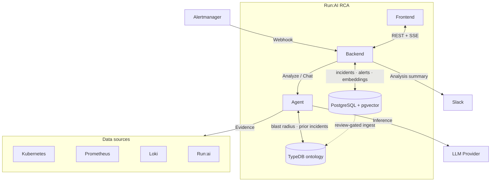

**🇰🇷 한국어** · [🇬🇧 English](../../README.md)

# Run:AI RCA

Run:AI RCA는 NVIDIA Run:ai 환경을 위한 KubeRCA에서 영감을 받은 인시던트 분석 콕핏입니다. Alertmanager 수집, 인시던트/알림 대시보드, 구조화된 RCA 리포트, 실시간 업데이트, 채팅, 재사용 가능한 인시던트 메모리를 제공합니다. 단일 에이전트 대신, NVIDIA NeMo Agent Toolkit을 오케스트레이션 백본으로 사용하는 컴포넌트 지향 멀티 에이전트 설계를 채택했습니다. RCA는 기본적으로 읽기 전용이며, Run:ai, Prometheus, Loki, Kubernetes 접근이 없어도 우아하게 성능을 저하시키며 동작합니다.

## Repository Layout

```text
agent/      FastAPI analysis service and NeMo Agent Toolkit workflow config
backend/    Go API server for Alertmanager intake, incidents, alerts, SSE
frontend/   React dashboard
charts/     Helm chart for Kubernetes deployment
docs/       Architecture and operation notes
```

## Architecture



위 다이어그램은 컴포넌트와 Agent가 읽는 외부 시스템을 보여줍니다. Agent 내부에서는 **오케스트레이터**가 분석 파이프라인을 실행합니다 — 플래너 → 7개의 병렬 수집기 → 중앙 조사 루프 및 수집기별 드릴다운 → 시그니처 매칭, 랭킹, 회의적인 자기 점검 → 종합 — 자세한 내용은 [RCA Pipeline](RCA-PIPELINE.md)에 있습니다. 오케스트레이터는 pgvector가 표현할 수 없는 관계형 사실 — 노드 blast radius(영향 범위), 동일 알림에 대한 과거 인시던트, 그래프에서 도출된 family/XID 조치 — 를 위해 선택적 **TypeDB 온톨로지**(`typedb.enabled`, Helm에서 기본 활성화)를 참조하며, 이는 Postgres 저장소로부터 리뷰 기반 수집(review-gated ingestion)으로 채워집니다. **pgvector** 유사도는 백엔드가 소유하며, 백엔드는 각 분석 요청에 유사 인시던트와 피드백 힌트를 전달합니다. 전체 설명: [RCA Pipeline](RCA-PIPELINE.md) ·
[Knowledge Base](KNOWLEDGE-BASE.md).

## Local Development

```bash
# Agent
cd agent && python -m venv .venv && source .venv/bin/activate
pip install -e ".[dev]" && uvicorn app.main:app --reload --port 8000

# Backend
cd backend && go test ./... && go run .

# Frontend
cd frontend && npm install && npm run dev
```

프런트엔드는 기본적으로 `http://localhost:8080`에서 백엔드를 찾습니다.

## Deployment

컨테이너 이미지와 Helm 차트는 `main` 푸시와 버전 태그(`v*.*.*`)에서 GHCR로 게시됩니다. 풀 리퀘스트는 빌드/린트만 수행합니다. 이미지는 차트 `appVersion`과 `sha-...`로 태그되며, 차트는 OCI 아티팩트로 게시됩니다.

- `ghcr.io/<owner>/runai-rca-backend`, `-agent`, `-frontend`
- `ghcr.io/<owner>/charts/runai-rca`

### 1. Secret

백엔드는 대상 데이터베이스가 없으면 자동으로 생성합니다(`CREATEDB` 권한이 필요하며, 그렇지 않으면 미리 생성하세요). 기존 데이터베이스는 절대 수정되지 않습니다.

```bash
kubectl create namespace runai-rca
kubectl create secret generic runai-rca-secrets -n runai-rca \
  --from-literal=DATABASE_URL='postgres://user:pw@pg-host:5432/runai_rca?sslmode=require' \
  --from-literal=POSTGRES_DSN='postgres://user:pw@pg-host:5432/runai_rca?sslmode=require' \
  --from-literal=RUNAI_CLIENT_ID='<id>' \
  --from-literal=RUNAI_CLIENT_SECRET='<secret>'
```

### 2. Install

```bash
helm upgrade --install runai-rca oci://ghcr.io/<owner>/charts/runai-rca \
  --version <chart-version> -n runai-rca \
  --set global.imageRegistry=ghcr.io/<owner> \
  --set secrets.existingSecret=runai-rca-secrets \
  --set agent.env.runaiBaseUrl=https://runai.example.com \
  --set agent.env.runaiTokenUrl=https://runai.example.com/auth/token \
  --set agent.env.prometheusUrl=http://prometheus.monitoring.svc:9090 \
  --set agent.env.lokiUrl=http://loki-read.monitoring.svc.cluster.local:3100
```

외부 DB 대신 번들된 단일 파드 Postgres를 사용하려면: `--set postgresql.enabled=true`.

### LLM synthesis (optional)

RCA 종합은 NeMo 런타임이 활성화되지 않는 한 프로세스 내에서 결정론적으로 실행됩니다. OpenAI 호환 엔드포인트(예: LiteLLM)를 통해 종합하려면:

```bash
  --set agent.env.enableNatRuntime=true \
  --set agent.env.natConfigFile=/app/configs/runai_rca_workflow_litellm.yml \
  --set agent.env.llmBaseUrl=https://llm.example.com/v1 \
  --set agent.env.llmModel=<model> \
  --set secrets.llmApiKey='<llm-api-key>'
```

워크플로 설정: `runai_rca_workflow.yml`(기본값, 외부 LLM 없음),
`_litellm.yml`(OpenAI 호환), `_mcp.yml`(Prometheus/Loki MCP + NIM).

### Runtime checks

자동 RCA는 Alertmanager가 백엔드 `/webhook/alertmanager`로 게시한 이후에만 시작됩니다. Slack 알림만으로는 RCA 웹훅 수신기가 라우팅되었음을 증명하지 못합니다. 실시간 수집 및 분석 상태는 다음으로 확인하세요:

```bash
curl -s http://<frontend-or-backend-url>/api/v1/alerts
curl -s http://<frontend-or-backend-url>/api/v1/analysis-runs
```

에이전트 `/healthz`는 에이전트 API 프로세스가 살아 있음을 의미합니다. UI의 수집기 카드는 RCA 실행이 수집기 `artifacts`를 저장한 이후에만 `ok`로 바뀝니다. 파드가 `Running`이거나 헬스 체크가 `200`인 것만으로는 충분하지 않습니다. 채팅은 활성 인시던트/알림 RCA 콘텐츠에서 컨텍스트 기반으로 동작합니다. 현재 구현에서는 LLM 경로를 직접 호출하지 않습니다. `ENABLE_NAT_RUNTIME=true`는 `/analyze` 종합에 영향을 주지만, `/chat`은 결정론적인 컨텍스트 답변을 반환합니다. 상세 RCA가 연결되지 않은 경우, 백엔드는 대시보드 및 분석 실행 상태를 제공하여 채팅이 현재 알림, 최신 실행 상태, 에이전트 타임아웃/실패 경고, 구성된 런타임 모드를 보고할 수 있도록 합니다.

## Configuration

주요 값(전체 시크릿 키: `DATABASE_URL`, `POSTGRES_DSN`, `RUNAI_CLIENT_ID`,
`RUNAI_CLIENT_SECRET`, `RUNAI_BEARER_TOKEN`, `NVIDIA_API_KEY`, `LLM_API_KEY`):

| Helm value | Purpose |
| --- | --- |
| `global.imageRegistry` / `imagePullSecrets` | 모든 이미지에 대한 레지스트리 접두사 및 풀 시크릿 |
| `secrets.existingSecret` | DB/Run:ai/NVIDIA/LLM 자격 증명이 담긴 기존 Secret |
| `agent.env.runaiBaseUrl` / `runaiTokenUrl` | Run:ai API URL 및 OAuth 토큰 URL (client_id/secret 사용 시 토큰 URL 필수) |
| `agent.env.prometheusUrl` / `lokiUrl` | 클러스터 내부 Prometheus / Loki URL. Loki는 인증 게이트웨이가 아닌 직접 읽기 서비스를 기본값으로 사용합니다. |
| `agent.env.enableNatRuntime` / `natConfigFile` | NeMo 종합 활성화 및 워크플로 설정 선택 |
| `agent.env.llmBaseUrl` / `llmModel` | OpenAI 호환 엔드포인트 및 모델 |
| `agent.rbac.clusterWide` / `namespaces` | 증거 수집을 위한 읽기 전용 RBAC 범위 |
| `postgresql.enabled` / `auth.*` | 번들된 Postgres 및 해당 사용자/비밀번호/데이터베이스 사용 |
| `ingress.*` | 프런트엔드 호스트, TLS, 클래스, 어노테이션 |
| `{backend,agent,frontend}.image.tag` | 이미지 태그 재정의 (기본값: 차트 appVersion) |

RCA 테이블은 멱등적인 `CREATE TABLE IF NOT EXISTS`로 자동 생성되므로 마이그레이션 단계가 필요하지 않습니다. pgvector는 사용 가능할 때 사용되며, 그렇지 않으면 백엔드는 JSONB 코사인 검색으로 폴백합니다. 민감한 값은 증거가 수집기를 떠나기 전에 마스킹 처리됩니다. `MASKING_REGEX_LIST_JSON`을 통해 패턴을 추가하세요.

## Documentation

전체 목차(GitBook 지원): [`SUMMARY.md`](../../SUMMARY.md).

- [Getting Started](GETTING-STARTED.md) — 로컬에서 실행하고 첫 RCA를 받아보기
- [Architecture](ARCHITECTURE.md) — 구현 계약
- [RCA Pipeline](RCA-PIPELINE.md) — 플래너 → 종합까지 모든 분석 단계
- [Knowledge Base](KNOWLEDGE-BASE.md) — 큐레이션된 카탈로그 + TypeDB 온톨로지
- [Operating Model](OPERATING-MODEL.md) — 운영 모델
- [Data Stores](DATABASE.md) — PostgreSQL + TypeDB 온톨로지
- [UI Direction](UI-DIRECTION.md) — UI/UX 방향성
- [Deployment](DEPLOYMENT.md) — 상세 배포, RBAC, DB 참고 사항
- [API Reference](API.md) — 백엔드 및 에이전트 엔드포인트
- [Configuration Reference](CONFIGURATION.md) — 전체 환경 변수 및 Helm 값 참조
