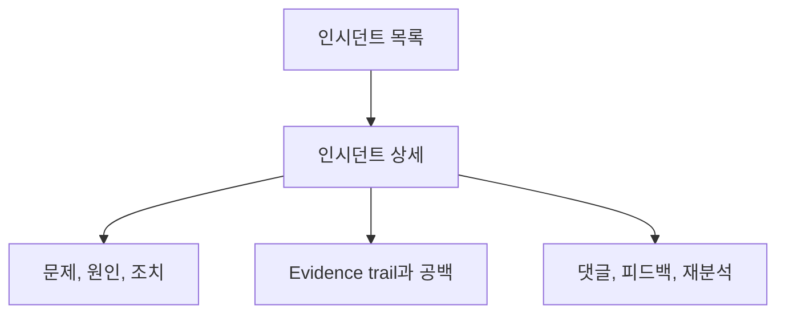

# UI Direction

> **관점:** 구축 방식(UI) — 운영자 콘솔의 디자인 계약(design contract).
> **이 문서에서 다루는 것:** 비주얼 시스템 · 페이지 모델 · 인터랙션 노트.

Run:AI RCA는 NVIDIA Run:ai 운영자를 위해 진화한 KubeRCA처럼 느껴져야 합니다.

**이 문서는 누구를 위한가:** 운영자 콘솔을 만드는 디자이너와 엔지니어를 위한 문서입니다.
화면은 세 질문에 빠르게 답해야 합니다. 무슨 일이 있었는가, 무엇이 이를 뒷받침하는가,
그리고 어떤 안전한 다음 점검을 해야 하는가입니다.

## 비주얼 시스템

- 기본: 흰색 및 거의 흰색에 가까운 표면(surface).
- 강조색: NVIDIA 그린 `#76B900`.
- 텍스트: 그래파이트와 차콜, 활성 상태와 정상(healthy) 신호에는 그린을 사용.
- 경고: 심각도 및 오류 상태에만 앰버와 레드 사용.
- 레이아웃: 조밀하고, 스캔하기 쉬우며, 대시보드 우선.

## 페이지 모델

MVP에서는 별도의 에이전트 분석 페이지를 허용하지 않습니다. 인시던트 및 알림 상세 페이지는 다음을 포함해야 합니다:

- 엔티티 헤더: 심각도, 상태, 클러스터, 프로젝트, 큐, 워크로드, 노드.
- RCA 요약: 간결한 최종 답변.
- RCA 본문: 근본 원인, 영향, 증거, 조치 항목, 누락된 데이터, 예방책.
- RCA 보고서: 구조화되어 훑어보기 쉬운 보고서 뷰.
- 에이전트 증거 추적(Evidence Trail): 같은 페이지의 단일 패널 안에 collector 탭으로 배치.
- 원시 아티팩트 뷰어: 기본적으로 접힘(collapsed).
- 채팅 패널: 컨텍스트 인지형이며 현재 라우트에 연결됨.

## 인터랙션 노트

- 첫 화면은 랜딩 페이지가 아니라 대시보드입니다.
- 사용자는 필터를 잃지 않고 대시보드에서 상세로, 그리고 다시 대시보드로 이동할 수 있어야 합니다.
- 실시간 분석 업데이트는 상태 배지와 SSE 이벤트를 통해 확인 가능해야 합니다.
- 누락된 연동은 명시적이되 시끄럽지 않아야 합니다.
